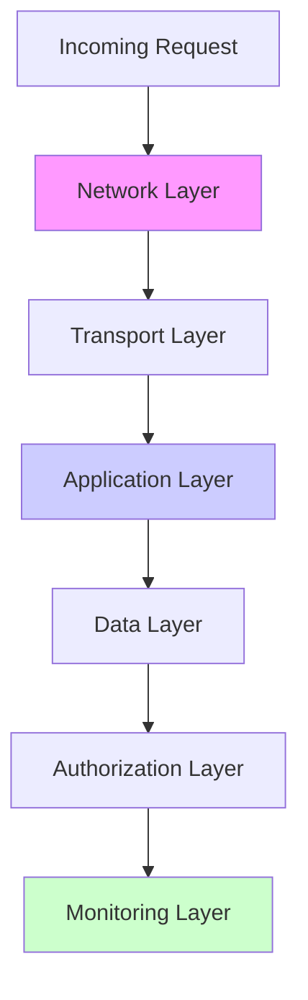

# 🛡️ Production API Security Mastery

_From Basic Protection to Enterprise Defense-in-Depth_

---

## 🎯 **The Security Mindset**

> **"Security isn't a feature; it's a fundamental property. Every line of code is a potential vulnerability."**

**Core Principles:**

- **Assume Breach** – Design as if attackers are already inside
- **Defense in Depth** – Multiple layers, no single point of failure
- **Least Privilege** – Grant minimum access required
- **Zero Trust** – Verify everything, trust nothing
- **Security by Design** – Not an afterthought

---

## 🏗️ **Defense-in-Depth Architecture**

### **The 7-Layer Security Model**



**Each layer provides independent protection:**

1. **Network** – VPNs, Firewalls, DDoS Protection
2. **Transport** – TLS, Certificate Pinning
3. **Application** – Input Validation, Rate Limiting
4. **Data** – SQL Injection Prevention, Encryption
5. **Authorization** – RBAC/ABAC, Token Validation
6. **Session** – CSRF, XSS Protection
7. **Monitoring** – Logging, Alerting, Anomaly Detection

---

## 1️⃣ **Rate Limiting: Production Implementation**

### **Multi-Strategy Rate Limiter**

```typescript
// Production-Grade Rate Limiting Service
import Redis from "ioredis";
import { RateLimiterRedis, RateLimiterRes } from "rate-limiter-flexible";

class ProductionRateLimiter {
  private limiters: Map<string, RateLimiterRedis>;
  private redis: Redis;

  constructor() {
    this.redis = new Redis({
      host: process.env.REDIS_HOST,
      port: parseInt(process.env.REDIS_PORT || "6379"),
      password: process.env.REDIS_PASSWORD,
      enableReadyCheck: true,
      maxRetriesPerRequest: 3,
    });

    this.limiters = new Map();
    this.initializeLimiters();
  }

  private initializeLimiters(): void {
    // User/IP-based limiting
    this.limiters.set(
      "user_ip",
      new RateLimiterRedis({
        storeClient: this.redis,
        keyPrefix: "rl_user_ip",
        points: 100, // 100 requests
        duration: 60, // per 60 seconds
        blockDuration: 300, // block for 5 minutes after exceeding
      })
    );

    // Endpoint-specific limiting
    this.limiters.set(
      "endpoint_comments",
      new RateLimiterRedis({
        storeClient: this.redis,
        keyPrefix: "rl_comments",
        points: 50, // 50 requests per minute for comments
        duration: 60,
        blockDuration: 600,
      })
    );

    // Global DDoS protection
    this.limiters.set(
      "global",
      new RateLimiterRedis({
        storeClient: this.redis,
        keyPrefix: "rl_global",
        points: 10000, // 10k global requests per minute
        duration: 60,
        blockDuration: 60,
      })
    );

    // Authentication endpoint (stricter)
    this.limiters.set(
      "auth",
      new RateLimiterRedis({
        storeClient: this.redis,
        keyPrefix: "rl_auth",
        points: 10, // 10 login attempts per IP
        duration: 300, // per 5 minutes
        blockDuration: 900, // block for 15 minutes
      })
    );
  }

  async checkRequest(
    req: Request,
    endpoint: string
  ): Promise<{ allowed: boolean; headers: Record<string, string> }> {
    const clientIp = this.getClientIp(req);
    const userId = req.user?.id || "anonymous";

    // Check multiple limits
    const checks = [
      this.checkLimit("global", `global:${clientIp}`, req),
      this.checkLimit("user_ip", `user_ip:${clientIp}:${userId}`, req),
      this.checkLimit(
        `endpoint_${endpoint}`,
        `endpoint:${endpoint}:${clientIp}`,
        req
      ),
    ];

    if (endpoint.includes("auth")) {
      checks.push(this.checkLimit("auth", `auth:${clientIp}`, req));
    }

    const results = await Promise.all(checks);

    // Check if any limit was exceeded
    const exceeded = results.find((result) => !result.allowed);

    if (exceeded) {
      return {
        allowed: false,
        headers: this.getRateLimitHeaders(exceeded),
      };
    }

    return {
      allowed: true,
      headers: this.getRateLimitHeaders(results[0]), // Use first result for headers
    };
  }

  private async checkLimit(
    limiterName: string,
    key: string,
    req: Request
  ): Promise<RateLimitResult> {
    try {
      const limiter = this.limiters.get(limiterName);
      if (!limiter) throw new Error(`Limiter ${limiterName} not found`);

      await limiter.consume(key);

      return {
        allowed: true,
        remaining: await this.getRemainingPoints(limiterName, key),
        reset: await this.getResetTime(limiterName, key),
      };
    } catch (error) {
      if (error instanceof Error && error.name === "RateLimiterRes") {
        const rateLimiterRes = error as RateLimiterRes;
        return {
          allowed: false,
          remaining: 0,
          reset: new Date(Date.now() + rateLimiterRes.msBeforeNext),
          retryAfter: Math.ceil(rateLimiterRes.msBeforeNext / 1000),
        };
      }
      throw error;
    }
  }

  // Dynamic rate limiting based on user tier
  async getTieredLimits(userTier: string): Promise<RateLimitConfig> {
    const tiers: Record<string, RateLimitConfig> = {
      free: { points: 100, duration: 60, blockDuration: 300 },
      premium: { points: 1000, duration: 60, blockDuration: 300 },
      enterprise: { points: 10000, duration: 60, blockDuration: 300 },
    };

    return tiers[userTier] || tiers.free;
  }
}

// Express middleware
const rateLimitMiddleware = async (
  req: Request,
  res: Response,
  next: NextFunction
) => {
  const rateLimiter = new ProductionRateLimiter();
  const endpoint = req.path.split("/").filter(Boolean)[0] || "default";

  const result = await rateLimiter.checkRequest(req, endpoint);

  if (!result.allowed) {
    // Set rate limit headers
    Object.entries(result.headers).forEach(([key, value]) => {
      res.setHeader(key, value);
    });

    return res.status(429).json({
      error: "Too Many Requests",
      message: "Rate limit exceeded",
      retry_after: result.headers["Retry-After"],
      documentation: "https://api.example.com/docs/rate-limiting",
    });
  }

  // Set rate limit headers for successful requests
  Object.entries(result.headers).forEach(([key, value]) => {
    res.setHeader(key, value);
  });

  next();
};
```

### **Rate Limit Headers (RFC 6585)**

```http
# Rate limit headers in response
X-RateLimit-Limit: 100
X-RateLimit-Remaining: 97
X-RateLimit-Reset: 1617035363
X-RateLimit-Policy: 100;w=60;comment="free tier"
Retry-After: 42

# For quota-based limits
X-RateLimit-Quota: 10000
X-RateLimit-Quota-Remaining: 7543
X-RateLimit-Quota-Reset: 1617244800
```

### **DDoS Protection Strategy**

```typescript
// Advanced DDoS Protection
class DDoSProtection {
  private redis: Redis;
  private anomalyThreshold = 1000; // Requests per second threshold

  constructor() {
    this.redis = new Redis(process.env.REDIS_URL);
  }

  async analyzeTrafficPattern(req: Request): Promise<ProtectionAction> {
    const ip = req.ip;
    const path = req.path;
    const now = Date.now();
    const windowStart = now - 60000; // 1 minute window

    // Track requests per IP per endpoint
    const key = `ddos:${ip}:${path}`;
    await this.redis.zadd(key, now, now.toString());

    // Clean old entries
    await this.redis.zremrangebyscore(key, 0, windowStart);

    // Count recent requests
    const requestCount = await this.redis.zcard(key);

    // Set expiry on key
    await this.redis.expire(key, 120);

    // Check for anomalies
    if (requestCount > this.anomalyThreshold) {
      // Add to block list temporarily
      await this.redis.setex(`blocked:${ip}`, 300, "1"); // Block for 5 minutes

      // Alert security team
      await this.sendAlert({
        type: "DDoS_SUSPECTED",
        ip,
        endpoint: path,
        requestCount,
        timestamp: new Date().toISOString(),
      });

      return {
        action: "block",
        reason: "DDoS suspected",
        duration: 300,
      };
    }

    return { action: "allow" };
  }

  // Geo-blocking for known malicious regions
  async checkGeoIP(ip: string): Promise<boolean> {
    const country = await this.getCountryFromIP(ip);
    const blockedCountries = ["XX", "YY", "ZZ"]; // High-risk countries

    if (blockedCountries.includes(country)) {
      // Allow through but log for analysis
      await this.logSuspiciousRequest(ip, country);
      return false; // Could block here if needed
    }

    return true;
  }

  // Request fingerprinting
  generateFingerprint(req: Request): string {
    const components = [
      req.ip,
      req.headers["user-agent"],
      req.headers["accept-language"],
      req.headers["accept-encoding"],
    ]
      .filter(Boolean)
      .join("|");

    return crypto.createHash("sha256").update(components).digest("hex");
  }
}
```

---

## 2️⃣ **CORS: Production Configuration**

### **Dynamic CORS with Multi-Tenant Support**

```typescript
// Production CORS Configuration
import cors, { CorsOptions, CorsOptionsDelegate } from "cors";
import { Request } from "express";

class DynamicCORS {
  private allowedOrigins: Set<string>;
  private preflightMaxAge: number;

  constructor() {
    this.allowedOrigins = new Set(
      [
        // Production domains
        "https://app.example.com",
        "https://admin.example.com",
        "https://api.example.com",

        // Staging environments
        "https://staging.example.com",
        "https://staging-api.example.com",

        // Development
        process.env.NODE_ENV === "development" && "http://localhost:3000",
        process.env.NODE_ENV === "development" && "http://localhost:3001",
      ].filter(Boolean) as string[]
    );

    this.preflightMaxAge = 86400; // 24 hours
  }

  // Dynamic CORS delegate
  getCorsOptions(): CorsOptionsDelegate<Request> {
    return (req, callback) => {
      const origin = req.headers.origin;

      // Allow requests with no origin (mobile apps, curl, etc.)
      if (!origin) {
        return callback(null, {
          origin: false,
          credentials: false,
        });
      }

      // Check against allowed origins
      if (this.allowedOrigins.has(origin)) {
        return callback(null, {
          origin: true, // Reflect the requesting origin
          credentials: true,
          maxAge: this.preflightMaxAge,
          allowedHeaders: [
            "Content-Type",
            "Authorization",
            "X-Requested-With",
            "X-CSRF-Token",
            "X-API-Key",
            "X-API-Version",
            "Accept",
            "Accept-Language",
            "Cache-Control",
            "If-None-Match",
          ],
          exposedHeaders: [
            "X-RateLimit-Limit",
            "X-RateLimit-Remaining",
            "X-RateLimit-Reset",
            "X-API-Version",
            "X-Request-ID",
            "ETag",
            "Content-Range",
          ],
          methods: ["GET", "POST", "PUT", "PATCH", "DELETE", "OPTIONS", "HEAD"],
        });
      }

      // Origin not allowed
      console.warn(`Blocked CORS request from origin: ${origin}`);

      // Log security event
      this.logSecurityEvent({
        type: "CORS_VIOLATION",
        origin,
        ip: req.ip,
        method: req.method,
        path: req.path,
        userAgent: req.get("User-Agent"),
        timestamp: new Date().toISOString(),
      });

      callback(new Error("Not allowed by CORS"), {
        origin: false,
        credentials: false,
      });
    };
  }

  // Add origin dynamically (for multi-tenant SaaS)
  async addAllowedOrigin(origin: string, tenantId: string): Promise<void> {
    // Validate origin format
    if (!this.isValidOrigin(origin)) {
      throw new Error("Invalid origin format");
    }

    // Check against blacklist
    if (await this.isBlacklistedOrigin(origin)) {
      throw new Error("Origin is blacklisted");
    }

    this.allowedOrigins.add(origin);

    // Store in database for persistence
    await this.db.tenantOrigins.create({
      tenantId,
      origin,
      addedAt: new Date(),
      addedBy: "system",
    });

    console.log(`Added CORS origin for tenant ${tenantId}: ${origin}`);
  }

  // Remove origin
  async removeAllowedOrigin(origin: string, tenantId: string): Promise<void> {
    this.allowedOrigins.delete(origin);

    // Update database
    await this.db.tenantOrigins.update(
      { tenantId, origin },
      { removedAt: new Date(), removedBy: "system" }
    );
  }

  // Validate origin format
  private isValidOrigin(origin: string): boolean {
    try {
      const url = new URL(origin);
      return ["http:", "https:"].includes(url.protocol);
    } catch {
      return false;
    }
  }

  // Check against known malicious origins
  private async isBlacklistedOrigin(origin: string): Promise<boolean> {
    const blacklist = await this.db.securityBlacklist.find({
      type: "origin",
      value: origin,
    });

    return blacklist.length > 0;
  }
}

// Usage in Express
const corsMiddleware = cors(new DynamicCORS().getCorsOptions());
app.use(corsMiddleware);

// Special handling for WebSocket connections
app.use("/ws", (req, res, next) => {
  // WebSocket connections need special CORS handling
  res.setHeader("Access-Control-Allow-Origin", req.headers.origin || "*");
  res.setHeader("Access-Control-Allow-Credentials", "true");
  next();
});
```

### **CORS Preflight Caching**

```nginx
# Nginx configuration for CORS preflight caching
location / {
    if ($request_method = 'OPTIONS') {
        add_header 'Access-Control-Allow-Origin' '$http_origin';
        add_header 'Access-Control-Allow-Methods' 'GET, POST, PUT, PATCH, DELETE, OPTIONS, HEAD';
        add_header 'Access-Control-Allow-Headers' 'DNT,User-Agent,X-Requested-With,If-Modified-Since,Cache-Control,Content-Type,Range,Authorization';
        add_header 'Access-Control-Allow-Credentials' 'true';
        add_header 'Access-Control-Max-Age' 86400;
        add_header 'Content-Type' 'text/plain; charset=utf-8';
        add_header 'Content-Length' 0;
        return 204;
    }

    # Pass to application
    proxy_pass http://app_server;
}
```

---

## 3️⃣ **SQL/NoSQL Injection: Comprehensive Protection**

### **Multi-Layer Injection Protection**

```typescript
// SQL Injection Protection Service
import { Pool } from "pg";
import { escape } from "pg-escape";

class SQLInjectionProtection {
  private pool: Pool;
  private queryPatterns: RegExp[];

  constructor() {
    this.pool = new Pool({
      connectionString: process.env.DATABASE_URL,
      statement_timeout: 10000, // 10 second timeout
      query_timeout: 15000,
      idle_in_transaction_session_timeout: 30000,
    });

    // Dangerous SQL patterns to detect
    this.queryPatterns = [
      /(\b(SELECT|INSERT|UPDATE|DELETE|DROP|ALTER|CREATE|TRUNCATE|EXEC|UNION|OR|AND)\b.*?\b(WHERE|FROM|INTO|TABLE|DATABASE|VALUES|SET)\b)/i,
      /(\b(OR|AND)\s+['"]?\d+['"]?\s*[=<>!]+\s*['"]?\d+['"]?)/i,
      /(--|\/\*|\*\/|;)/, // SQL comments and statement terminators
      /(\b(SLEEP|WAITFOR|BENCHMARK)\s*\(/i,
      /(\b(LOAD_FILE|OUTFILE|DUMPFILE)\s*\(/i,
      /(\b(EXEC|EXECUTE|EXEC_SP)\s*\(/i,
    ];
  }

  // Safe parameterized query execution
  async safeQuery<T>(queryText: string, params: any[] = []): Promise<T[]> {
    // 1. Validate query structure
    this.validateQuery(queryText);

    // 2. Validate parameters
    const sanitizedParams = this.sanitizeParameters(params);

    // 3. Check for suspicious patterns
    if (this.detectInjectionAttempt(queryText, sanitizedParams)) {
      await this.logInjectionAttempt(queryText, sanitizedParams);
      throw new SecurityError("Potential SQL injection detected");
    }

    // 4. Execute with parameterized query
    try {
      const result = await this.pool.query(queryText, sanitizedParams);
      return result.rows;
    } catch (error) {
      // Don't expose database errors to client
      console.error("Database error:", error);
      throw new DatabaseError(
        "An error occurred while processing your request"
      );
    }
  }

  // NoSQL Injection Protection
  async safeMongoQuery(
    collection: string,
    query: object,
    options: object = {}
  ): Promise<any[]> {
    // 1. Validate query structure
    const validatedQuery = this.validateMongoQuery(query);

    // 2. Check for operator injection
    if (this.detectNoSQLInjection(validatedQuery)) {
      await this.logNoSQLInjectionAttempt(collection, validatedQuery);
      throw new SecurityError("Potential NoSQL injection detected");
    }

    // 3. Apply query restrictions
    const restrictedQuery = this.applyQueryRestrictions(validatedQuery);

    // 4. Execute query
    return await this.mongo
      .collection(collection)
      .find(restrictedQuery, options)
      .toArray();
  }

  private validateQuery(queryText: string): void {
    // Check for multiple statements
    if (queryText.includes(";")) {
      const statements = queryText.split(";").filter((s) => s.trim());
      if (statements.length > 1) {
        throw new SecurityError("Multiple SQL statements not allowed");
      }
    }

    // Check for dangerous keywords in suspicious contexts
    const dangerousInContext = /(\b(DROP|ALTER|TRUNCATE|EXEC)\b)/i;
    if (
      dangerousInContext.test(queryText) &&
      !queryText.includes("/* ALLOWED */")
    ) {
      // Only allow these with explicit comment
      throw new SecurityError("Dangerous SQL operation detected");
    }
  }

  private sanitizeParameters(params: any[]): any[] {
    return params.map((param) => {
      if (typeof param === "string") {
        // Remove null bytes and control characters
        return param.replace(/[\x00-\x1F\x7F]/g, "");
      }
      return param;
    });
  }

  private detectInjectionAttempt(queryText: string, params: any[]): boolean {
    // Check query text for patterns
    for (const pattern of this.queryPatterns) {
      if (pattern.test(queryText)) {
        return true;
      }
    }

    // Check parameters for suspicious content
    for (const param of params) {
      if (typeof param === "string") {
        // Check for SQL comment patterns in parameters
        if (
          param.includes("--") ||
          param.includes("/*") ||
          param.includes("*/")
        ) {
          return true;
        }

        // Check for common injection patterns
        const injectionPatterns = [
          /' OR '1'='1/i,
          /' OR '1'='1' --/i,
          /" OR "1"="1/i,
          /' UNION SELECT/i,
          /' AND SLEEP\(/i,
        ];

        for (const pattern of injectionPatterns) {
          if (pattern.test(param)) {
            return true;
          }
        }
      }
    }

    return false;
  }

  private async logInjectionAttempt(
    queryText: string,
    params: any[]
  ): Promise<void> {
    await this.securityLog.create({
      type: "SQL_INJECTION_ATTEMPT",
      query: queryText.substring(0, 500), // Limit log size
      params: JSON.stringify(params),
      ip: this.getClientIp(),
      timestamp: new Date(),
      severity: "HIGH",
    });

    // Alert security team for high-risk attempts
    if (this.isHighRiskAttempt(queryText)) {
      await this.sendSecurityAlert({
        type: "HIGH_RISK_SQL_INJECTION",
        query: queryText,
        params,
        ip: this.getClientIp(),
      });
    }
  }
}

// ORM Integration with protection
class SecureORM {
  constructor(private protection: SQLInjectionProtection) {}

  async findUsersWithFilters(filters: UserFilters): Promise<User[]> {
    // Build safe query using parameterized approach
    const { query, params } = this.buildSafeQuery(filters);

    return await this.protection.safeQuery<User>(query, params);
  }

  private buildSafeQuery(filters: UserFilters): {
    query: string;
    params: any[];
  } {
    const params: any[] = [];
    const conditions: string[] = [];
    let paramIndex = 1;

    if (filters.email) {
      conditions.push(`email = $${paramIndex}`);
      params.push(filters.email);
      paramIndex++;
    }

    if (filters.status) {
      conditions.push(`status = $${paramIndex}`);
      params.push(filters.status);
      paramIndex++;
    }

    // Prevent SQL injection through order by
    const validSortFields = ["created_at", "email", "name"];
    const sortField = validSortFields.includes(filters.sort)
      ? filters.sort
      : "created_at";

    const sortDirection = filters.order === "ASC" ? "ASC" : "DESC";

    const query = `
      SELECT id, email, name, created_at 
      FROM users 
      ${conditions.length > 0 ? `WHERE ${conditions.join(" AND ")}` : ""}
      ORDER BY ${sortField} ${sortDirection}
      LIMIT $${paramIndex}
    `;

    params.push(filters.limit || 100);

    return { query, params };
  }
}
```

### **Input Validation Middleware**

```typescript
// Comprehensive input validation
import Joi from "joi";
import { escape, escapeId } from "sqlstring";
import validator from "validator";

class InputValidation {
  // Schema-based validation
  validateSchema<T>(data: any, schema: Joi.Schema): T {
    const { error, value } = schema.validate(data, {
      abortEarly: false,
      stripUnknown: true,
      convert: true,
    });

    if (error) {
      throw new ValidationError(
        "Input validation failed",
        error.details.map((detail) => ({
          field: detail.path.join("."),
          message: detail.message,
          type: detail.type,
        }))
      );
    }

    return value;
  }

  // SQL-specific validation
  validateSQLIdentifier(identifier: string): boolean {
    // Only allow alphanumeric and underscores
    return /^[a-zA-Z_][a-zA-Z0-9_]*$/.test(identifier);
  }

  validateSQLValue(value: any): any {
    if (typeof value === "string") {
      // Escape SQL special characters
      return escape(value);
    }
    return value;
  }

  // XSS prevention
  sanitizeHTML(input: string): string {
    return validator.escape(input);
  }

  sanitizeForSQL(input: string): string {
    // Remove SQL comment patterns
    return input
      .replace(/--/g, "")
      .replace(/\/\*/g, "")
      .replace(/\*\//g, "")
      .replace(/;/g, "");
  }

  // Content Security
  validateContentType(contentType: string): boolean {
    const allowedTypes = [
      "application/json",
      "application/x-www-form-urlencoded",
      "multipart/form-data",
    ];

    return allowedTypes.includes(contentType);
  }

  // File upload validation
  validateFileUpload(file: Express.Multer.File): void {
    // Check file size
    const maxSize = 10 * 1024 * 1024; // 10MB
    if (file.size > maxSize) {
      throw new ValidationError("File too large");
    }

    // Check file type
    const allowedMimeTypes = [
      "image/jpeg",
      "image/png",
      "image/gif",
      "application/pdf",
    ];

    if (!allowedMimeTypes.includes(file.mimetype)) {
      throw new ValidationError("Invalid file type");
    }

    // Check file extension
    const allowedExtensions = [".jpg", ".jpeg", ".png", ".gif", ".pdf"];
    const extension = path.extname(file.originalname).toLowerCase();

    if (!allowedExtensions.includes(extension)) {
      throw new ValidationError("Invalid file extension");
    }

    // Scan for malicious content
    this.scanFileForMalware(file);
  }
}

// Usage in middleware
const validateInput = (schema: Joi.Schema) => {
  return async (req: Request, res: Response, next: NextFunction) => {
    try {
      const validator = new InputValidation();

      // Validate request body
      if (req.body && Object.keys(req.body).length > 0) {
        req.body = validator.validateSchema(req.body, schema);
      }

      // Validate query parameters
      if (req.query && Object.keys(req.query).length > 0) {
        req.query = validator.validateSchema(req.query, schema);
      }

      // Validate route parameters
      if (req.params && Object.keys(req.params).length > 0) {
        req.params = validator.validateSchema(req.params, schema);
      }

      next();
    } catch (error) {
      if (error instanceof ValidationError) {
        return res.status(400).json({
          error: "Validation failed",
          details: error.details,
          documentation: "https://api.example.com/docs/validation",
        });
      }

      next(error);
    }
  };
};
```

---

## 4️⃣ **Web Application Firewall (WAF)**

### **Custom WAF Implementation**

```typescript
// Custom WAF for additional protection
class WebApplicationFirewall {
  private rules: WAFRule[];
  private redis: Redis;

  constructor() {
    this.redis = new Redis(process.env.REDIS_URL);
    this.rules = this.loadRules();
  }

  private loadRules(): WAFRule[] {
    return [
      // SQL Injection rules
      {
        id: "SQL_INJECTION_1",
        type: "SQL_INJECTION",
        pattern:
          /(\b(SELECT|INSERT|UPDATE|DELETE|DROP|ALTER|TRUNCATE)\b.*?\b(FROM|INTO|TABLE|DATABASE)\b)/i,
        action: "BLOCK",
        score: 10,
      },

      // XSS rules
      {
        id: "XSS_1",
        type: "XSS",
        pattern:
          /(<script|<iframe|<object|<embed|javascript:|onload=|onerror=|onclick=)/i,
        action: "BLOCK",
        score: 8,
      },

      // Path traversal
      {
        id: "PATH_TRAVERSAL_1",
        type: "PATH_TRAVERSAL",
        pattern: /(\.\.\/|\.\.\\|\.\.%2f|\.\.%5c)/i,
        action: "BLOCK",
        score: 7,
      },

      // Command injection
      {
        id: "COMMAND_INJECTION_1",
        type: "COMMAND_INJECTION",
        pattern: /(\|&;`\$\(|\|\||&&|\$\(|\$\{)/,
        action: "BLOCK",
        score: 9,
      },

      // LFI/RFI
      {
        id: "LFI_RFI_1",
        type: "LFI_RFI",
        pattern:
          /(\b(include|require|file_get_contents|fopen|readfile)\s*\(.*?(\.\.|http:|https:|ftp:|php:\/\/))/i,
        action: "BLOCK",
        score: 8,
      },
    ];
  }

  async inspectRequest(req: Request): Promise<WAFResult> {
    const inspection: WAFInspection = {
      ip: req.ip,
      method: req.method,
      url: req.url,
      headers: req.headers,
      body: req.body,
      query: req.query,
      params: req.params,
      userAgent: req.get("User-Agent"),
    };

    let totalScore = 0;
    const triggeredRules: string[] = [];
    const actions: WAFAction[] = [];

    // Check each rule
    for (const rule of this.rules) {
      const matches = this.checkRule(rule, inspection);

      if (matches.length > 0) {
        totalScore += rule.score;
        triggeredRules.push(rule.id);

        if (rule.action === "BLOCK") {
          actions.push({
            type: "BLOCK",
            ruleId: rule.id,
            matches,
          });
        } else if (rule.action === "LOG") {
          actions.push({
            type: "LOG",
            ruleId: rule.id,
            matches,
          });
        }
      }
    }

    // Check IP reputation
    const ipReputation = await this.checkIPReputation(req.ip);
    if (ipReputation.score > 50) {
      totalScore += ipReputation.score;
      triggeredRules.push("IP_REPUTATION");

      if (ipReputation.block) {
        actions.push({
          type: "BLOCK",
          ruleId: "IP_REPUTATION",
          reason: "High risk IP address",
        });
      }
    }

    // Check for bot behavior
    const botDetection = await this.detectBot(req);
    if (botDetection.isBot) {
      totalScore += 20;
      triggeredRules.push("BOT_DETECTION");

      actions.push({
        type: "CHALLENGE",
        ruleId: "BOT_DETECTION",
        challenge: "CAPTCHA",
      });
    }

    // Apply threshold-based blocking
    const threshold = 25; // Block if score > 25
    if (totalScore > threshold) {
      // Add to block list
      await this.redis.setex(`waf:blocked:${req.ip}`, 300, "1");

      actions.push({
        type: "BLOCK",
        ruleId: "THRESHOLD",
        reason: `Total threat score ${totalScore} exceeds threshold ${threshold}`,
      });
    }

    return {
      allowed: actions.every((action) => action.type !== "BLOCK"),
      score: totalScore,
      triggeredRules,
      actions,
      requestId: req.id,
    };
  }

  private checkRule(rule: WAFRule, inspection: WAFInspection): string[] {
    const matches: string[] = [];

    // Check URL
    if (rule.pattern.test(inspection.url)) {
      matches.push(`URL: ${inspection.url}`);
    }

    // Check query parameters
    if (inspection.query) {
      const queryString = JSON.stringify(inspection.query);
      if (rule.pattern.test(queryString)) {
        matches.push(`Query: ${queryString.substring(0, 100)}`);
      }
    }

    // Check request body
    if (inspection.body) {
      const bodyString = JSON.stringify(inspection.body);
      if (rule.pattern.test(bodyString)) {
        matches.push(`Body: ${bodyString.substring(0, 100)}`);
      }
    }

    // Check headers
    if (inspection.headers) {
      const headerString = JSON.stringify(inspection.headers);
      if (rule.pattern.test(headerString)) {
        matches.push(`Headers: ${headerString.substring(0, 100)}`);
      }
    }

    return matches;
  }

  private async checkIPReputation(ip: string): Promise<IPReputation> {
    // Check cache first
    const cached = await this.redis.get(`ip:reputation:${ip}`);
    if (cached) {
      return JSON.parse(cached);
    }

    // Check internal blacklist
    const blacklisted = await this.db.ipBlacklist.findOne({ ip });
    if (blacklisted) {
      const result = { score: 100, block: true, reason: blacklisted.reason };
      await this.redis.setex(
        `ip:reputation:${ip}`,
        3600,
        JSON.stringify(result)
      );
      return result;
    }

    // Check external reputation service
    const externalRep = await this.checkExternalIPReputation(ip);

    // Store in cache
    await this.redis.setex(
      `ip:reputation:${ip}`,
      1800,
      JSON.stringify(externalRep)
    );

    return externalRep;
  }

  private async detectBot(req: Request): Promise<BotDetection> {
    const fingerprint = this.generateFingerprint(req);

    // Check if fingerprint is known bot
    const isKnownBot = await this.redis.sismember("known_bots", fingerprint);
    if (isKnownBot) {
      return { isBot: true, confidence: 0.9 };
    }

    // Analyze behavior patterns
    const behavior = await this.analyzeBehavior(req.ip);

    return {
      isBot: behavior.suspicious,
      confidence: behavior.confidence,
      reason: behavior.reason,
    };
  }
}

// WAF middleware
const wafMiddleware = async (
  req: Request,
  res: Response,
  next: NextFunction
) => {
  const waf = new WebApplicationFirewall();
  const result = await waf.inspectRequest(req);

  if (!result.allowed) {
    // Log the attack attempt
    await waf.logAttackAttempt(req, result);

    // Send appropriate response
    const blockAction = result.actions.find((a) => a.type === "BLOCK");

    res.status(403).json({
      error: "Access Denied",
      message: "Request blocked by security policy",
      requestId: result.requestId,
      reason: blockAction?.reason,
      documentation: "https://api.example.com/docs/security",
    });

    return;
  }

  // Add WAF result to request for downstream processing
  req.wafResult = result;

  next();
};
```

---

## 5️⃣ **VPN & Network Security**

### **Zero Trust Network Architecture**

```typescript
// Zero Trust Network Access (ZTNA) Implementation
class ZeroTrustNetwork {
  private allowedCidrs: string[];
  private privateSubnets: string[];
  private vpnRequiredEndpoints: string[];

  constructor() {
    this.allowedCidrs = [
      "10.0.0.0/8", // Corporate network
      "192.168.0.0/16", // Internal networks
      "172.16.0.0/12", // Docker/container networks
    ];

    this.privateSubnets = [
      "/admin",
      "/internal",
      "/monitoring",
      "/debug",
      "/health/internal",
    ];

    this.vpnRequiredEndpoints = [
      "/api/internal",
      "/api/admin",
      "/api/analytics",
    ];
  }

  async authorizeRequest(req: Request): Promise<NetworkAuthResult> {
    const clientIp = req.ip;
    const path = req.path;

    // 1. Check if IP is in allowed CIDR ranges
    const isInternalIP = this.isIPInAllowedRange(clientIp);

    // 2. Check if endpoint requires VPN
    const requiresVPN = this.doesRequireVPN(path);

    // 3. Perform device attestation for sensitive endpoints
    const deviceValid = await this.verifyDeviceAttestation(req);

    // 4. Apply Zero Trust policies
    if (requiresVPN && !isInternalIP) {
      return {
        allowed: false,
        reason: "VPN required for this endpoint",
        requiredAction: "connect_to_vpn",
      };
    }

    if (!deviceValid && this.isSensitiveEndpoint(path)) {
      return {
        allowed: false,
        reason: "Device attestation failed",
        requiredAction: "device_registration",
      };
    }

    // 5. Apply additional network policies
    const networkPolicies = await this.checkNetworkPolicies(clientIp, path);
    if (!networkPolicies.allowed) {
      return networkPolicies;
    }

    return {
      allowed: true,
      isInternal: isInternalIP,
      requiresVPN,
      deviceAttested: deviceValid,
    };
  }

  private isIPInAllowedRange(ip: string): boolean {
    const ipLong = this.ipToLong(ip);

    for (const cidr of this.allowedCidrs) {
      const [range, bits] = cidr.split("/");
      const rangeLong = this.ipToLong(range);
      const mask = ~((1 << (32 - parseInt(bits))) - 1);

      if ((ipLong & mask) === (rangeLong & mask)) {
        return true;
      }
    }

    return false;
  }

  private doesRequireVPN(path: string): boolean {
    return this.vpnRequiredEndpoints.some((endpoint) =>
      path.startsWith(endpoint)
    );
  }

  private async verifyDeviceAttestation(req: Request): Promise<boolean> {
    // Check for device certificate
    const deviceCert = req.headers["x-device-certificate"];
    if (!deviceCert) return false;

    // Verify certificate chain
    const isValid = await this.verifyCertificate(deviceCert);

    // Check if device is compliant
    const isCompliant = await this.checkDeviceCompliance(req);

    return isValid && isCompliant;
  }

  private isSensitiveEndpoint(path: string): boolean {
    const sensitivePaths = [
      "/api/keys",
      "/api/secrets",
      "/api/config",
      "/api/users/admin",
    ];

    return sensitivePaths.some((p) => path.includes(p));
  }

  private async checkNetworkPolicies(
    ip: string,
    path: string
  ): Promise<NetworkAuthResult> {
    // Check rate limits per IP per endpoint
    const rateLimitKey = `network:rate:${ip}:${path}`;
    const requests = await this.redis.incr(rateLimitKey);

    if (requests === 1) {
      await this.redis.expire(rateLimitKey, 60);
    }

    if (requests > 100) {
      // 100 requests per minute per IP per endpoint
      return {
        allowed: false,
        reason: "Network rate limit exceeded",
        retryAfter: 60,
      };
    }

    // Check geographic restrictions
    const country = await this.getCountryFromIP(ip);
    const restrictedCountries = ["XX", "YY", "ZZ"];

    if (restrictedCountries.includes(country)) {
      return {
        allowed: false,
        reason: "Access restricted from your region",
        country,
      };
    }

    return { allowed: true };
  }
}

// Network security middleware
const networkSecurityMiddleware = async (
  req: Request,
  res: Response,
  next: NextFunction
) => {
  const ztna = new ZeroTrustNetwork();
  const authResult = await ztna.authorizeRequest(req);

  if (!authResult.allowed) {
    // Log security event
    await this.securityLog.create({
      type: "NETWORK_ACCESS_DENIED",
      ip: req.ip,
      path: req.path,
      reason: authResult.reason,
      userAgent: req.get("User-Agent"),
      timestamp: new Date(),
    });

    return res.status(403).json({
      error: "Network Access Denied",
      message: authResult.reason,
      requiredAction: authResult.requiredAction,
      documentation: "https://internal.example.com/docs/vpn-access",
    });
  }

  // Add network context to request
  req.networkContext = {
    isInternal: authResult.isInternal,
    requiresVPN: authResult.requiresVPN,
    deviceAttested: authResult.deviceAttested,
  };

  next();
};
```

### **Mutual TLS Authentication**

```typescript
// mTLS Implementation for internal APIs
import fs from "fs";
import https from "https";
import tls from "tls";

class MutualTLS {
  private caCert: Buffer;
  private serverCert: Buffer;
  private serverKey: Buffer;

  constructor() {
    this.caCert = fs.readFileSync(process.env.CA_CERT_PATH);
    this.serverCert = fs.readFileSync(process.env.SERVER_CERT_PATH);
    this.serverKey = fs.readFileSync(process.env.SERVER_KEY_PATH);
  }

  createMTLSServer(app: Express): https.Server {
    const options: https.ServerOptions = {
      cert: this.serverCert,
      key: this.serverKey,

      // Request client certificate
      requestCert: true,
      rejectUnauthorized: true, // Reject clients without valid certificate

      // Only allow our CA to sign client certificates
      ca: [this.caCert],

      // Strong cipher suites
      ciphers: [
        "ECDHE-RSA-AES256-GCM-SHA384",
        "ECDHE-RSA-AES128-GCM-SHA256",
        "DHE-RSA-AES256-GCM-SHA384",
      ].join(":"),

      honorCipherOrder: true,
      minVersion: "TLSv1.2",
    };

    const server = https.createServer(options, app);

    // Add client certificate validation
    server.on("secureConnection", (socket: tls.TLSSocket) => {
      const cert = socket.getPeerCertificate();

      if (!cert || !cert.subject) {
        socket.destroy();
        return;
      }

      // Validate certificate subject
      const validSubjects = this.getValidCertificateSubjects();
      const certSubject = cert.subject.CN;

      if (!validSubjects.includes(certSubject)) {
        console.warn(`Invalid certificate subject: ${certSubject}`);
        socket.destroy();
        return;
      }

      // Check certificate expiration
      const expiration = new Date(cert.valid_to);
      if (expiration < new Date()) {
        console.warn("Certificate expired");
        socket.destroy();
        return;
      }

      // Add certificate info to socket for later use
      (socket as any).clientCert = cert;
    });

    return server;
  }

  createMTLSClient(): https.Agent {
    return new https.Agent({
      cert: this.serverCert,
      key: this.serverKey,
      ca: this.caCert,

      // Require server certificate validation
      rejectUnauthorized: true,

      // Client certificate for mutual auth
      requestCert: true,
    });
  }

  validateClientCertificate(cert: tls.DetailedPeerCertificate): boolean {
    // Check certificate chain
    if (!cert.issuerCertificate) {
      return false;
    }

    // Verify issuer is our CA
    const issuerCN = cert.issuerCertificate.subject.CN;
    if (issuerCN !== process.env.CA_COMMON_NAME) {
      return false;
    }

    // Check certificate purpose
    if (!cert.ext_key_usage || !cert.ext_key_usage.includes("clientAuth")) {
      return false;
    }

    // Check certificate is not revoked
    if (this.isCertificateRevoked(cert.serialNumber)) {
      return false;
    }

    return true;
  }

  // Middleware to extract and validate client certificate
  mTLSMiddleware(req: Request, res: Response, next: NextFunction): void {
    const socket = req.socket as any;
    const cert = socket.clientCert;

    if (!cert) {
      return res.status(403).json({
        error: "Client certificate required",
        message: "This endpoint requires mutual TLS authentication",
      });
    }

    if (!this.validateClientCertificate(cert)) {
      return res.status(403).json({
        error: "Invalid client certificate",
        message: "Certificate validation failed",
      });
    }

    // Add certificate info to request
    req.clientCertificate = {
      subject: cert.subject,
      issuer: cert.issuer,
      serialNumber: cert.serialNumber,
      validFrom: new Date(cert.valid_from),
      validTo: new Date(cert.valid_to),
    };

    next();
  }
}
```

---

## 6️⃣ **CSRF Protection**

### **Advanced CSRF Protection System**

```typescript
// Production CSRF Protection
import crypto from "crypto";

class CSRFTokenManager {
  private secret: Buffer;
  private tokenLifetime: number;

  constructor() {
    // Generate cryptographically secure secret
    this.secret = crypto.randomBytes(32);
    this.tokenLifetime = 3600; // 1 hour
  }

  // Generate CSRF token
  generateToken(req: Request): string {
    // Create token payload
    const payload = {
      sessionId: req.session?.id,
      ip: req.ip,
      userAgent: req.get("User-Agent"),
      timestamp: Date.now(),
      nonce: crypto.randomBytes(16).toString("hex"),
    };

    // Create HMAC
    const hmac = crypto.createHmac("sha256", this.secret);
    hmac.update(JSON.stringify(payload));

    // Return token: payload.hmac
    const token = `${Buffer.from(JSON.stringify(payload)).toString(
      "base64"
    )}.${hmac.digest("hex")}`;

    // Store token in session
    if (req.session) {
      req.session.csrfTokens = req.session.csrfTokens || [];
      req.session.csrfTokens.push({
        token,
        issuedAt: new Date(),
        expiresAt: new Date(Date.now() + this.tokenLifetime * 1000),
      });

      // Clean up old tokens
      req.session.csrfTokens = req.session.csrfTokens.filter(
        (t) => new Date(t.expiresAt) > new Date()
      );
    }

    return token;
  }

  // Verify CSRF token
  async verifyToken(req: Request, token: string): Promise<boolean> {
    try {
      // Split token into parts
      const [encodedPayload, receivedHmac] = token.split(".");

      if (!encodedPayload || !receivedHmac) {
        return false;
      }

      // Decode payload
      const payloadStr = Buffer.from(encodedPayload, "base64").toString();
      const payload = JSON.parse(payloadStr);

      // Check expiration
      if (Date.now() - payload.timestamp > this.tokenLifetime * 1000) {
        return false;
      }

      // Verify HMAC
      const hmac = crypto.createHmac("sha256", this.secret);
      hmac.update(
        JSON.stringify({
          sessionId: payload.sessionId,
          ip: payload.ip,
          userAgent: payload.userAgent,
          timestamp: payload.timestamp,
          nonce: payload.nonce,
        })
      );

      const expectedHmac = hmac.digest("hex");

      // Constant-time comparison to prevent timing attacks
      if (
        !crypto.timingSafeEqual(
          Buffer.from(receivedHmac, "hex"),
          Buffer.from(expectedHmac, "hex")
        )
      ) {
        return false;
      }

      // Check session match
      if (req.session?.id !== payload.sessionId) {
        return false;
      }

      // Optional: Check IP and User-Agent (can be strict or lenient)
      if (process.env.NODE_ENV === "production") {
        // Strict mode - exact match required
        if (req.ip !== payload.ip) {
          return false;
        }

        if (req.get("User-Agent") !== payload.userAgent) {
          return false;
        }
      }

      // Check if token exists in session
      if (req.session?.csrfTokens) {
        const tokenExists = req.session.csrfTokens.some(
          (t) => t.token === token
        );
        if (!tokenExists) {
          return false;
        }
      }

      // Token is valid, remove it from session (one-time use)
      if (req.session?.csrfTokens) {
        req.session.csrfTokens = req.session.csrfTokens.filter(
          (t) => t.token !== token
        );
      }

      return true;
    } catch (error) {
      console.error("CSRF token verification error:", error);
      return false;
    }
  }

  // Middleware to verify CSRF token
  csrfProtectionMiddleware(
    allowedMethods: string[] = ["POST", "PUT", "PATCH", "DELETE"]
  ) {
    return async (req: Request, res: Response, next: NextFunction) => {
      // Skip CSRF check for safe methods
      if (!allowedMethods.includes(req.method)) {
        return next();
      }

      // Get token from header or body
      const token = req.headers["x-csrf-token"] || req.body?._csrf;

      if (!token) {
        return res.status(403).json({
          error: "CSRF token required",
          message: "This request requires a CSRF token",
          documentation: "https://api.example.com/docs/csrf-protection",
        });
      }

      const isValid = await this.verifyToken(req, token);

      if (!isValid) {
        // Log potential CSRF attack
        await this.logSecurityEvent({
          type: "CSRF_ATTEMPT",
          ip: req.ip,
          method: req.method,
          path: req.path,
          userAgent: req.get("User-Agent"),
          token: token.substring(0, 50), // Log partial token
          timestamp: new Date(),
        });

        return res.status(403).json({
          error: "Invalid CSRF token",
          message: "The CSRF token is invalid or expired",
        });
      }

      next();
    };
  }

  // Double Submit Cookie pattern
  generateDoubleSubmitCookie(res: Response, token: string): void {
    // Set HTTP-only cookie with same token value
    res.cookie("XSRF-TOKEN", token, {
      httpOnly: false, // Must be accessible by JavaScript
      secure: process.env.NODE_ENV === "production",
      sameSite: "strict",
      maxAge: this.tokenLifetime * 1000,
      path: "/",
    });
  }

  // Verify Double Submit Cookie
  verifyDoubleSubmitCookie(req: Request): boolean {
    const cookieToken = req.cookies["XSRF-TOKEN"];
    const headerToken = req.headers["x-csrf-token"];

    if (!cookieToken || !headerToken) {
      return false;
    }

    // Simple string comparison (both values should be the same)
    return cookieToken === headerToken;
  }
}

// Express middleware setup
const csrfManager = new CSRFTokenManager();

// Apply CSRF protection to state-changing methods
app.use(csrfManager.csrfProtectionMiddleware());

// Generate CSRF token endpoint
app.get("/api/csrf-token", (req, res) => {
  const token = csrfManager.generateToken(req);

  // Set Double Submit Cookie
  csrfManager.generateDoubleSubmitCookie(res, token);

  res.json({ csrfToken: token });
});

// SPA-friendly CSRF setup
app.use((req, res, next) => {
  // Always set XSRF-TOKEN cookie for SPAs
  if (!req.cookies["XSRF-TOKEN"]) {
    const token = csrfManager.generateToken(req);
    csrfManager.generateDoubleSubmitCookie(res, token);
  }

  next();
});
```

---

## 7️⃣ **XSS Protection**

### **Multi-Layer XSS Defense**

```typescript
// Comprehensive XSS Protection System
import DOMPurify from "dompurify";
import { JSDOM } from "jsdom";
import xss from "xss";
import validator from "validator";

class XSSProtection {
  private domPurify: any;
  private xssFilter: any;

  constructor() {
    // Initialize DOMPurify with secure configuration
    const window = new JSDOM("").window;
    this.domPurify = DOMPurify(window);

    // Configure XSS filter
    this.xssFilter = new xss.FilterXSS({
      whiteList: {}, // Empty whitelist means all tags are removed
      stripIgnoreTag: true, // Filter out all HTML not in whitelist
      stripIgnoreTagBody: ["script", "style"], // Also filter content in script/style tags
      css: false, // Disable CSS parsing

      // Custom filtering rules
      onTag: (tag, html, options) => {
        // Block specific dangerous tags
        const dangerousTags = ["script", "iframe", "object", "embed", "link"];
        if (dangerousTags.includes(tag)) {
          return ""; // Remove tag completely
        }

        // Allow safe tags with restrictions
        const safeTags = ["p", "br", "b", "i", "u", "strong", "em"];
        if (safeTags.includes(tag)) {
          return html; // Allow tag as-is
        }

        // Remove unknown tags
        return "";
      },

      onTagAttr: (tag, name, value, isWhiteAttr) => {
        // Block dangerous attributes
        const dangerousAttrs = [
          "onload",
          "onerror",
          "onclick",
          "onmouseover",
          "javascript:",
        ];
        if (dangerousAttrs.some((attr) => name.includes(attr))) {
          return ""; // Remove attribute
        }

        // Sanitize href and src attributes
        if (name === "href" || name === "src") {
          if (value.startsWith("javascript:") || value.startsWith("data:")) {
            return ""; // Remove dangerous protocols
          }
          return `${name}="${validator.escape(value)}"`;
        }

        // Allow safe attributes
        const safeAttrs = ["class", "id", "title", "alt", "href", "src"];
        if (safeAttrs.includes(name)) {
          return `${name}="${validator.escape(value)}"`;
        }

        return ""; // Remove unknown attributes
      },
    });
  }

  // Input sanitization
  sanitizeInput(
    input: string,
    context: "html" | "attribute" | "css" | "url" = "html"
  ): string {
    if (typeof input !== "string") {
      return input;
    }

    switch (context) {
      case "html":
        return this.sanitizeHTML(input);
      case "attribute":
        return this.sanitizeAttribute(input);
      case "css":
        return this.sanitizeCSS(input);
      case "url":
        return this.sanitizeURL(input);
      default:
        return this.sanitizeHTML(input);
    }
  }

  private sanitizeHTML(html: string): string {
    // Remove null bytes and control characters
    let cleaned = html.replace(/[\x00-\x1F\x7F]/g, "");

    // Use DOMPurify for HTML sanitization
    cleaned = this.domPurify.sanitize(cleaned, {
      ALLOWED_TAGS: [
        "p",
        "br",
        "b",
        "i",
        "u",
        "strong",
        "em",
        "a",
        "ul",
        "ol",
        "li",
      ],
      ALLOWED_ATTR: ["href", "target", "rel", "class", "id", "title"],
      FORBID_TAGS: ["script", "style", "iframe", "object", "embed"],
      FORBID_ATTR: ["onload", "onerror", "onclick", "style"],

      // Additional security
      ALLOW_DATA_ATTR: false,
      USE_PROFILES: { html: true },
      RETURN_TRUSTED_TYPE: true,
    });

    // Additional XSS filter
    cleaned = this.xssFilter.process(cleaned);

    return cleaned;
  }

  private sanitizeAttribute(attr: string): string {
    // Escape for HTML attribute context
    return validator
      .escape(attr)
      .replace(/"/g, "&quot;")
      .replace(/'/g, "&#x27;")
      .replace(/`/g, "&#x60;");
  }

  private sanitizeCSS(css: string): string {
    // Remove dangerous CSS patterns
    return css
      .replace(/expression\(/gi, "")
      .replace(/javascript:/gi, "")
      .replace(/vbscript:/gi, "")
      .replace(/@import/gi, "")
      .replace(/url\(/gi, "")
      .replace(/[\x00-\x1F\x7F]/g, "");
  }

  private sanitizeURL(url: string): string {
    // Validate URL format
    if (!validator.isURL(url, { require_protocol: true })) {
      return "";
    }

    // Only allow http/https protocols
    const parsed = new URL(url);
    if (!["http:", "https:"].includes(parsed.protocol)) {
      return "";
    }

    // Escape for URL context
    return encodeURI(url);
  }

  // Output encoding
  encodeOutput(
    output: any,
    context: "html" | "attribute" | "javascript" | "url"
  ): string {
    if (typeof output !== "string") {
      output = String(output);
    }

    switch (context) {
      case "html":
        return this.encodeHTML(output);
      case "attribute":
        return this.encodeAttribute(output);
      case "javascript":
        return this.encodeJavaScript(output);
      case "url":
        return this.encodeURL(output);
      default:
        return this.encodeHTML(output);
    }
  }

  private encodeHTML(html: string): string {
    return html
      .replace(/&/g, "&amp;")
      .replace(/</g, "&lt;")
      .replace(/>/g, "&gt;")
      .replace(/"/g, "&quot;")
      .replace(/'/g, "&#x27;")
      .replace(/\//g, "&#x2F;");
  }

  private encodeAttribute(attr: string): string {
    return this.encodeHTML(attr); // Same as HTML encoding for attributes
  }

  private encodeJavaScript(js: string): string {
    return js
      .replace(/\\/g, "\\\\")
      .replace(/'/g, "\\'")
      .replace(/"/g, '\\"')
      .replace(/\n/g, "\\n")
      .replace(/\r/g, "\\r")
      .replace(/\t/g, "\\t")
      .replace(/</g, "\\x3C");
  }

  private encodeURL(url: string): string {
    return encodeURIComponent(url);
  }

  // Content Security Policy (CSP) header generation
  generateCSPHeader(): string {
    const policies = {
      "default-src": ["'self'"],
      "script-src": ["'self'", "'unsafe-inline'", "'unsafe-eval'"],
      "style-src": ["'self'", "'unsafe-inline'"],
      "img-src": ["'self'", "data:", "https:"],
      "font-src": ["'self'", "https:"],
      "connect-src": ["'self'"],
      "media-src": ["'self'"],
      "object-src": ["'none'"],
      "frame-src": ["'none'"],
      "frame-ancestors": ["'none'"],
      "form-action": ["'self'"],
      "base-uri": ["'self'"],
      "report-uri": ["/api/csp-violation-report"],
    };

    // Convert to CSP header string
    return Object.entries(policies)
      .map(([directive, sources]) => `${directive} ${sources.join(" ")}`)
      .join("; ");
  }

  // CSP violation reporting endpoint
  async handleCSPViolation(req: Request, res: Response): Promise<void> {
    const report = req.body;

    // Log CSP violation
    await this.securityLog.create({
      type: "CSP_VIOLATION",
      report: JSON.stringify(report),
      ip: req.ip,
      userAgent: req.get("User-Agent"),
      timestamp: new Date(),
      severity: "MEDIUM",
    });

    // Analyze patterns for persistent attacks
    await this.analyzeCSPViolationPattern(report);

    res.status(204).end();
  }

  // XSS detection in user content
  async detectXSS(content: string): Promise<XSSDetectionResult> {
    const patterns = [
      // Script tags
      /<script\b[^>]*>[\s\S]*?<\/script>/gi,

      // Event handlers
      /\bon\w+\s*=\s*["'][^"']*["']/gi,

      // JavaScript URLs
      /javascript:\s*[^"'\s]*/gi,

      // Data URLs with scripts
      /data:\s*[^;]*;\s*base64\s*,[^"']*/gi,

      // CSS expressions
      /expression\s*\([^)]*\)/gi,

      // Unicode evasion
      /&#x?\d+;?/gi,
    ];

    const matches: string[] = [];

    for (const pattern of patterns) {
      const found = content.match(pattern);
      if (found) {
        matches.push(...found);
      }
    }

    return {
      detected: matches.length > 0,
      matches,
      severity: this.calculateSeverity(matches),
    };
  }

  private calculateSeverity(matches: string[]): "LOW" | "MEDIUM" | "HIGH" {
    const highSeverityPatterns = [
      /<script/i,
      /javascript:/i,
      /data:.*;base64/i,
    ];

    const mediumSeverityPatterns = [/\bon\w+=/i, /expression\(/i];

    for (const match of matches) {
      for (const pattern of highSeverityPatterns) {
        if (pattern.test(match)) {
          return "HIGH";
        }
      }

      for (const pattern of mediumSeverityPatterns) {
        if (pattern.test(match)) {
          return "MEDIUM";
        }
      }
    }

    return "LOW";
  }
}

// XSS protection middleware
const xssProtectionMiddleware = (
  req: Request,
  res: Response,
  next: NextFunction
) => {
  const xssProtection = new XSSProtection();

  // Sanitize request body
  if (req.body && typeof req.body === "object") {
    req.body = this.sanitizeObject(req.body, xssProtection);
  }

  // Sanitize query parameters
  if (req.query && typeof req.query === "object") {
    req.query = this.sanitizeObject(req.query, xssProtection);
  }

  // Set security headers
  res.setHeader("X-XSS-Protection", "1; mode=block");
  res.setHeader("Content-Security-Policy", xssProtection.generateCSPHeader());
  res.setHeader("X-Content-Type-Options", "nosniff");
  res.setHeader("Referrer-Policy", "strict-origin-when-cross-origin");

  next();
};

// Helper to sanitize nested objects
const sanitizeObject = (obj: any, xssProtection: XSSProtection): any => {
  if (typeof obj !== "object" || obj === null) {
    return typeof obj === "string" ? xssProtection.sanitizeInput(obj) : obj;
  }

  if (Array.isArray(obj)) {
    return obj.map((item) => sanitizeObject(item, xssProtection));
  }

  const sanitized: any = {};

  for (const [key, value] of Object.entries(obj)) {
    sanitized[key] = sanitizeObject(value, xssProtection);
  }

  return sanitized;
};
```

---

## 🔍 **Security Monitoring & Incident Response**

### **Security Event Logging**

```typescript
// Comprehensive Security Event Logger
class SecurityEventLogger {
  private db: Database;
  private alertThresholds: AlertThresholds;

  constructor() {
    this.alertThresholds = {
      failedLogins: { count: 10, period: 300 }, // 10 in 5 minutes
      sqlInjection: { count: 3, period: 60 }, // 3 in 1 minute
      xssAttempts: { count: 5, period: 300 }, // 5 in 5 minutes
      rateLimitHits: { count: 20, period: 60 }, // 20 in 1 minute
    };
  }

  async logEvent(event: SecurityEvent): Promise<void> {
    // Store in database
    await this.db.securityEvents.create({
      ...event,
      timestamp: new Date(),
      severity: this.calculateSeverity(event),
    });

    // Check for alert conditions
    await this.checkAlertConditions(event);

    // Send to SIEM if configured
    if (process.env.SIEM_ENDPOINT) {
      await this.sendToSIEM(event);
    }
  }

  private calculateSeverity(event: SecurityEvent): SecuritySeverity {
    const highSeverityEvents = [
      "SQL_INJECTION_SUCCESS",
      "DATA_EXFILTRATION",
      "ADMIN_ACCESS_GRANTED",
      "PRIVILEGE_ESCALATION",
    ];

    const mediumSeverityEvents = [
      "SQL_INJECTION_ATTEMPT",
      "XSS_ATTEMPT",
      "CSRF_ATTEMPT",
      "AUTH_BYPASS_ATTEMPT",
    ];

    if (highSeverityEvents.includes(event.type)) {
      return "HIGH";
    }

    if (mediumSeverityEvents.includes(event.type)) {
      return "MEDIUM";
    }

    return "LOW";
  }

  private async checkAlertConditions(event: SecurityEvent): Promise<void> {
    // Count recent events of this type
    const count = await this.db.securityEvents.count({
      where: {
        type: event.type,
        timestamp: {
          gt: new Date(
            Date.now() - this.alertThresholds[event.type]?.period * 1000 ||
              300000
          ),
        },
      },
    });

    const threshold = this.alertThresholds[event.type]?.count || 10;

    if (count >= threshold) {
      await this.sendAlert({
        type: `SECURITY_ALERT_${event.type}`,
        message: `Threshold exceeded for ${event.type}: ${count} events`,
        events: await this.getRecentEvents(event.type, 10),
        severity: this.calculateSeverity(event),
      });
    }
  }

  // Generate security reports
  async generateSecurityReport(
    startDate: Date,
    endDate: Date
  ): Promise<SecurityReport> {
    const events = await this.db.securityEvents.find({
      where: {
        timestamp: {
          between: [startDate, endDate],
        },
      },
      orderBy: { timestamp: "desc" },
    });

    const summary = this.aggregateEvents(events);

    return {
      period: { startDate, endDate },
      totalEvents: events.length,
      summary,
      topAttackVectors: this.getTopAttackVectors(events),
      recommendedActions: this.generateRecommendations(summary),
    };
  }

  // Real-time alerting
  async sendAlert(alert: SecurityAlert): Promise<void> {
    // Send to multiple channels
    const channels = [
      this.sendToSlack(alert),
      this.sendToEmail(alert),
      this.sendToPagerDuty(alert.severity === "HIGH" ? alert : null),
    ];

    await Promise.all(channels.filter(Boolean));

    // Store alert
    await this.db.securityAlerts.create({
      ...alert,
      sentAt: new Date(),
      acknowledged: false,
    });
  }
}
```

### **Incident Response Playbook**

```typescript
// Automated Incident Response
class IncidentResponse {
  private playbooks: Map<string, IncidentPlaybook>;

  constructor() {
    this.playbooks = new Map();
    this.loadPlaybooks();
  }

  private loadPlaybooks(): void {
    this.playbooks.set("SQL_INJECTION", {
      name: "SQL Injection Incident Response",
      steps: [
        {
          action: "ISOLATE",
          description: "Isolate affected system from network",
          automated: true,
          condition: 'severity === "HIGH"',
        },
        {
          action: "BLOCK_IP",
          description: "Block attacking IP address",
          automated: true,
        },
        {
          action: "REVIEW_LOGS",
          description: "Review security logs for similar patterns",
          automated: false,
          assignTo: "security-team",
        },
        {
          action: "PATCH",
          description: "Apply security patches to vulnerable endpoints",
          automated: false,
          assignTo: "dev-team",
        },
      ],
    });

    this.playbooks.set("DDOS_ATTACK", {
      name: "DDoS Attack Response",
      steps: [
        {
          action: "ENABLE_DDOS_PROTECTION",
          description: "Enable DDoS protection on load balancer",
          automated: true,
        },
        {
          action: "SCALE_UP",
          description: "Scale up infrastructure to handle load",
          automated: true,
        },
        {
          action: "ANALYZE_TRAFFIC",
          description: "Analyze traffic patterns for mitigation",
          automated: false,
          assignTo: "ops-team",
        },
      ],
    });
  }

  async handleIncident(incident: SecurityIncident): Promise<IncidentResponse> {
    const playbook = this.playbooks.get(incident.type);

    if (!playbook) {
      console.error(`No playbook for incident type: ${incident.type}`);
      return this.handleGenericIncident(incident);
    }

    const response: IncidentResponse = {
      incidentId: incident.id,
      playbook: playbook.name,
      steps: [],
      status: "IN_PROGRESS",
    };

    // Execute playbook steps
    for (const step of playbook.steps) {
      try {
        if (step.automated) {
          await this.executeAutomatedStep(step, incident);
          response.steps.push({
            ...step,
            executedAt: new Date(),
            status: "COMPLETED",
          });
        } else {
          response.steps.push({
            ...step,
            assignedAt: new Date(),
            status: "PENDING_ASSIGNMENT",
          });

          // Create ticket for manual step
          await this.createTicket(step, incident);
        }
      } catch (error) {
        console.error(`Failed to execute step: ${step.action}`, error);
        response.steps.push({
          ...step,
          executedAt: new Date(),
          status: "FAILED",
          error: error.message,
        });
      }
    }

    response.status = "EXECUTED";
    return response;
  }

  private async executeAutomatedStep(
    step: PlaybookStep,
    incident: SecurityIncident
  ): Promise<void> {
    switch (step.action) {
      case "BLOCK_IP":
        await this.blockIPAddress(incident.sourceIp);
        break;
      case "ISOLATE":
        await this.isolateSystem(incident.affectedSystem);
        break;
      case "ENABLE_DDOS_PROTECTION":
        await this.enableDDoSProtection();
        break;
      case "SCALE_UP":
        await this.scaleInfrastructure(2); // Double capacity
        break;
      default:
        throw new Error(`Unknown automated action: ${step.action}`);
    }
  }
}
```

---

## 📊 **Security Metrics Dashboard**

### **Key Security Metrics**

```typescript
interface SecurityMetrics {
  // Attack Metrics
  attacksBlocked: {
    total: number;
    byType: Record<string, number>;
    trend: "UP" | "DOWN" | "STABLE";
  };

  // Performance Metrics
  securityLatency: {
    average: number;
    p95: number;
    p99: number;
  };

  // Coverage Metrics
  securityCoverage: {
    endpointsProtected: number;
    endpointsTotal: number;
    coveragePercentage: number;
  };

  // Threat Intelligence
  threatIntelligence: {
    knownAttackersBlocked: number;
    zeroDayAttacksDetected: number;
    iocMatches: number;
  };

  // Compliance Metrics
  compliance: {
    pciDss: number; // Percentage compliant
    gdpr: number;
    hipaa: number;
    soc2: number;
  };
}
```

### **Security Health Score**

```typescript
class SecurityHealthScore {
  async calculateScore(): Promise<SecurityScore> {
    const metrics = await this.collectMetrics();

    const scores = {
      networkSecurity: this.scoreNetworkSecurity(metrics),
      applicationSecurity: this.scoreApplicationSecurity(metrics),
      dataSecurity: this.scoreDataSecurity(metrics),
      monitoring: this.scoreMonitoring(metrics),
      incidentResponse: this.scoreIncidentResponse(metrics),
    };

    const overallScore =
      Object.values(scores).reduce((a, b) => a + b, 0) /
      Object.keys(scores).length;

    return {
      overall: overallScore,
      breakdown: scores,
      grade: this.scoreToGrade(overallScore),
      recommendations: this.generateRecommendations(scores),
    };
  }

  private scoreToGrade(score: number): string {
    if (score >= 90) return "A";
    if (score >= 80) return "B";
    if (score >= 70) return "C";
    if (score >= 60) return "D";
    return "F";
  }

  private generateRecommendations(scores: Record<string, number>): string[] {
    const recommendations: string[] = [];

    if (scores.networkSecurity < 80) {
      recommendations.push("Implement stricter network segmentation");
      recommendations.push("Enable mutual TLS for internal services");
    }

    if (scores.applicationSecurity < 80) {
      recommendations.push("Add automated security testing to CI/CD");
      recommendations.push(
        "Implement runtime application self-protection (RASP)"
      );
    }

    if (scores.monitoring < 80) {
      recommendations.push(
        "Set up security information and event management (SIEM)"
      );
      recommendations.push(
        "Implement user and entity behavior analytics (UEBA)"
      );
    }

    return recommendations;
  }
}
```

---

## 🚀 **Deployment & Operations**

### **Security CI/CD Pipeline**

```yaml
# GitHub Actions Security Pipeline
name: Security Scan

on: [push, pull_request]

jobs:
  security-scan:
    runs-on: ubuntu-latest

    steps:
      - uses: actions/checkout@v3

      # Dependency scanning
      - name: Run npm audit
        run: npm audit --audit-level=high

      - name: Run Snyk test
        uses: snyk/actions/node@master
        env:
          SNYK_TOKEN: ${{ secrets.SNKY_TOKEN }}

      # Static Application Security Testing (SAST)
      - name: Run ESLint security rules
        run: npx eslint --config .eslintrc.security.js .

      - name: Run Semgrep
        uses: returntocorp/semgrep-action@v1
        with:
          config: p/security-audit

      # Secret scanning
      - name: Run TruffleHog
        uses: trufflesecurity/trufflehog@main
        with:
          path: ./

      # Container scanning
      - name: Run Trivy
        uses: aquasecurity/trivy-action@master
        with:
          image-ref: "my-image:latest"
          format: "sarif"
          output: "trivy-results.sarif"

      # Infrastructure as Code scanning
      - name: Run Checkov
        uses: bridgecrewio/checkov-action@master
        with:
          directory: terraform/

  security-test:
    runs-on: ubuntu-latest
    needs: security-scan

    steps:
      - uses: actions/checkout@v3

      # Dynamic Application Security Testing (DAST)
      - name: Run OWASP ZAP
        uses: zaproxy/action-full-scan@v0.10.0
        with:
          target: "https://staging.example.com"

      # API security testing
      - name: Run API security tests
        run: npm run test:security

      # Load testing with security checks
      - name: Run security load tests
        uses: k6io/action@v0.2
        with:
          filename: tests/security/load.js
```

### **Security as Code**

```typescript
// Security Configuration as Code
class SecurityConfig {
  private config: SecurityConfiguration;

  constructor() {
    this.config = {
      rateLimiting: {
        enabled: true,
        strategy: "sliding_window",
        limits: {
          free: { requestsPerMinute: 100 },
          premium: { requestsPerMinute: 1000 },
          enterprise: { requestsPerMinute: 10000 },
        },
      },

      authentication: {
        require2FA: true,
        sessionTimeout: 3600,
        maxFailedAttempts: 5,
        lockoutDuration: 900,
      },

      authorization: {
        model: "RBAC",
        defaultRole: "viewer",
        roleDefinitions: {
          admin: ["*"],
          editor: ["read", "write"],
          viewer: ["read"],
        },
      },

      encryption: {
        algorithm: "aes-256-gcm",
        keyRotationDays: 90,
        encryptAtRest: true,
        encryptInTransit: true,
      },

      logging: {
        enabled: true,
        retentionDays: 90,
        sensitiveFields: ["password", "token", "credit_card"],
        alertOn: ["HIGH", "CRITICAL"],
      },

      monitoring: {
        enabled: true,
        metrics: ["requests", "errors", "latency", "security_events"],
        alertChannels: ["slack", "email", "pagerduty"],
      },
    };
  }

  // Validate configuration
  validate(): ValidationResult {
    const errors: string[] = [];

    if (this.config.authentication.maxFailedAttempts < 3) {
      errors.push("maxFailedAttempts should be at least 3");
    }

    if (this.config.encryption.keyRotationDays > 365) {
      errors.push("Key rotation should occur at least yearly");
    }

    if (
      !this.config.logging.retentionDays ||
      this.config.logging.retentionDays < 30
    ) {
      errors.push("Log retention should be at least 30 days");
    }

    return {
      valid: errors.length === 0,
      errors,
    };
  }

  // Apply configuration
  async apply(): Promise<void> {
    const validation = this.validate();
    if (!validation.valid) {
      throw new Error(
        `Invalid security configuration: ${validation.errors.join(", ")}`
      );
    }

    // Apply rate limiting configuration
    await this.applyRateLimiting();

    // Apply authentication configuration
    await this.applyAuthentication();

    // Apply monitoring configuration
    await this.applyMonitoring();

    console.log("Security configuration applied successfully");
  }
}
```

---

## 📚 **Security Resources & Training**

### **Essential Security Resources**

```
📚 Books:
• "The Web Application Hacker's Handbook" - Stuttard & Pinto
• "API Security in Action" - Neil Madden
• "Securing DevOps" - Julien Vehent
• "Threat Modeling" - Adam Shostack

🛠️ Tools:
• OWASP ZAP - DAST scanning
• Semgrep - SAST scanning
• Trivy - Container scanning
• Vault - Secrets management
• Falco - Runtime security

🌐 Online Resources:
• OWASP Top 10 (https://owasp.org)
• PortSwigger Web Security Academy
• HackerOne Hacktivity
• SANS Security Training

🔬 Practice Platforms:
• PortSwigger Web Security Academy
• PentesterLab
• HackTheBox
• TryHackMe

📋 Certifications:
• OSCP (Offensive Security Certified Professional)
• OSWE (Offensive Security Web Expert)
• GWAPT (GIAC Web Application Penetration Tester)
• CSSLP (Certified Secure Software Lifecycle Professional)
```

### **Security Training Program**

```markdown
# 12-Week Security Training Program

## Weeks 1-4: Foundation

• OWASP Top 10 deep dive
• HTTP security headers
• SSL/TLS configuration
• Basic penetration testing

## Weeks 5-8: Application Security

• SAST/DAST tools
• API security testing
• Container security
• Secrets management

## Weeks 9-12: Advanced Topics

• Threat modeling
• Incident response
• Security automation
• Compliance frameworks
```

---

## 🎯 **Security Checklist for Senior Engineers**

### **Pre-Production Security Review**

```markdown
## Architecture Review

- [ ] Threat modeling completed
- [ ] Security requirements defined
- [ ] Defense-in-depth implemented
- [ ] Zero Trust principles applied

## Code Review

- [ ] SAST scans clean
- [ ] Dependency vulnerabilities resolved
- [ ] Secrets not hardcoded
- [ ] Input validation implemented
- [ ] Output encoding implemented

## Infrastructure Review

- [ ] Network segmentation configured
- [ ] Firewall rules reviewed
- [ ] TLS configured (TLS 1.3)
- [ ] Secrets management in place
- [ ] Backup and recovery tested

## Authentication & Authorization

- [ ] Multi-factor authentication enabled
- [ ] Role-based access control implemented
- [ ] Principle of least privilege applied
- [ ] Session management secure
- [ ] Token management secure

## Monitoring & Logging

- [ ] Security event logging enabled
- [ ] Alerting configured for security events
- [ ] Log retention compliant
- [ ] Incident response plan documented

## Compliance

- [ ] Data classification implemented
- [ ] Encryption requirements met
- [ ] Privacy requirements addressed
- [ ] Regulatory compliance verified
```

### **Continuous Security Monitoring**

```typescript
// Security Health Monitor
class SecurityHealthMonitor {
  async runDailyChecks(): Promise<SecurityHealthReport> {
    const checks = [
      this.checkVulnerabilities(),
      this.checkCompliance(),
      this.checkMonitoring(),
      this.checkIncidentResponse(),
      this.checkBackups(),
    ];

    const results = await Promise.all(checks);

    return {
      timestamp: new Date(),
      checks: results,
      overallHealth: this.calculateOverallHealth(results),
      actionItems: this.generateActionItems(results),
    };
  }

  private async checkVulnerabilities(): Promise<SecurityCheck> {
    // Check for known vulnerabilities
    const vulnCheck = await this.vulnerabilityScanner.scan();

    return {
      name: "Vulnerability Scan",
      status: vulnCheck.critical > 0 ? "FAIL" : "PASS",
      details: vulnCheck,
      recommendation:
        vulnCheck.critical > 0
          ? "Patch critical vulnerabilities immediately"
          : "Continue regular scanning",
    };
  }

  private calculateOverallHealth(
    checks: SecurityCheck[]
  ): "HEALTHY" | "WARNING" | "CRITICAL" {
    const failCount = checks.filter((c) => c.status === "FAIL").length;
    const warningCount = checks.filter((c) => c.status === "WARNING").length;

    if (failCount > 0) return "CRITICAL";
    if (warningCount > 0) return "WARNING";
    return "HEALTHY";
  }
}
```

---

> **Remember:** Security is not a destination but a journey. The threat landscape evolves daily, and so must your defenses. The most secure system is one that's designed, implemented, and operated with security as a first principle, not an afterthought.

**Your next step:** Conduct a security audit on one of your APIs using the techniques in this guide. Start with rate limiting and work your way through all seven layers. Document your findings and create an improvement plan. 🛡️

---

_In security, paranoia is a virtue. Assume you're already compromised, and design accordingly._
