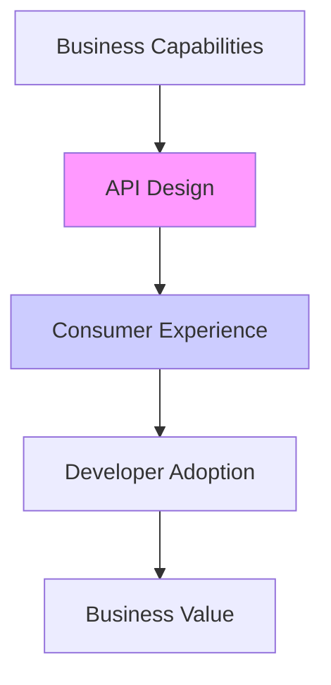

# 🎯 Senior-Level API Design Mastery

_From REST to GraphQL, Authentication to Production Security_

---

## 🧠 **The Senior API Mindset**

> **"APIs are contracts, not implementations. Design for evolution, not perfection."**

**Paradigm Shifts:**

- **From Consumer to Contract Designer** – You're designing interfaces, not just endpoints
- **From Technical to Business-First** – APIs enable business capabilities
- **From Implementation to Evolution** – Design for change and versioning
- **From Local to Global Scale** – APIs are public contracts; breakage affects everyone

---

## 🏗️ **API Architecture Philosophy**

### **The API as a Product**



**Core Principles:**

1. **APIs are forever** – Once published, they're harder to change than your database schema
2. **Design for the consumer** – Empathy for developers using your API
3. **Consistency is king** – Inconsistent APIs are expensive to maintain and use
4. **Documentation is part of the API** – Undocumented features don't exist

---

## 🌐 **Protocol Selection Framework**

### **Protocol Decision Matrix**

```yaml
# When to use which protocol:
HTTP/REST:
  When: Public APIs, Web/Mobile clients, Caching needed
  Why: Ubiquitous, Tooling-rich, Browser-compatible
  Examples: Public SaaS APIs, E-commerce platforms

GraphQL:
  When: Complex data requirements, Multiple client types
  Why: Avoid over/under-fetching, Rapid iteration
  Examples: Dashboard apps, Mobile-first products

gRPC:
  When: Internal services, Performance-critical, Streaming
  Why: Binary format, HTTP/2, Strong typing
  Examples: Microservices, Real-time analytics

WebSockets:
  When: Real-time bidirectional communication
  Why: Low latency, Server push capability
  Examples: Chat, Live dashboards, Collaborative editing

AMQP:
  When: Asynchronous workflows, Event-driven systems
  Why: Guaranteed delivery, Decoupling
  Examples: Order processing, Notification systems
```

### **TCP vs UDP: The Transport Layer Reality**

```typescript
// Senior Engineer's Transport Decision Tree
class TransportSelector {
  selectProtocol(requirements: Requirements): Protocol {
    if (requirements.reliability > requirements.speed) {
      if (requirements.orderedDelivery) {
        return Protocol.TCP;
      }
    }

    if (requirements.speed > requirements.reliability) {
      if (requirements.canTolerateLoss > 0.1) {
        // 10% loss tolerance
        return Protocol.UDP;
      }
    }

    // Default to TCP for web APIs
    return Protocol.TCP;
  }
}

// Real-world examples:
const useCases = {
  paymentProcessing: { reliability: 0.99, speed: 0.7, orderedDelivery: true }, // TCP
  videoStreaming: { reliability: 0.8, speed: 0.95, canTolerateLoss: 0.2 }, // UDP
  chatMessages: { reliability: 0.9, speed: 0.8, orderedDelivery: true }, // TCP
  gameStateUpdates: { reliability: 0.7, speed: 0.99, canTolerateLoss: 0.15 }, // UDP
};
```

---

## 🔄 **REST API Design: Senior Patterns**

### **Resource Modeling Masterclass**

```typescript
// ❌ Junior: Verbs in URLs, inconsistent patterns
GET /getProducts
POST /createProduct
PUT /updateProduct/:id
DELETE /deleteProduct/:id

// ✅ Senior: Resource-based, consistent patterns
// Collection pattern
GET    /products           // List products
POST   /products           // Create product
GET    /products/{id}      // Get product
PUT    /products/{id}      // Replace product
PATCH  /products/{id}      // Update product partially
DELETE /products/{id}      // Delete product

// Sub-resource pattern
GET    /products/{id}/reviews
POST   /products/{id}/reviews
GET    /products/{id}/reviews/{reviewId}
```

### **Advanced Filtering & Querying**

```http
# Senior-level query capabilities
GET /api/v1/products?
  # Filtering
  category=electronics&
  price[gte]=100&
  price[lte]=1000&
  inStock=true&

  # Full-text search
  q=wireless+headphones&

  # Sorting
  sort=-createdAt,price&

  # Pagination (cursor-based)
  cursor=eyJpZCI6IjEyMyIsImNyZWF0ZWRBdCI6IjIwMjMtMDEtMDEifQ&
  limit=20&

  # Field selection
  fields=id,name,price,images[0].url&

  # Related resources
  include=category,manufacturer&

  # Aggregation
  aggregate[avg]=price&
  aggregate[count]=*
```

### **Hypermedia & HATEOAS (Level 3 REST)**

```json
{
  "data": {
    "id": "123",
    "name": "Wireless Headphones",
    "price": 199.99,
    "status": "available"
  },
  "links": {
    "self": { "href": "/products/123", "method": "GET" },
    "update": { "href": "/products/123", "method": "PATCH" },
    "delete": { "href": "/products/123", "method": "DELETE" },
    "reviews": { "href": "/products/123/reviews", "method": "GET" },
    "add_to_cart": {
      "href": "/cart/items",
      "method": "POST",
      "schema": {
        "product_id": "string",
        "quantity": "integer"
      }
    }
  },
  "meta": {
    "version": "v1",
    "server_time": "2024-01-15T10:30:00Z",
    "rate_limit": {
      "limit": 1000,
      "remaining": 987,
      "reset": "2024-01-15T11:30:00Z"
    }
  }
}
```

### **API Versioning Strategies**

```typescript
// Strategy 1: URL Versioning (Most Common)
GET /api/v1/products
GET /api/v2/products

// Strategy 2: Header Versioning
GET /api/products
Headers: { "Accept": "application/vnd.company.v2+json" }

// Strategy 3: Media Type Versioning
GET /api/products
Headers: { "Accept": "application/json; version=2" }

// Strategy 4: Query Parameter (Avoid for public APIs)
GET /api/products?version=2

// Senior Recommendation: Use URL for breaking changes,
// Headers for additive changes, NEVER remove/deprecate without migration path
```

---

## 🕸️ **GraphQL: Beyond Basics**

### **Schema Design Patterns**

```graphql
# Senior-Level Schema Design
type Query {
  # Relay-style connections for pagination
  products(
    first: Int
    after: String
    last: Int
    before: String
    filter: ProductFilter
    sort: [ProductSort!]
  ): ProductConnection!

  # Batch loading pattern
  productsByIds(ids: [ID!]!): [Product]!

  # Search with advanced filtering
  searchProducts(
    query: String!
    filters: SearchFilters
    aggregations: [AggregationRequest!]
  ): SearchResult!
}

type Mutation {
  # Input types for complex mutations
  createProduct(input: CreateProductInput!): CreateProductPayload!
  updateProduct(input: UpdateProductInput!): UpdateProductPayload!

  # Bulk operations
  bulkUpdateProducts(input: [UpdateProductInput!]!): BulkUpdatePayload!
}

# Input Types (Never reuse output types!)
input CreateProductInput {
  name: String!
  price: Decimal!
  categoryId: ID!
  attributes: JSON
}

# Payload pattern for extensibility
type CreateProductPayload {
  product: Product
  errors: [UserError!]
  query: Query # Allow client to refetch related data
}

# Custom scalars for type safety
scalar Decimal
scalar DateTime
scalar JSON
scalar URL

# Interface and union types for polymorphism
interface Node {
  id: ID!
}

union SearchResult = Product | Category | Manufacturer

# Directive-based authorization
directive @auth(requires: Role = USER) on FIELD_DEFINITION
directive @rateLimit(limit: Int!, duration: Int!) on FIELD_DEFINITION
```

### **N+1 Problem Solutions**

```javascript
// ❌ Naive: N+1 queries
const resolvers = {
  Product: {
    async reviews(product) {
      return db.reviews.find({ productId: product.id }); // Query per product!
    },
  },
};

// ✅ Senior: DataLoader pattern
const DataLoader = require("dataloader");

// Batch loader
const reviewsLoader = new DataLoader(async (productIds) => {
  const reviews = await db.reviews.find({ productId: { $in: productIds } });

  // Group by productId
  const reviewsByProduct = {};
  reviews.forEach((review) => {
    if (!reviewsByProduct[review.productId]) {
      reviewsByProduct[review.productId] = [];
    }
    reviewsByProduct[review.productId].push(review);
  });

  // Return in same order as input keys
  return productIds.map((id) => reviewsByProduct[id] || []);
});

const resolvers = {
  Product: {
    async reviews(product) {
      return reviewsLoader.load(product.id); // Batched!
    },
  },
};
```

### **GraphQL Performance Patterns**

```typescript
// 1. Query Complexity Analysis
const complexityLimit = {
  query: 50,
  depth: 7,
  breadth: 10,
};

// 2. Persisted Queries
app.use(
  "/graphql",
  graphqlHTTP({
    schema,
    validationRules: [
      depthLimit(complexityLimit.depth),
      costLimit({ maxCost: 1000, defaultCost: 1 }),
    ],
    extensions: ({ document, variables, operationName, result }) => ({
      // Log performance metrics
      executionTime: result.extensions?.executionTime,
      queryComplexity: calculateComplexity(document),
    }),
  })
);

// 3. Field-level instrumentation
const resolvers = {
  Product: {
    async expensiveField(product, args, context, info) {
      // Add tracing
      const span = context.tracer.startSpan("expensiveField");
      try {
        // Implementation
      } finally {
        span.finish();
      }
    },
  },
};
```

---

## 🔐 **Authentication & Authorization: Production Patterns**

### **JWT Implementation Deep Dive**

```typescript
// Senior JWT Service
import * as jose from "jose";

class AuthService {
  private secret: Uint8Array;
  private alg = "HS256";

  constructor() {
    this.secret = new TextEncoder().encode(process.env.JWT_SECRET);
  }

  async createAccessToken(user: User): Promise<string> {
    return await new jose.SignJWT({
      // Standard claims
      sub: user.id,
      iss: "your-api",
      aud: "your-app",
      iat: Math.floor(Date.now() / 1000),

      // Custom claims
      role: user.role,
      permissions: user.permissions,
      tenant_id: user.tenantId,
    })
      .setProtectedHeader({ alg: this.alg })
      .setExpirationTime("15m") // Short-lived
      .setIssuedAt()
      .sign(this.secret);
  }

  async createRefreshToken(userId: string): Promise<string> {
    const token = crypto.randomBytes(40).toString("hex");

    // Store in database with metadata
    await db.refreshTokens.create({
      token,
      userId,
      expiresAt: new Date(Date.now() + 7 * 24 * 60 * 60 * 1000), // 7 days
      userAgent: req.headers["user-agent"],
      ipAddress: req.ip,
      createdAt: new Date(),
    });

    return token;
  }

  async verifyToken(token: string): Promise<JWTClaims> {
    try {
      const { payload } = await jose.jwtVerify(token, this.secret, {
        issuer: "your-api",
        audience: "your-app",
      });

      // Additional checks
      if (await this.isTokenRevoked(payload.jti)) {
        throw new Error("Token revoked");
      }

      return payload;
    } catch (error) {
      throw new AuthenticationError("Invalid token");
    }
  }

  async refreshTokenFlow(refreshToken: string): Promise<TokenPair> {
    // 1. Validate refresh token exists and isn't expired
    const storedToken = await db.refreshTokens.findValid(refreshToken);
    if (!storedToken) {
      throw new AuthenticationError("Invalid refresh token");
    }

    // 2. Rotate refresh token (security best practice)
    await db.refreshTokens.revoke(storedToken.id);

    // 3. Create new tokens
    const user = await db.users.findById(storedToken.userId);
    const newAccessToken = await this.createAccessToken(user);
    const newRefreshToken = await this.createRefreshToken(user.id);

    // 4. Return new token pair
    return {
      access_token: newAccessToken,
      refresh_token: newRefreshToken,
      expires_in: 900, // 15 minutes in seconds
    };
  }
}
```

### **OAuth 2.0 Implementation**

```typescript
// Senior OAuth 2.0 Provider
class OAuth2Service {
  async authorize(
    clientId: string,
    redirectUri: string,
    scope: string[],
    state: string
  ): Promise<AuthorizationResponse> {
    // 1. Validate client
    const client = await this.validateClient(clientId, redirectUri);

    // 2. Generate authorization code
    const code = this.generateAuthorizationCode({
      clientId,
      userId: req.user.id,
      redirectUri,
      scope,
      expiresAt: Date.now() + 10 * 60 * 1000, // 10 minutes
    });

    // 3. Store code (for later exchange)
    await this.storeAuthorizationCode(code);

    return {
      code,
      state,
      redirect_uri: redirectUri,
    };
  }

  async exchangeCodeForToken(
    code: string,
    clientId: string,
    clientSecret: string,
    redirectUri: string
  ): Promise<TokenResponse> {
    // 1. Validate authorization code
    const authCode = await this.validateAuthorizationCode(
      code,
      clientId,
      clientSecret,
      redirectUri
    );

    // 2. Create tokens
    const accessToken = await this.createAccessToken({
      userId: authCode.userId,
      clientId,
      scope: authCode.scope,
    });

    const refreshToken = await this.createRefreshToken({
      userId: authCode.userId,
      clientId,
    });

    // 3. Clean up used authorization code
    await this.revokeAuthorizationCode(code);

    return {
      access_token: accessToken,
      token_type: "Bearer",
      expires_in: 3600,
      refresh_token: refreshToken,
      scope: authCode.scope.join(" "),
    };
  }
}
```

### **Advanced Authorization Patterns**

```typescript
// Attribute-Based Access Control (ABAC)
class ABACPolicyEngine {
  async evaluate(
    user: User,
    resource: Resource,
    action: string,
    context: Context
  ): Promise<boolean> {
    // Load policies
    const policies = await this.loadPolicies(resource.type, action);

    // Evaluate each policy
    for (const policy of policies) {
      if (await this.evaluatePolicy(policy, user, resource, context)) {
        return policy.effect === "ALLOW";
      }
    }

    // Default deny
    return false;
  }

  private async evaluatePolicy(
    policy: Policy,
    user: User,
    resource: Resource,
    context: Context
  ): Promise<boolean> {
    // Evaluate conditions using a rules engine
    const engine = new RulesEngine();

    // Add facts
    engine.addFact("user", user.attributes);
    engine.addFact("resource", resource.attributes);
    engine.addFact("environment", context);

    // Run rules
    const results = await engine.run(policy.rules);

    return results.passed;
  }
}

// Usage
const canEdit = await policyEngine.evaluate(user, document, "edit", {
  timeOfDay: "09:00",
  location: "office",
});
```

---

## 🛡️ **Security: Beyond Basic Protection**

### **Rate Limiting: Advanced Patterns**

```typescript
// Token Bucket + Sliding Window Rate Limiter
class RateLimiter {
  private redis: Redis;
  private strategies: Map<string, RateLimitStrategy>;

  constructor() {
    this.strategies = new Map([
      ["token_bucket", new TokenBucketStrategy()],
      ["sliding_window", new SlidingWindowStrategy()],
      ["fixed_window", new FixedWindowStrategy()],
    ]);
  }

  async checkLimit(
    key: string,
    strategy: string = "sliding_window",
    limit: number = 100,
    windowMs: number = 60000
  ): Promise<RateLimitResult> {
    const limiter = this.strategies.get(strategy);
    if (!limiter) throw new Error("Invalid strategy");

    return await limiter.check(key, limit, windowMs);
  }
}

// Multiple strategies implementation
class SlidingWindowStrategy {
  async check(
    key: string,
    limit: number,
    windowMs: number
  ): Promise<RateLimitResult> {
    const now = Date.now();
    const windowStart = now - windowMs;

    // Get requests in current window
    const requests = await this.redis.zrangebyscore(
      `ratelimit:${key}`,
      windowStart,
      now
    );

    if (requests.length >= limit) {
      // Calculate reset time (oldest request + window)
      const oldestRequest = Math.min(...requests.map((r) => parseInt(r)));
      const resetTime = oldestRequest + windowMs;

      return {
        allowed: false,
        remaining: 0,
        reset: new Date(resetTime),
        retryAfter: Math.ceil((resetTime - now) / 1000),
      };
    }

    // Add current request
    await this.redis.zadd(`ratelimit:${key}`, now, now.toString());
    await this.redis.expire(`ratelimit:${key}`, Math.ceil(windowMs / 1000));

    return {
      allowed: true,
      remaining: limit - (requests.length + 1),
      reset: new Date(now + windowMs),
    };
  }
}

// Usage with headers
app.use(async (req, res, next) => {
  const key = `ip:${req.ip}:${req.path}`;
  const result = await rateLimiter.checkLimit(
    key,
    "sliding_window",
    100,
    60000
  );

  if (!result.allowed) {
    res.setHeader("X-RateLimit-Limit", "100");
    res.setHeader("X-RateLimit-Remaining", "0");
    res.setHeader(
      "X-RateLimit-Reset",
      Math.floor(result.reset.getTime() / 1000)
    );
    res.setHeader("Retry-After", result.retryAfter);

    return res.status(429).json({
      error: "Too Many Requests",
      message: `Rate limit exceeded. Try again in ${result.retryAfter} seconds.`,
    });
  }

  res.setHeader("X-RateLimit-Limit", "100");
  res.setHeader("X-RateLimit-Remaining", result.remaining.toString());
  res.setHeader("X-RateLimit-Reset", Math.floor(result.reset.getTime() / 1000));

  next();
});
```

### **Advanced CORS Configuration**

```typescript
// Production CORS Configuration
const corsOptions = {
  origin: (origin, callback) => {
    // Allow requests with no origin (like mobile apps, curl)
    if (!origin) return callback(null, true);

    const allowedOrigins = [
      "https://app.yourdomain.com",
      "https://admin.yourdomain.com",
      "https://staging.yourdomain.com",
      process.env.NODE_ENV === "development" && "http://localhost:3000",
    ].filter(Boolean);

    if (allowedOrigins.indexOf(origin) !== -1) {
      callback(null, true);
    } else {
      // Log unauthorized origins for security monitoring
      console.warn(`Blocked CORS request from origin: ${origin}`);
      callback(new Error("Not allowed by CORS"));
    }
  },

  credentials: true, // Allow cookies/auth headers

  allowedHeaders: [
    "Content-Type",
    "Authorization",
    "X-Requested-With",
    "X-CSRF-Token",
    "X-API-Version",
    "Accept",
    "Accept-Language",
    "Cache-Control",
  ],

  exposedHeaders: [
    "X-RateLimit-Limit",
    "X-RateLimit-Remaining",
    "X-RateLimit-Reset",
    "X-API-Version",
    "X-Request-ID",
  ],

  methods: ["GET", "POST", "PUT", "PATCH", "DELETE", "OPTIONS"],

  maxAge: 86400, // 24 hours for preflight cache

  preflightContinue: false,

  optionsSuccessStatus: 204,
};

// Dynamic CORS for multi-tenant
app.use((req, res, next) => {
  const origin = req.headers.origin;

  // Check if origin matches a tenant's domain
  if (origin) {
    const tenant = await tenantService.findByDomain(new URL(origin).hostname);
    if (tenant) {
      res.setHeader("Access-Control-Allow-Origin", origin);
      res.setHeader("Access-Control-Allow-Credentials", "true");
      return next();
    }
  }

  // Default to strict CORS
  cors(corsOptions)(req, res, next);
});
```

### **Comprehensive Security Middleware**

```typescript
// Security Middleware Stack
app.use(
  helmet({
    contentSecurityPolicy: {
      directives: {
        defaultSrc: ["'self'"],
        styleSrc: ["'self'", "'unsafe-inline'"],
        scriptSrc: ["'self'"],
        imgSrc: ["'self'", "data:", "https:"],
        connectSrc: ["'self'", "https://api.yourdomain.com"],
        fontSrc: ["'self'"],
        objectSrc: ["'none'"],
        mediaSrc: ["'self'"],
        frameSrc: ["'none'"],
      },
    },

    hsts: {
      maxAge: 31536000,
      includeSubDomains: true,
      preload: true,
    },

    frameguard: { action: "deny" },

    hidePoweredBy: true,

    ieNoOpen: true,

    noSniff: true,

    xssFilter: true,

    referrerPolicy: { policy: "strict-origin-when-cross-origin" },
  })
);

// Request ID for tracing
app.use((req, res, next) => {
  req.id = crypto.randomUUID();
  res.setHeader("X-Request-ID", req.id);
  next();
});

// Input validation and sanitization
app.use(
  express.json({
    limit: "1mb",
    verify: (req, res, buf) => {
      try {
        JSON.parse(buf.toString());
      } catch (e) {
        throw new Error("Invalid JSON");
      }
    },
  })
);

// SQL/NoSQL injection protection
app.use((req, res, next) => {
  // Sanitize query parameters
  if (req.query) {
    Object.keys(req.query).forEach((key) => {
      if (typeof req.query[key] === "string") {
        req.query[key] = sanitize(req.query[key]);
      }
    });
  }

  // Sanitize body
  if (req.body) {
    req.body = sanitize(req.body);
  }

  next();
});

// CSRF protection for state-changing methods
app.use(
  csrf({
    cookie: {
      httpOnly: true,
      secure: process.env.NODE_ENV === "production",
      sameSite: "strict",
    },

    // Skip for API tokens
    ignoreMethods: ["GET", "HEAD", "OPTIONS"],

    value: (req) => {
      return req.headers["x-csrf-token"] || req.body._csrf;
    },
  })
);
```

---

## 📊 **API Monitoring & Observability**

### **Structured Logging**

```typescript
// Winston Logger with context
const logger = winston.createLogger({
  level: process.env.LOG_LEVEL || "info",
  format: winston.format.combine(
    winston.format.timestamp(),
    winston.format.errors({ stack: true }),
    winston.format.json()
  ),
  defaultMeta: { service: "api-service" },
  transports: [
    new winston.transports.File({ filename: "error.log", level: "error" }),
    new winston.transports.File({ filename: "combined.log" }),
  ],
});

// Request logging middleware
app.use((req, res, next) => {
  const start = Date.now();

  // Capture response
  const originalSend = res.send;
  res.send = function (body) {
    const duration = Date.now() - start;

    logger.info("request", {
      requestId: req.id,
      method: req.method,
      url: req.url,
      statusCode: res.statusCode,
      duration,
      userAgent: req.get("User-Agent"),
      ip: req.ip,
      userId: req.user?.id,
      query: req.query,
      bodySize: Buffer.byteLength(body || ""),
      // Never log sensitive data!
    });

    return originalSend.call(this, body);
  };

  next();
});

// Error logging
app.use((error, req, res, next) => {
  logger.error("api_error", {
    requestId: req.id,
    error: {
      message: error.message,
      stack: error.stack,
      code: error.code,
      details: error.details,
    },
    url: req.url,
    method: req.method,
    userId: req.user?.id,
    ip: req.ip,
  });

  next(error);
});
```

### **Metrics Collection**

```typescript
// Prometheus metrics
const client = require("prom-client");
const register = new client.Registry();

// Custom metrics
const httpRequestDuration = new client.Histogram({
  name: "http_request_duration_seconds",
  help: "Duration of HTTP requests in seconds",
  labelNames: ["method", "route", "status_code"],
  buckets: [0.1, 0.5, 1, 2, 5, 10],
});

const httpRequestsTotal = new client.Counter({
  name: "http_requests_total",
  help: "Total HTTP requests",
  labelNames: ["method", "route", "status_code"],
});

const activeConnections = new client.Gauge({
  name: "active_connections",
  help: "Number of active connections",
});

register.registerMetric(httpRequestDuration);
register.registerMetric(httpRequestsTotal);
register.registerMetric(activeConnections);

// Metrics middleware
app.use((req, res, next) => {
  const end = httpRequestDuration.startTimer();
  const route = req.route?.path || req.path;

  res.on("finish", () => {
    const labels = {
      method: req.method,
      route,
      status_code: res.statusCode,
    };

    end(labels);
    httpRequestsTotal.inc(labels);
  });

  next();
});

// Expose metrics endpoint
app.get("/metrics", async (req, res) => {
  res.set("Content-Type", register.contentType);
  res.end(await register.metrics());
});
```

### **Distributed Tracing**

```typescript
// OpenTelemetry setup
const { NodeTracerProvider } = require("@opentelemetry/node");
const { SimpleSpanProcessor } = require("@opentelemetry/tracing");
const { JaegerExporter } = require("@opentelemetry/exporter-jaeger");

const provider = new NodeTracerProvider();
provider.register();

const exporter = new JaegerExporter({
  serviceName: "api-service",
  endpoint: "http://jaeger:14268/api/traces",
});

provider.addSpanProcessor(new SimpleSpanProcessor(exporter));

// Tracing middleware
app.use((req, res, next) => {
  const tracer = opentelemetry.trace.getTracer("api-tracer");
  const span = tracer.startSpan("http_request", {
    attributes: {
      "http.method": req.method,
      "http.url": req.url,
      "http.user_agent": req.get("User-Agent"),
      "http.client_ip": req.ip,
    },
  });

  // Add span to request context
  req.span = span;

  res.on("finish", () => {
    span.setAttribute("http.status_code", res.statusCode);
    span.end();
  });

  next();
});

// Database tracing
const tracedQuery = async (query: string, params: any[], span: Span) => {
  const dbSpan = tracer.startSpan("database_query", {
    parent: span,
  });

  try {
    dbSpan.setAttribute("db.query", query);
    dbSpan.setAttribute("db.params", JSON.stringify(params));

    const result = await db.query(query, params);

    dbSpan.setAttribute("db.row_count", result.rowCount);
    dbSpan.end();

    return result;
  } catch (error) {
    dbSpan.setAttribute("db.error", error.message);
    dbSpan.setStatus({ code: 2, message: error.message }); // ERROR
    dbSpan.end();

    throw error;
  }
};
```

---

## 🔄 **API Evolution & Versioning**

### **Versioning Strategy**

```typescript
// Semantic Versioning for APIs
class APIVersionManager {
  private versions: Map<string, APIVersion>;

  constructor() {
    this.versions = new Map();
  }

  async registerVersion(version: APIVersion): Promise<void> {
    // Validate version format (semver)
    if (!this.isValidSemver(version.version)) {
      throw new Error("Invalid version format");
    }

    // Check for breaking changes
    if (version.breakingChanges.length > 0) {
      await this.scheduleDeprecation(version);
    }

    this.versions.set(version.version, version);
  }

  async handleRequest(req: Request): Promise<Response> {
    const requestedVersion = this.extractVersion(req);
    const version = this.versions.get(requestedVersion);

    if (!version) {
      // Version negotiation
      const compatibleVersion = this.findCompatibleVersion(requestedVersion);

      if (compatibleVersion) {
        return this.handleWithCompatibility(req, compatibleVersion);
      }

      throw new APIVersionError(
        `Version ${requestedVersion} not supported. ` +
          `Supported versions: ${Array.from(this.versions.keys()).join(", ")}`
      );
    }

    return version.handle(req);
  }

  private findCompatibleVersion(requested: string): APIVersion | null {
    // Implementation of semantic version compatibility
    // e.g., ^1.2.3 matches 1.2.4, 1.3.0, but not 2.0.0
    return null;
  }
}
```

### **Breaking Change Management**

```typescript
// Breaking Change Process
class BreakingChangeManager {
  async introduceBreakingChange(
    change: BreakingChange,
    currentVersion: string
  ): Promise<MigrationPlan> {
    // 1. Announce deprecation
    await this.announceDeprecation(change, currentVersion);

    // 2. Provide migration guide
    const migrationGuide = await this.createMigrationGuide(change);

    // 3. Schedule removal
    const removalDate = new Date();
    removalDate.setMonth(removalDate.getMonth() + 6); // 6 months notice

    // 4. Create compatibility layer
    const compatibilityLayer = await this.createCompatibilityLayer(change);

    return {
      deprecationNotice: change.description,
      migrationGuide,
      removalDate,
      compatibilityLayer,
      affectedEndpoints: change.affectedEndpoints,
    };
  }

  async handleDeprecatedRequest(req: Request): Promise<Response> {
    // Return deprecated endpoint response
    return {
      status: 410, // Gone
      body: {
        error: "This endpoint has been deprecated",
        message: "Please migrate to the new endpoint",
        documentation: "https://api.yourdomain.com/migration-guide",
        sunset: "2024-06-30T00:00:00Z",
      },
      headers: {
        Deprecation: "true",
        Sunset: "Sat, 30 Jun 2024 00:00:00 GMT",
        Link: '<https://api.yourdomain.com/v2/users>; rel="successor-version"',
      },
    };
  }
}
```

---

## 🚀 **API Performance Optimization**

### **Caching Strategies**

```typescript
// Multi-layer Caching Strategy
class CacheManager {
  private layers: CacheLayer[];

  constructor() {
    this.layers = [
      new MemoryCacheLayer({ ttl: 1000, maxSize: 1000 }), // L1: In-memory
      new RedisCacheLayer({ ttl: 60000 }), // L2: Redis
      new CDNCacheLayer(), // L3: CDN for static assets
    ];
  }

  async get<T>(key: string): Promise<T | null> {
    // Check each layer
    for (const layer of this.layers) {
      const value = await layer.get(key);
      if (value !== null) {
        // Populate higher layers (cache warming)
        await this.warmUpperLayers(key, value, layer);
        return value;
      }
    }

    return null;
  }

  async set(
    key: string,
    value: any,
    options: CacheOptions = {}
  ): Promise<void> {
    // Set in all layers with appropriate TTLs
    const promises = this.layers.map((layer, index) => {
      const layerTtl = options.ttl ? options.ttl / (index + 1) : undefined;
      return layer.set(key, value, { ...options, ttl: layerTtl });
    });

    await Promise.all(promises);
  }
}

// Cache patterns
const cachePatterns = {
  // Cache Aside (Lazy Loading)
  cacheAside: async (key: string, fetchFn: () => Promise<any>) => {
    const cached = await cache.get(key);
    if (cached) return cached;

    const fresh = await fetchFn();
    await cache.set(key, fresh);
    return fresh;
  },

  // Write Through
  writeThrough: async (
    key: string,
    value: any,
    writeFn: () => Promise<void>
  ) => {
    await cache.set(key, value);
    await writeFn();
  },

  // Write Behind
  writeBehind: async (
    key: string,
    value: any,
    writeFn: () => Promise<void>
  ) => {
    await cache.set(key, value);
    // Queue for async write
    writeQueue.push(() => writeFn());
  },
};
```

### **Connection Pooling & Keep-Alive**

```typescript
// Database Connection Pool
import { Pool } from "pg";

const pool = new Pool({
  host: process.env.DB_HOST,
  port: parseInt(process.env.DB_PORT || "5432"),
  database: process.env.DB_NAME,
  user: process.env.DB_USER,
  password: process.env.DB_PASSWORD,

  // Connection pool settings
  max: 20, // maximum number of clients in the pool
  idleTimeoutMillis: 30000, // how long a client is allowed to remain idle
  connectionTimeoutMillis: 2000, // how long to wait for connection
  ssl:
    process.env.NODE_ENV === "production"
      ? {
          rejectUnauthorized: false,
        }
      : false,
});

// HTTP Keep-Alive
const apiClient = axios.create({
  baseURL: "https://api.external.com",
  timeout: 10000,

  // HTTP/2 if available
  httpAgent: new http.Agent({ keepAlive: true }),
  httpsAgent: new https.Agent({ keepAlive: true }),

  // Connection pooling
  maxRedirects: 5,
  maxContentLength: 50 * 1000 * 1000, // 50MB

  // Retry logic
  retry: {
    retries: 3,
    retryDelay: (retryCount) => {
      return Math.pow(2, retryCount) * 1000; // Exponential backoff
    },
    retryCondition: (error) => {
      return (
        axios.isRetryableError(error) ||
        error.code === "ECONNRESET" ||
        error.code === "ETIMEDOUT"
      );
    },
  },
});
```

---

## 📝 **API Documentation & Developer Experience**

### **OpenAPI/Swagger Implementation**

```yaml
# OpenAPI 3.0 Specification (Senior Level)
openapi: 3.0.3
info:
  title: Product API
  description: |
    # Product Management API

    This API allows you to manage products in our catalog.

    ## Rate Limiting
    - 100 requests per minute per API key
    - Contact support for higher limits

    ## Authentication
    All endpoints require Bearer token authentication.

    ## Versioning
    Current version: v1
    [Migration guide to v2](https://api.example.com/migration-guide)

  version: 1.0.0
  contact:
    name: API Support
    email: api-support@example.com
    url: https://api.example.com/support
  license:
    name: Proprietary
    url: https://api.example.com/license

servers:
  - url: https://api.example.com/v1
    description: Production server
  - url: https://staging-api.example.com/v1
    description: Staging server
  - url: http://localhost:3000/v1
    description: Local development

paths:
  /products:
    get:
      summary: List products
      description: |
        Returns a paginated list of products.

        ### Filtering
        You can filter products by:
        - category
        - price range
        - availability

        ### Sorting
        Sort by:
        - price (asc/desc)
        - createdAt (asc/desc)
        - popularity (desc)

      operationId: listProducts
      tags:
        - Products
      security:
        - BearerAuth: []
      parameters:
        - $ref: "#/components/parameters/Page"
        - $ref: "#/components/parameters/Limit"
        - $ref: "#/components/parameters/Sort"
        - $ref: "#/components/parameters/Filter"
      responses:
        "200":
          description: Successful response
          content:
            application/json:
              schema:
                $ref: "#/components/schemas/ProductList"
              examples:
                success:
                  value:
                    data:
                      - id: "prod_123"
                        name: "Wireless Headphones"
                        price: 199.99
                    meta:
                      page: 1
                      limit: 20
                      total: 150
                    links:
                      self: "/v1/products?page=1&limit=20"
                      next: "/v1/products?page=2&limit=20"
                      last: "/v1/products?page=8&limit=20"
        "400":
          $ref: "#/components/responses/BadRequest"
        "401":
          $ref: "#/components/responses/Unauthorized"
        "429":
          $ref: "#/components/responses/TooManyRequests"
      x-code-samples:
        - lang: curl
          source: |
            curl -X GET "https://api.example.com/v1/products" \
              -H "Authorization: Bearer $ACCESS_TOKEN"
        - lang: JavaScript
          source: |
            const response = await fetch('https://api.example.com/v1/products', {
              headers: {
                'Authorization': `Bearer ${accessToken}`
              }
            });

            const data = await response.json();
```

### **Interactive Documentation**

```typescript
// Swagger UI with customizations
app.use(
  "/api-docs",
  swaggerUi.serve,
  swaggerUi.setup(swaggerSpec, {
    explorer: true,
    customCss: ".swagger-ui .topbar { display: none }",
    customSiteTitle: "Product API Documentation",
    customfavIcon: "/favicon.ico",

    swaggerOptions: {
      persistAuthorization: true,
      displayRequestDuration: true,
      docExpansion: "list",
      filter: true,
      showExtensions: true,
      showCommonExtensions: true,

      // Try-it-out functionality
      tryItOutEnabled: true,

      // Authentication
      oauth2RedirectUrl: `${baseUrl}/api-docs/oauth2-redirect.html`,
      initOAuth: {
        clientId: process.env.OAUTH_CLIENT_ID,
        appName: "Product API",
        usePkceWithAuthorizationCodeGrant: true,
      },
    },

    // Custom middleware for authentication
    middleware: (req, res, next) => {
      // Add request ID to all requests
      req.headers["X-Request-ID"] = crypto.randomUUID();
      next();
    },
  })
);

// ReDoc for alternative documentation
app.use("/redoc", express.static("redoc.html"));
```

---

## 🧪 **Testing Strategy**

### **API Testing Pyramid**

```typescript
// 1. Unit Tests (70%)
describe("ProductService", () => {
  it("should validate product creation", async () => {
    const service = new ProductService(mockRepo, mockCache);
    await expect(service.create({})).rejects.toThrow("Invalid product");
  });
});

// 2. Integration Tests (20%)
describe("Product API Integration", () => {
  let app: Express;
  let agent: SuperTest;

  beforeAll(async () => {
    app = await createTestApp();
    agent = request(app);
  });

  it("GET /products returns 200", async () => {
    const response = await agent
      .get("/api/v1/products")
      .set("Authorization", `Bearer ${testToken}`);

    expect(response.status).toBe(200);
    expect(response.body).toHaveProperty("data");
  });
});

// 3. Contract Tests (5%)
describe("API Contract", () => {
  it("should match OpenAPI specification", async () => {
    const validator = new OpenAPIValidator({
      apiSpec: "./openapi.yaml",
      validateRequests: true,
      validateResponses: true,
    });

    await validator.validate({
      method: "get",
      path: "/products",
      headers: { authorization: "Bearer token" },
      query: { page: "1", limit: "20" },
    });
  });
});

// 4. Performance Tests (5%)
describe("API Performance", () => {
  it("should handle 1000 requests per minute", async () => {
    const results = await k6.run({
      vus: 50,
      duration: "1m",
      thresholds: {
        http_req_duration: ["p(95)<200"],
        http_req_failed: ["rate<0.01"],
      },
    });

    expect(results.metrics.http_req_duration.values["p(95)"]).toBeLessThan(200);
  });
});
```

---

## 🚀 **Deployment & DevOps**

### **API Gateway Configuration**

```yaml
# Kong API Gateway Configuration
_format_version: "2.1"
_transform: true

services:
  - name: product-service
    url: http://product-service:3000
    routes:
      - name: product-routes
        paths:
          - /api/v1/products
          - /api/v1/products/*
        methods:
          - GET
          - POST
          - PUT
          - PATCH
          - DELETE
        strip_path: true
        plugins:
          - name: rate-limiting
            config:
              minute: 100
              policy: local
          - name: cors
            config:
              origins:
                - https://app.example.com
              methods:
                - GET
                - POST
                - PUT
                - PATCH
                - DELETE
                - OPTIONS
              credentials: true
          - name: request-transformer
            config:
              add:
                headers:
                  - X-Forwarded-For: $(socket.remote_address)
          - name: key-auth
            config:
              hide_credentials: true
          - name: prometheus
            config:
              metrics: all

  - name: user-service
    url: http://user-service:3001
    routes:
      - name: user-routes
        paths:
          - /api/v1/users
          - /api/v1/users/*
        strip_path: true
        plugins:
          - name: rate-limiting
            config:
              minute: 50
          - name: oauth2
            config:
              enable_authorization_code: true
              enable_client_credentials: true
              enable_password_grant: false
              enable_implicit_grant: false
```

---

## 📈 **Senior API Metrics Dashboard**

### **Key Metrics to Monitor**

```typescript
interface APIMetrics {
  // Business Metrics
  totalRequests: number;
  activeUsers: number;
  revenuePerRequest: number;

  // Performance Metrics
  p95Latency: number;
  errorRate: number;
  availability: number;

  // Usage Metrics
  topEndpoints: Array<{ endpoint: string; count: number }>;
  userAgentDistribution: Record<string, number>;
  geographicDistribution: Record<string, number>;

  // Quality Metrics
  schemaValidationErrors: number;
  deprecationUsage: number;
  clientErrorsVsServerErrors: { client: number; server: number };

  // Cost Metrics
  costPerRequest: number;
  cacheHitRate: number;
  bandwidthUsage: number;
}
```

### **Alerting Rules**

```yaml
# Prometheus Alert Rules
groups:
  - name: api_alerts
    rules:
      - alert: HighErrorRate
        expr: |
          rate(http_requests_total{status=~"5.."}[5m]) 
          / rate(http_requests_total[5m]) 
          > 0.05
        for: 5m
        labels:
          severity: critical
        annotations:
          summary: "High error rate on {{ $labels.endpoint }}"
          description: "Error rate is {{ $value | humanizePercentage }} for {{ $labels.endpoint }}"

      - alert: HighLatency
        expr: |
          histogram_quantile(0.95, rate(http_request_duration_seconds_bucket[5m])) > 1
        for: 10m
        labels:
          severity: warning
        annotations:
          summary: "High latency on {{ $labels.endpoint }}"
          description: "95th percentile latency is {{ $value }}s"

      - alert: RateLimitHit
        expr: |
          increase(rate_limit_hits_total[1h]) > 100
        labels:
          severity: warning
        annotations:
          summary: "High rate limit usage"
          description: "{{ $value }} rate limit hits in the last hour"

      - alert: DeprecatedEndpointUsage
        expr: |
          increase(deprecated_endpoint_usage_total[24h]) > 1000
        labels:
          severity: info
        annotations:
          summary: "High deprecated endpoint usage"
          description: "Consider accelerating migration"
```

---

## 🎯 **Senior API Designer Checklist**

### **Design Review Checklist**

```markdown
## API Design Review (Senior Level)

### Consistency

- [ ] Naming conventions followed (camelCase vs snake_case)
- [ ] Error response format consistent across endpoints
- [ ] Pagination pattern consistent (cursor vs offset)
- [ ] Date/time format consistent (ISO 8601)

### Security

- [ ] Authentication method appropriate (OAuth 2.0, JWT)
- [ ] Authorization implemented (RBAC/ABAC)
- [ ] Rate limiting configured per endpoint/user
- [ ] Input validation and sanitization
- [ ] SQL/NoSQL injection prevention
- [ ] CORS properly configured
- [ ] HTTPS enforced

### Performance

- [ ] Pagination implemented for list endpoints
- [ ] Filtering and sorting supported
- [ ] Field selection (sparse fieldsets)
- [ ] Caching strategy (CDN, Redis, in-memory)
- [ ] Connection pooling configured
- [ ] Payload size optimized

### Developer Experience

- [ ] OpenAPI/Swagger documentation
- [ ] SDKs available for common languages
- [ ] Clear error messages with actionable advice
- [ ] Versioning strategy documented
- [ ] Migration guides for breaking changes
- [ ] Interactive documentation (try-it-out)

### Operational Excellence

- [ ] Health check endpoint
- [ ] Metrics endpoint (Prometheus format)
- [ ] Structured logging with correlation IDs
- [ ] Distributed tracing headers
- [ ] Alerting configured for SLO breaches
- [ ] Rate limit headers (RFC 6585)

### Business Alignment

- [ ] API aligns with business capabilities
- [ ] Pricing/tiering strategy if applicable
- [ ] Usage analytics implemented
- [ ] Deprecation policy documented
- [ ] SLAs documented and measurable
```

---

## 🚀 **Your 90-Day API Mastery Plan**

### **Month 1: Foundation & Design**

```markdown
Week 1-2: REST API Design

- Design and implement a REST API with proper resource modeling
- Implement filtering, sorting, pagination
- Add comprehensive error handling

Week 3-4: Authentication & Security

- Implement JWT authentication with refresh tokens
- Add rate limiting and security headers
- Implement input validation and sanitization
```

### **Month 2: Advanced Patterns**

```markdown
Week 5-6: GraphQL Implementation

- Design and implement a GraphQL API
- Solve N+1 problems with DataLoader
- Implement query complexity limiting

Week 7-8: Performance & Caching

- Implement multi-layer caching (Redis, CDN)
- Add connection pooling and keep-alive
- Implement API gateway patterns
```

### **Month 3: Production Excellence**

```markdown
Week 9-10: Monitoring & Observability

- Implement structured logging
- Add metrics collection (Prometheus)
- Set up distributed tracing

Week 11-12: DevOps & Deployment

- Create OpenAPI specifications
- Set up CI/CD with contract testing
- Implement canary deployments
```

---

## 📚 **Senior API Resources**

### **Must-Read Books**

1. **"Designing Web APIs"** - Brenda Jin, Saurabh Sahni, Amir Shevat
2. **"The Design of Web APIs"** - Arnaud Lauret
3. **"API Security in Action"** - Neil Madden
4. **"Building Microservices"** - Sam Newman (for API design in distributed systems)

### **Essential Tools**

- **Postman/Insomnia** - API testing and documentation
- **Stoplight** - API design and documentation
- **Kong/Tyk** - API gateway
- **Prisma/Hasura** - GraphQL tooling
- **Swagger/OpenAPI** - API specification

### **Communities to Follow**

- API Craft Slack
- APIs You Won't Hate Newsletter
- Nordic APIs blog
- Postman API Network

---

> **Remember:** Senior API design isn't about knowing every technology—it's about making the right trade-offs for your specific context. The best API is the one that solves the business problem while being a joy for developers to use.

**Your next step:** Pick ONE aspect of API design (security, performance, documentation) and implement it at production level in your current project. Measure the impact. Iterate. 🚀

---

_Great APIs are invisible—they just work, scale, and evolve gracefully._
