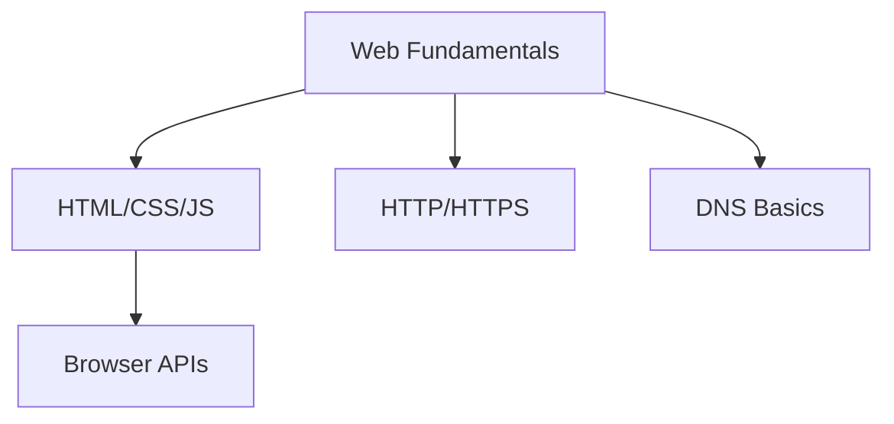
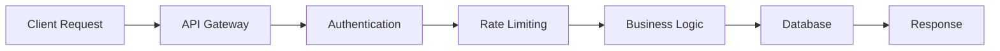
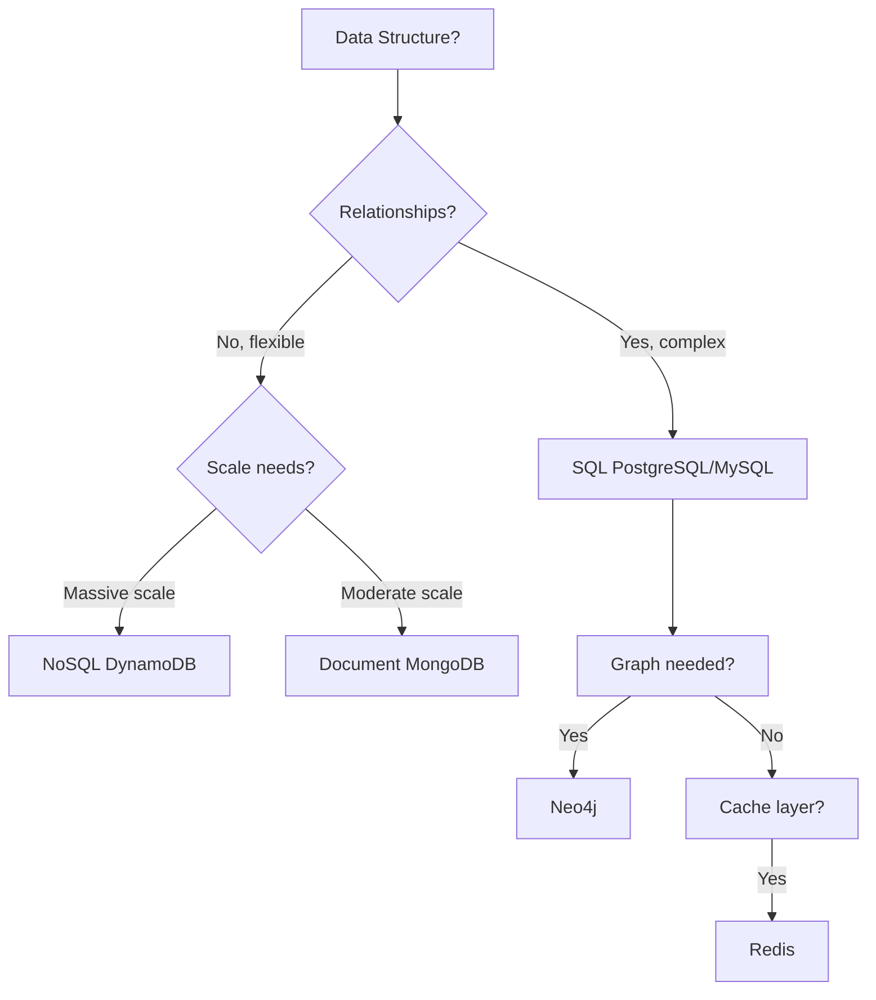
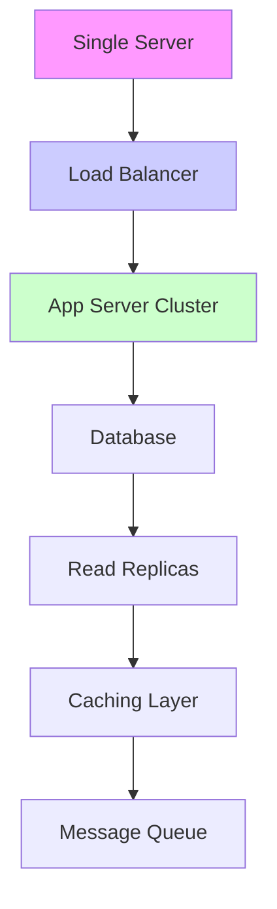
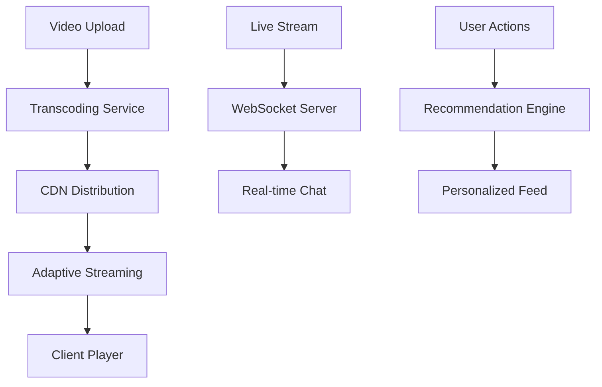

# 🚀 Full-Stack Developer Roadmap & Learning Strategy

_A Comprehensive Guide to Modern Web Development_

---

## 🎯 **Core Learning Philosophy**

> **"Don't memorize—implement. Build projects to understand concepts in context."**

### 📌 Key Principles:

- **Learn by doing** – Concepts stick better when implemented in real projects
- **Start simple, then scale** – Begin with basics, add complexity gradually
- **Context over memorization** – Understand _why_ and _when_ to use each tool/pattern
- **Project-first approach** – Choose ambitious projects that force you to learn multiple concepts

---

## 🎨 **Front-End Development**

### **Foundation Layer**



- **Essential Basics:**
  - ✅ **HTML5** – Semantic markup, accessibility
  - ✅ **CSS3** – Flexbox, Grid, animations, responsive design
  - ✅ **JavaScript (ES6+)** – Modern syntax, async/await, modules
  - ✅ **Browser DevTools** – Debugging, performance profiling
  - ✅ **Web APIs** – DOM manipulation, Fetch API, Storage

### **Framework Ecosystem**

| Category            | Technologies             | When to Choose                                 |
| ------------------- | ------------------------ | ---------------------------------------------- |
| **React Ecosystem** | React, Next.js, Remix    | SPAs, SEO-heavy sites, full-stack JS           |
| **Vue Ecosystem**   | Vue, Nuxt.js             | Progressive enhancement, gentle learning curve |
| **Angular**         | Angular                  | Enterprise, TypeScript-first, full framework   |
| **Meta-Frameworks** | Next.js, Nuxt, SvelteKit | Full-stack apps, SSR/SSG needs                 |

### **Key Concepts to Master**

1. **State Management**

   - Component state vs. global state
   - Context API, Redux, Zustand, Recoil
   - Server state (React Query, SWR)

2. **Rendering Strategies**

   ```
   SSR → SEO friendly, slower TTFB
   CSR → Fast interactions, poor SEO
   SSG → Blazing fast, static content
   ISR → Hybrid approach (Next.js)
   ```

3. **Performance Optimization**

   - 📦 **Bundle Analysis** – Webpack Bundle Analyzer
   - 🖼️ **Image Optimization** – Next.js Image, WebP format
   - 🔄 **Code Splitting** – Dynamic imports, route-based splitting
   - ⏳ **Lazy Loading** – Components, images, libraries

4. **SEO & Accessibility**

   - Semantic HTML structure
   - Meta tags, Open Graph, structured data
   - ARIA labels, keyboard navigation
   - Lighthouse audits

5. **Testing Pyramid**

   ```
   Unit Tests (Jest) → Components/Utils
   Integration Tests → User flows
   E2E Tests (Cypress) → Full scenarios
   ```

6. **Mobile Development Bridge**
   - **React Native** – Leverage React knowledge
   - **Flutter** – Single codebase, performant
   - **PWA** – Web to app conversion

---

## ⚙️ **Back-End Development**

### **Runtime Selection Guide**

```
┌─────────────┬─────────────────────────────┐
│ Use Case    │ Recommended Runtime         │
├─────────────┼─────────────────────────────┤
│ Fast MVP    │ Node.js + Express           │
│ Enterprise  │ Java/Spring or C#/.NET      │
│ Data Science│ Python (Django/Flask)       │
│ Performance │ Go or Rust                  │
└─────────────┴─────────────────────────────┘
```

### **API Design & Architecture**



#### **REST vs GraphQL Decision Matrix**

| Criteria                | REST                  | GraphQL                |
| ----------------------- | --------------------- | ---------------------- |
| **Data Fetching**       | Multiple endpoints    | Single endpoint        |
| **Over/Under-fetching** | Common problem        | Eliminated             |
| **Versioning**          | URL versioning        | No versioning needed   |
| **Caching**             | HTTP caching built-in | Client-side caching    |
| **Complexity**          | Simple to moderate    | Steeper learning curve |

### **Critical Backend Concepts**

#### 1. **Authentication & Authorization**

```
Token-based (JWT) → Stateless, scalable
Session-based → Stateful, simpler invalidation
OAuth 2.0 → Third-party login
API Keys → Service-to-service
```

#### 2. **Data Flow & Processing**

- **Request Validation** – Zod, Joi, class-validator
- **File Uploads** – Multipart forms, streaming, CDN integration
- **Background Jobs** – Bull (Redis), Celery (Python)
- **Real-time Features** – WebSockets (Socket.io), Server-Sent Events

#### 3. **Third-Party Integrations**

```
Payment → Stripe, PayPal
Email → SendGrid, AWS SES
SMS → Twilio
Maps → Google Maps, Mapbox
Analytics → Mixpanel, Google Analytics
```

#### 4. **Architecture Patterns**

- **MVC** – Separation of concerns
- **Repository Pattern** – Abstract data access
- **Dependency Injection** – Testable, modular code
- **Clean Architecture** – Business logic independence

---

## 🗄️ **Databases Deep Dive**

### **Database Selection Framework**



### **SQL Database Mastery**

```sql
-- Essential Relationships
1:1 → User ↔ UserProfile
1:N → User ↔ Posts
N:N → Posts ↔ Tags (through junction table)

-- Performance Checklist
☑️ Proper indexing (WHERE, JOIN, ORDER BY columns)
☑️ Query optimization (EXPLAIN ANALYZE)
☑️ Connection pooling
☑️ Read replicas for scaling
```

### **Advanced Database Concepts**

1. **Transactions & ACID**

   - Atomicity – All or nothing
   - Consistency – Valid state transitions
   - Isolation – Concurrent execution control
   - Durability – Committed data persists

2. **Replication Strategies**

   ```
   Master-Slave → Read scaling
   Master-Master → High availability
   Multi-region → Geographic distribution
   ```

3. **Backup & Recovery**
   - Automated backups (daily/weekly)
   - Point-in-time recovery
   - Disaster recovery planning

---

## 🔒 **Security Checklist**

### **Multi-Layer Defense Strategy**

#### **Front-End Security**

- ✅ Input sanitization
- ✅ XSS prevention (Content Security Policy)
- ✅ HTTPS enforcement
- ✅ Secure cookie settings (HttpOnly, Secure, SameSite)

#### **Back-End Security**

```yaml
authentication:
  - rate_limiting: per IP/User
  - brute_force_protection: account lockout
  - password_policy: min 12 chars, hashed (bcrypt)

authorization:
  - principle_of_least_privilege: minimal permissions
  - role_based_access: RBAC implementation
  - resource_ownership: user can only access their data

api_security:
  - cors: strict origin checking
  - input_validation: server-side always
  - sql_injection: parameterized queries only
  - secrets_management: env vars, never in code
```

#### **Database Security**

- Encryption at rest (AES-256)
- Encryption in transit (TLS 1.3)
- Regular security audits
- Principle of least privilege for DB users

---

## 🚀 **Performance & Scalability**

### **Front-End Optimization**

```
1. Initial Load
   - Critical CSS inlined
   - JavaScript deferred/async
   - Font display: swap

2. Runtime Performance
   - Virtual scrolling for long lists
   - Web Workers for heavy computation
   - Memory leak prevention

3. Caching Strategy
   - Service Workers for offline
   - CDN for static assets
   - Browser caching headers
```

### **Back-End Scaling Patterns**



#### **Scaling Strategies**

- **Vertical Scaling** – More powerful server (CPU/RAM)
- **Horizontal Scaling** – More servers (load balancing)
- **Database Scaling** – Read replicas, sharding
- **Cache Everything** – Redis for sessions, API responses

#### **Resilience Patterns**

- **Circuit Breaker** – Fail fast when downstream fails
- **Retry with Exponential Backoff** – Transient failure handling
- **Bulkhead Pattern** – Isolate failures to one component

---

## 🚢 **Deployment & DevOps**

### **Development to Production Pipeline**

```
Local → Docker Compose
 ↓
GitHub → CI/CD Pipeline
 ↓
Staging → Automated Tests
 ↓
Production → Blue-Green Deployment
 ↓
Monitoring → Logs, Metrics, Alerts
```

### **Infrastructure as Code (IaC)**

```terraform
# Example: AWS Infrastructure
module "web_app" {
  source = "./modules/web_app"

  environment = "production"
  instance_type = "t3.medium"
  min_size = 2
  max_size = 10

  database = {
    engine = "postgresql"
    size = 100 # GB
    multi_az = true
  }
}
```

### **Environment Strategy**

```
┌──────────────┬─────────────────────┬──────────────────┐
│ Environment  │ Purpose             │ Access           │
├──────────────┼─────────────────────┼──────────────────┤
│ Development  │ Feature development │ All developers   │
│ Staging      │ Integration testing │ QA, Product      │
│ Production   │ Live users          │ DevOps only      │
└──────────────┴─────────────────────┴──────────────────┘
```

### **Monitoring Stack**

- **Logs** – ELK Stack, CloudWatch
- **Metrics** – Prometheus, Grafana
- **APM** – New Relic, DataDog
- **Alerting** – PagerDuty, OpsGenie

---

## 🏗️ **Architecture Evolution**

### **When to Choose Which Architecture**

```
Phase 1: MVP → Monolithic (Fast iteration)
Phase 2: Growth → Modular Monolith (Separation)
Phase 3: Scale → Microservices (Team autonomy)
Phase 4: Enterprise → Event-Driven (Complex workflows)
```

### **Architecture Patterns Comparison**

| Pattern           | Pros                          | Cons                                | Best For                             |
| ----------------- | ----------------------------- | ----------------------------------- | ------------------------------------ |
| **Monolithic**    | Simple, easy testing          | Hard to scale, tech lock-in         | Startups, MVPs                       |
| **Microservices** | Independent scaling, polyglot | Complex deployment, network issues  | Large teams, different scaling needs |
| **Event-Driven**  | Loose coupling, real-time     | Complex debugging, message ordering | Real-time apps, distributed systems  |
| **Serverless**    | No ops, auto-scale            | Cold starts, vendor lock-in         | Sporadic workloads, APIs             |

---

## 📋 **Best Practices Checklist**

### **Version Control Mastery**

```bash
# Commit Convention
feat:     New feature
fix:      Bug fix
docs:     Documentation
style:    Formatting
refactor: Code restructuring
test:     Adding tests
chore:    Maintenance
```

### **Code Quality Pipeline**

```
Pre-commit → Husky hooks (lint, test)
CI Pipeline → Build, test, security scan
Code Review → PR templates, approval required
Deployment → Canary releases, feature flags
```

### **Testing Strategy**

```javascript
// Test Pyramid Implementation
70% Unit Tests (Jest/Vitest)      // Fast, isolated
20% Integration Tests             // API endpoints, DB
10% E2E Tests (Cypress/Playwright)// User journeys
```

### **Documentation Standards**

- **README.md** – Project setup, architecture
- **API Documentation** – OpenAPI/Swagger
- **Architecture Decision Records (ADRs)** – Why decisions were made
- **Runbooks** – Operational procedures

---

## 🎯 **Project-Based Learning Path**

### **Project 1: Video Streaming Platform** _(YouTube + Netflix + Twitch)_



**Technologies to Implement:**

- Video processing (FFmpeg, AWS Elemental)
- Adaptive bitrate streaming (HLS/DASH)
- Real-time chat (Socket.io, Redis Pub/Sub)
- Recommendation system (Collaborative filtering)
- CDN optimization (CloudFront, Cloudflare)
- Monetization (Stripe subscriptions, ads)

### **Project 2: Project Management Platform** _(Jira + Linear + Notion)_

**Features to Build:**

- Multi-tenant architecture (isolated customer data)
- Real-time collaboration (Operational Transformation/CRDT)
- Advanced search (Elasticsearch)
- File attachments (S3 with signed URLs)
- Webhook system for integrations
- Advanced reporting (data aggregation, charts)
- Mobile apps (React Native)

---

## 🧠 **Learning Methodology**

### **The 4-Phase Approach**

1. **Phase 1: Foundation** (Weeks 1-4)

   - Build simple CRUD apps
   - Master one frontend + one backend stack
   - Learn basic deployment

2. **Phase 2: Depth** (Weeks 5-12)

   - Add complex features to existing projects
   - Implement authentication, file uploads, payments
   - Learn monitoring and debugging

3. **Phase 3: Breadth** (Weeks 13-20)

   - Build the ambitious projects above
   - Implement 70%+ of listed concepts
   - Focus on performance and scalability

4. **Phase 4: Specialization** (Weeks 21+)
   - Choose niche (AI, Blockchain, DevOps)
   - Contribute to open source
   - Build portfolio with 3-5 substantial projects

### **Weekly Learning Rhythm**

```
Monday:     Learn new concept
Tuesday:    Implement in small project
Wednesday:  Debug and optimize
Thursday:   Document learnings
Friday:     Review week, plan next
Weekend:    Build on main project
```

---

## 📚 **Resource Recommendations**

### **Must-Read Books**

- "Designing Data-Intensive Applications" (Kleppmann)
- "Clean Code" & "Clean Architecture" (Martin)
- "The Pragmatic Programmer" (Hunt/Thomas)
- "You Don't Know JS" (Simpson)

### **Practice Platforms**

- **Frontend:** Frontend Mentor, CSS Battles
- **Backend:** Codewars, LeetCode (system design)
- **Full-Stack:** Build your own X (github.com/danistefanovic)

---

## 💡 **Final Wisdom**

> "The master has failed more times than the beginner has even tried." – Stephen McCranie

### **Remember:**

1. **Build, don't just learn** – Knowledge without application fades
2. **Embrace the struggle** – Debugging is where real learning happens
3. **Specialize strategically** – Full-stack breadth, then T-shaped depth
4. **Teach to solidify** – Write blogs, record videos, mentor others
5. **Stay curious** – The field evolves; continuous learning is mandatory

---

**Next Step:** Pick **one** project idea and start building today. Commit to shipping weekly, even if imperfect. Progress over perfection. 🚀

---

_Last updated: {{date}} | Based on comprehensive full-stack development roadmap_
