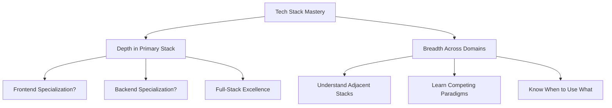
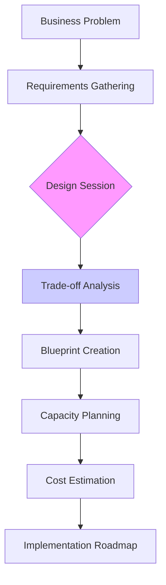
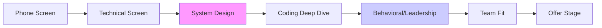

# 🏆 Senior Software Engineer Roadmap

_From Code Contributor to Technical Leader_

---

## 🎯 **The Senior Engineer Mindset**

> **"Senior engineers don't just write code; they solve business problems with technical solutions."**

**Paradigm Shifts Required:**

- **From Code to Impact** → Measure success by business outcomes, not lines of code
- **From Individual to Multiplier** → Your value scales through your influence on others
- **From Known to Unknown** → Comfortable with ambiguity and making decisions with incomplete information
- **From Technical to Strategic** → Understand the "why" behind every "what"

---

## 🏗️ **Pillar 1: Technical Mastery**

### **1.1 Tech Stack Fluency Matrix**



**Assessment Tool:** _Can you explain trade-offs between 3 different solutions to the same problem?_

### **1.2 Clean Code in Production**

```typescript
// BEFORE: Junior/Mid-Level Code
class UserService {
  async process(user: any): Promise<any> {
    // Multiple responsibilities
    // Hard to test
    // Business logic mixed with infrastructure
  }
}

// AFTER: Senior-Level Code
interface UserProcessor {
  process(user: User): Promise<ProcessingResult>;
}

class UserValidationService implements UserProcessor {
  constructor(private validator: UserValidator, private logger: Logger) {}

  async process(user: User): Promise<ProcessingResult> {
    // Single responsibility
    // Dependency injected
    // Easy to test and mock
  }
}
```

**Principles to Internalize:**

- **SOLID in Practice:** Not just theory, but daily application
- **KISS Over Clever:** Simple solutions that work beat complex ones that don't
- **DRY with Context:** Don't abstract prematurely; wait for the third occurrence
- **YAGNI (You Ain't Gonna Need It):** Fight over-engineering instincts

### **1.3 Production-Grade Testing Strategy**

```
Testing Pyramid (Production-Ready):
         /¯¯¯¯¯¯¯¯¯¯¯¯\
        |  E2E Tests   | ← Critical user journeys (5-10%)
         ¯¯¯¯¯¯¯¯¯¯¯¯/
        /            \
       | Integration  | ← API contracts, service boundaries (15-20%)
        ¯¯¯¯¯¯¯¯¯¯¯¯\
       /              \
      |   Unit Tests   | ← Pure logic, algorithms (70-75%)
       ¯¯¯¯¯¯¯¯¯¯¯¯¯¯/

Specialized Tests:
• Performance Tests (K6/Gatling) - Load, stress, spike testing
• Chaos Engineering - Netflix Chaos Monkey principles
• Contract Tests - Consumer-driven contracts
• Security Tests - SAST, DAST, dependency scanning
```

**Load Testing Framework:**

```javascript
// K6 Performance Test Example
import http from "k6/http";
import { check, sleep } from "k6";
import { Rate } from "k6/metrics";

const errorRate = new Rate("errors");

export const options = {
  stages: [
    { duration: "2m", target: 100 }, // Ramp-up
    { duration: "5m", target: 100 }, // Steady state
    { duration: "2m", target: 200 }, // Stress test
    { duration: "2m", target: 0 }, // Ramp-down
  ],
  thresholds: {
    errors: ["rate<0.01"], // <1% errors
    http_req_duration: ["p(95)<200"], // 95% < 200ms
  },
};

export default function () {
  const res = http.get("https://api.example.com/users");

  check(res, {
    "status is 200": (r) => r.status === 200,
    "response time < 500ms": (r) => r.timings.duration < 500,
  });

  errorRate.add(res.status !== 200);
  sleep(1);
}
```

---

## 🏢 **Pillar 2: Production Architecture & Cloud**

### **2.1 The Senior Design Process**



### **2.2 Architectural Decision Framework**

```markdown
# ADR (Architectural Decision Record) Template

## Context

What problem are we solving? What constraints exist?

## Decision

What are we going to do?

## Alternatives Considered

1. **Alternative A**: Pros/Cons
2. **Alternative B**: Pros/Cons
3. **Alternative C**: Pros/Cons

## Consequences

- Technical: Scalability, maintainability, complexity
- Business: Cost, time to market, risk
- Team: Learning curve, operational overhead

## Status

✅ Accepted | 📊 Proposed | ❌ Rejected

## Date

YYYY-MM-DD
```

### **2.3 Cloud Architecture Selection Matrix**

```
┌─────────────────┬──────────────────────────────┬─────────────────────────────┐
│ Requirement     │ AWS Service                  │ Azure Equivalent           │
├─────────────────┼──────────────────────────────┼─────────────────────────────┤
│ Serverless API  │ API Gateway + Lambda         │ API Management + Functions │
│ Real-time       │ AppSync (GraphQL)            │ SignalR                    │
│ Background Jobs │ SQS + Lambda                 │ Service Bus + Functions    │
│ File Processing │ S3 + EventBridge + Lambda    │ Blob Storage + Event Grid  │
│ ML Inference    │ SageMaker Endpoints          │ Azure ML Endpoints         │
└─────────────────┴──────────────────────────────┴─────────────────────────────┘
```

### **2.4 AWS Well-Architected Framework Application**

```yaml
# Production System Checklist
Operational Excellence: ☑️ Infrastructure as Code (CDK/Terraform)
  ☑️ Automated deployments (CI/CD pipelines)
  ☑️ Comprehensive logging (CloudWatch/ELK)
  ☑️ Runbooks for common failures

Security: ☑️ IAM roles with least privilege
  ☑️ Encryption at rest (KMS) and in transit (TLS 1.3)
  ☑️ WAF for DDoS protection
  ☑️ Regular security audits

Reliability: ☑️ Multi-AZ deployment
  ☑️ Auto-scaling groups
  ☑️ Health checks and self-healing
  ☑️ Backup and disaster recovery tested

Performance Efficiency: ☑️ Right-sized instances
  ☑️ Caching layers (Redis/ElastiCache)
  ☑️ CDN for static assets
  ☑️ Database query optimization

Cost Optimization: ☑️ Reserved instances for steady workloads
  ☑️ Spot instances for batch processing
  ☑️ Auto-scaling to match demand
  ☑️ Regular cost reviews and cleanup

Sustainability: ☑️ Serverless where possible
  ☑️ Data lifecycle policies
  ☑️ Efficient algorithms and data structures
```

### **2.5 Modern Architecture Patterns Deep Dive**

```typescript
// Event-Driven Microservice Pattern
class OrderService {
  constructor(
    private eventBus: EventBus,
    private inventoryService: InventoryService,
    private notificationService: NotificationService
  ) {}

  async placeOrder(order: Order): Promise<void> {
    // 1. Validate and persist order
    const savedOrder = await this.orderRepository.save(order);

    // 2. Emit domain event (not coupled to consumers)
    await this.eventBus.publish("OrderPlaced", {
      orderId: savedOrder.id,
      customerId: savedOrder.customerId,
      total: savedOrder.total,
      timestamp: new Date(),
    });

    // 3. Return immediately (async processing)
  }
}

// Event Handler (Separate Service)
class InventoryHandler {
  @EventHandler("OrderPlaced")
  async handleOrderPlaced(event: OrderPlacedEvent): Promise<void> {
    await this.inventoryService.reserveItems(event.orderId, event.items);
  }
}
```

**DDD (Domain-Driven Design) Implementation:**

```typescript
// Rich Domain Model (vs Anemic Model)
class Order {
  private items: OrderItem[];
  private status: OrderStatus;

  constructor(public readonly id: string, public readonly customerId: string) {
    this.status = OrderStatus.PENDING;
    this.items = [];
  }

  addItem(productId: string, quantity: number, price: number): void {
    // Business rules enforced here
    if (this.status !== OrderStatus.PENDING) {
      throw new Error("Cannot modify shipped order");
    }

    if (quantity <= 0) {
      throw new Error("Quantity must be positive");
    }

    this.items.push(new OrderItem(productId, quantity, price));
  }

  calculateTotal(): number {
    return this.items.reduce(
      (sum, item) => sum + item.quantity * item.price,
      0
    );
  }

  // Domain events
  place(): OrderPlacedEvent {
    if (this.items.length === 0) {
      throw new Error("Cannot place empty order");
    }

    this.status = OrderStatus.PLACED;
    return new OrderPlacedEvent(
      this.id,
      this.customerId,
      this.calculateTotal()
    );
  }
}
```

---

## 🤝 **Pillar 3: Positioning & Leadership**

### **3.1 The Senior Engineer's "Product Mindset"**

```markdown
# From Technical to Business Communication

## ❌ Technical Description:

"We Dockerized the monolith into microservices using Kubernetes,
implemented GraphQL with Apollo Server, and increased test coverage to 85%."

## ✅ Business Value Description:

"We reduced deployment time from 2 hours to 5 minutes, enabling
faster feature delivery. Our new API architecture reduced mobile
data usage by 40%, improving user retention. The system now handles
10x more traffic without additional infrastructure costs."
```

### **3.2 Resume & LinkedIn Optimization**

```markdown
# STAR Method for Senior Roles

SITUATION: Legacy system handling 10k users, 2-hour deployments
TASK: Lead migration to modern stack while maintaining 99.9% uptime
ACTION: Designed event-driven microservices, implemented CI/CD,
trained team on new patterns
RESULT: 10x user growth support, 95% faster deployments, $200k
annual infrastructure savings

# LinkedIn Optimization Checklist:

☑️ Professional headshot (not cropped from vacation photos)
☑️ Custom headline: "Senior Software Engineer | Cloud Architecture | Team Leadership"
☑️ Detailed experience with metrics (increased X by Y%)
☑️ Skills section with endorsements
☑️ Regular posts about technical challenges solved
☑️ Recommendations from peers and managers
```

### **3.3 Interview Excellence Framework**



**System Design Interview Template:**

```markdown
# 45-Minute System Design Framework

## Minute 0-5: Requirements Clarification

- Functional requirements
- Non-functional requirements (scale, latency, consistency)
- Constraints and assumptions

## Minute 5-15: High-Level Design

- API design (REST/GraphQL/gRPC)
- Data model and storage
- Component diagram

## Minute 15-30: Deep Dive

- Scaling strategies (caching, sharding, replication)
- Failure scenarios and mitigation
- Security considerations
- Cost estimation

## Minute 30-40: Trade-offs & Optimization

- Discuss alternatives considered
- Justify decisions
- Identify bottlenecks

## Minute 40-45: Wrap-up

- Summarize key decisions
- Mention monitoring/observability
- Suggest next steps for iteration
```

### **3.4 Salary Negotiation Playbook**

```javascript
class SalaryNegotiator {
  constructor(currentSalary, marketRate, roleLevel) {
    this.currentSalary = currentSalary;
    this.marketRate = marketRate;
    this.roleLevel = roleLevel;
  }

  async negotiate(offer) {
    // Rule 1: Never give first number
    if (askedForCurrentSalary) {
      return "I'm looking for a competitive package based on the role's responsibilities and my experience. What range did you have in mind?";
    }

    // Rule 2: Anchor high (20-30% above target)
    const anchor = this.calculateAnchor();
    return `Based on my research for ${this.roleLevel} roles in this market with my expertise in [specific valuable skills], I was expecting around ${anchor}.`;

    // Rule 3: Consider total comp, not just base
    const totalComp = offer.base + offer.bonus + offer.equity + offer.benefits;

    // Rule 4: Have a walk-away number
    if (totalComp < this.walkAwayNumber) {
      return "I appreciate the offer, but I don't think we're aligned on value. I'll have to decline.";
    }
  }

  calculateAnchor() {
    // Glassdoor, Levels.fyi, Blind data
    // Add premium for specialized skills (AI/ML, security, etc.)
    return this.marketRate * 1.25; // 25% above market
  }
}
```

**Negotiation Scripts:**

```markdown
## When They Ask Current Salary:

"I'm currently exploring opportunities in the range of $X to $Y, depending on the total compensation package and growth opportunities. What's the budget for this role?"

## When You Get the Initial Offer:

"Thank you for the offer. I'm excited about the opportunity to contribute to [specific project/team]. Based on my experience with [specific valuable skills] and the market rates I've researched, I was expecting something closer to $Z. Is there flexibility here?"

## When Negotiating Multiple Offers:

"I have another offer at $X, but I'm more interested in this role because [specific reason]. If you can match/beat that offer, I'm ready to accept immediately."
```

---

## 🤖 **Bonus: AI-Assisted Development Mastery**

### **The AI-Augmented Senior Engineer**

```python
# Traditional vs AI-Augmented Workflow
class TraditionalDeveloper:
    def solve_problem(self, problem):
        # 1. Google/search documentation (10-30 mins)
        # 2. Write code with trial/error
        # 3. Debug with console.log/breakpoints
        # 4. Write tests
        # 5. Total: 2-4 hours

class AIAugmentedDeveloper:
    def solve_problem(self, problem):
        # 1. Prompt: "Design a scalable rate limiter for our API in TypeScript"
        # 2. Review generated solution (5 mins)
        # 3. Prompt: "Add Redis support and unit tests"
        # 4. Review and adjust (10 mins)
        # 5. Total: 15-30 mins (10x faster)
```

### **AI Integration Architecture Patterns**

```typescript
// RAG (Retrieval-Augmented Generation) System
class RAGSystem {
  constructor(
    private vectorStore: VectorDatabase,
    private llm: LanguageModel,
    private documentProcessor: DocumentProcessor
  ) {}

  async query(question: string, context: UserContext): Promise<Answer> {
    // 1. Retrieve relevant documents
    const relevantDocs = await this.vectorStore.similaritySearch(question, {
      userId: context.userId,
    });

    // 2. Augment prompt with context
    const augmentedPrompt = this.buildAugmentedPrompt(question, relevantDocs);

    // 3. Generate answer with citations
    const answer = await this.llm.generate(augmentedPrompt, {
      temperature: 0.1, // Low for factual accuracy
      maxTokens: 500,
    });

    return {
      answer,
      sources: relevantDocs,
      confidence: this.calculateConfidence(answer, relevantDocs),
    };
  }
}

// MCP (Model Context Protocol) Integration
class CodebaseContextProvider {
  async getContextForTask(task: string): Promise<Context> {
    // Analyze codebase structure
    // Find relevant files based on task
    // Extract class/method definitions
    // Include recent changes and patterns
    return {
      architecture: await this.extractArchitecture(),
      relevantCode: await this.findRelevantCode(task),
      patterns: await this.identifyPatterns(),
      constraints: await this.extractConstraints(),
    };
  }
}
```

### **Prompt Engineering for Development**

```markdown
# Effective Prompt Patterns for Senior Engineers

## System Design Prompts:

"Act as a senior architect. Design a Twitter-like feed system for 10M DAU. Consider:

1. Timeline generation (fan-out on write vs read)
2. Data partitioning strategy
3. Caching layers
4. Real-time updates
5. Cost optimization for AWS"

## Code Review Prompts:

"Review this code for:

1. Security vulnerabilities
2. Performance bottlenecks
3. Maintainability issues
4. Edge cases not handled
5. Testing gaps

Code: [paste code here]"

## Debugging Prompts:

"I'm seeing 500 errors on our payment endpoint. Here are the logs:
[logs]
Our stack is Node.js, PostgreSQL, Redis on AWS.
What are the most likely causes and how would you debug them?"
```

### **AI Tools Stack for Senior Engineers**

```
┌─────────────────────────────────────────────────────┐
│ Development Productivity                           │
├─────────────────────────────────────────────────────┤
│ • GitHub Copilot (70% faster coding)              │
│ • Cursor (AI-native IDE)                          │
│ • Windsurf (VS Code AI extension)                 │
│ • Sourcegraph Cody (Codebase-aware AI)            │
├─────────────────────────────────────────────────────┤
│ Architecture & Design                             │
├─────────────────────────────────────────────────────┤
│ • Mermaid AI (Architecture diagrams)              │
│ • Excalidraw AI (Whiteboarding)                   │
│ • ChatGPT Advanced Data Analysis                  │
├─────────────────────────────────────────────────────┤
│ Documentation & Communication                     │
├─────────────────────────────────────────────────────┤
│ • Notion AI (Technical documentation)             │
│ • Mem.ai (Meeting notes and insights)             │
│ • Otter.ai (Interview transcriptions)             │
└─────────────────────────────────────────────────────┘
```

---

## 🎯 **Career Acceleration Framework**

### **90-Day Senior Engineer Plan**

```markdown
# Month 1: Foundation & Assessment

• Week 1-2: Master domain and existing architecture
• Week 3: Identify 2-3 quick wins (bugs, optimizations)
• Week 4: Propose first improvement with business impact

# Month 2: Impact & Influence

• Lead a small feature end-to-end
• Mentor 1-2 junior engineers
• Document tribal knowledge
• Establish coding standards

# Month 3: Strategic Contributions

• Design and propose architectural improvement
• Drive adoption of new best practice
• Build relationships with product managers
• Present technical demo to leadership
```

### **Promotion Readiness Checklist**

```yaml
Technical Excellence:
  ✅ Consistently delivers complex features with minimal bugs
  ✅ Designs systems that scale and are maintainable
  ✅ Writes comprehensive tests and documentation
  ✅ Stays current with emerging technologies

Leadership & Influence: ✅ Mentors junior team members effectively
  ✅ Drives technical decisions and gets buy-in
  ✅ Improves team processes and productivity
  ✅ Represents team in cross-functional meetings

Business Impact: ✅ Connects technical work to business outcomes
  ✅ Proactively identifies opportunities for improvement
  ✅ Manages project scope and delivers on time
  ✅ Communicates effectively with non-technical stakeholders

Innovation: ✅ Introduces new technologies when appropriate
  ✅ Solves complex problems with creative solutions
  ✅ Contributes to open source or tech community
  ✅ Publishes/blog about technical insights
```

### **Compensation Progression Targets**

```
Level            | Base Range     | Total Comp      | Timeline
-----------------------------------------------------------------
Mid-Level        | $120k - $150k  | $140k - $180k   | Current
Senior (Target)  | $160k - $200k  | $200k - $300k   | 6-12 months
Staff            | $200k - $250k  | $300k - $450k   | 18-24 months
Principal        | $250k - $350k  | $400k - $600k+  | 3-5 years
```

**Note:** Ranges vary by location (SF/NYC vs remote), company size (FAANG vs startup), and specialization (AI/ML, security, etc.).

---

## 🚨 **Common Senior Engineer Traps & How to Avoid Them**

### **Trap 1: The "Expert Beginner"**

```markdown
## Symptoms:

• Thinks they know everything after 3-5 years
• Dismisses new technologies/frameworks
• Writes "clever" but unmaintainable code
• Resists feedback and process changes

## Antidote:

• Embrace being a "conscious competent"
• Regularly learn outside your comfort zone
• Seek code reviews from diverse perspectives
• Teach others (you don't truly understand until you can teach it)
```

### **Trap 2: Over-Engineering Everything**

```typescript
// Over-engineered "solution"
class AbstractFactorySingletonAdapterProxyDecorator {
  // 10 layers of abstraction for a simple CRUD app
}

// Senior engineer solution
class UserService {
  async getUser(id: string): Promise<User> {
    return db.users.findOne({ id });
  }
}
```

**Rule of Three:** Refactor on the third occurrence, not the first.

### **Trap 3: Ignoring Soft Skills**

```markdown
## Technical Skills Get You Hired,

## Soft Skills Get You Promoted.

Essential Senior Soft Skills:

1. **Stakeholder Management** - Align tech with business needs
2. **Conflict Resolution** - Navigate technical disagreements
3. **Influence Without Authority** - Get buy-in from peers
4. **Strategic Communication** - Right message, right audience
5. **Emotional Intelligence** - Read the room, manage relationships
```

### **Trap 4: Job Hopping Too Soon**

```
Ideal Timeline for Impact:
• Months 1-3: Learning and small contributions
• Months 4-12: Major features and process improvements
• Year 2: Leadership, mentoring, architectural decisions
• Year 3+: Strategic impact, promotions, significant raises

Minimum Stay for Resume: 18-24 months (shows you can deliver long-term)
```

---

## 📊 **Metrics That Matter for Senior Engineers**

### **Quantifiable Impact Dashboard**

```yaml
Technical Metrics:
  - System uptime: 99.95%+
  - P95 latency: < 200ms
  - Test coverage: 80%+ (meaningful tests)
  - Build time: < 10 minutes
  - Deployment frequency: Daily+
  - Lead time for changes: < 1 day

Business Metrics Influenced:
  - User growth: +X% through technical improvements
  - Revenue impact: $Y from performance optimizations
  - Cost savings: $Z from infrastructure optimizations
  - Customer satisfaction: Improved NPS/CSAT

Team Metrics:
  - Mentorship: Junior engineers promoted
  - Knowledge sharing: Documentation created/improved
  - Process improvements: Cycle time reduction
  - Hiring impact: Successful interviews conducted
```

---

## 🎓 **Continuous Learning Framework**

### **Monthly Learning Rhythm**

```
Week 1: Deep Dive - Master one new technology/concept
Week 2: Breadth - Explore adjacent domains (security, DevOps, data engineering)
Week 3: Application - Build something with new knowledge
Week 4: Teaching - Write blog, give talk, mentor someone

Quarterly:
• Complete one certification (AWS/GCP, security, etc.)
• Contribute to open source
• Attend/participate in one conference
```

### **Recommended Learning Resources**

```markdown
# Must-Read Books for Senior Engineers

## Technical Depth:

- "Designing Data-Intensive Applications" - Martin Kleppmann
- "The Site Reliability Workbook" - Google SRE Team
- "Building Microservices" - Sam Newman

## Leadership & Influence:

- "The Manager's Path" - Camille Fournier
- "Staff Engineer" - Will Larson
- "The Effective Engineer" - Edmond Lau

## Business Acumen:

- "The Lean Startup" - Eric Ries
- "Inspired" - Marty Cagan
- "Measure What Matters" - John Doerr
```

---

## 🏁 **The Senior Engineer's North Star**

> **Your value isn't in what you know, but in what problems you can solve.**

### **Daily Checklist for Senior Impact:**

- [ ] Did I make a decision today that saved others time?
- [ ] Did I teach someone something new?
- [ ] Did I prevent a future problem through good design?
- [ ] Did I connect my work to business outcomes?
- [ ] Did I leave the codebase better than I found it?

### **Weekly Reflection Questions:**

1. What was my most impactful contribution this week?
2. What did I learn that I can share with the team?
3. What process could be improved, and how will I drive that change?
4. Who did I help grow this week?
5. How did I advance toward my career goals?

---

## 🚀 **Your Senior Engineer Launch Plan**

### **This Week:**

1. **Audit your skills** against this roadmap
2. **Identify 2-3 gaps** to address immediately
3. **Schedule 30 minutes** with your manager to discuss growth
4. **Pick one small process** to improve and own it

### **This Month:**

1. **Complete one certification** or deep learning project
2. **Mentor someone** (formally or informally)
3. **Document tribal knowledge** that only you know
4. **Propose one architectural improvement** with business justification

### **This Quarter:**

1. **Lead a significant feature** from design to deployment
2. **Establish yourself as a go-to expert** in one domain
3. **Build relationships** with 2-3 stakeholders outside engineering
4. **Create measurable impact** that you can quantify on your resume

---

> **Remember:** Senior isn't a title, it's a mindset. It's not about years of experience, but about the quality of impact. Start thinking and acting like a senior engineer today, and the title will follow.

**Your next step:** Pick ONE area from this roadmap and commit to mastering it in the next 30 days. Document your progress. Share your learnings. Repeat. 🎯

---

_The bridge from mid-level to senior is built with initiative, ownership, and impact—one deliberate step at a time._
