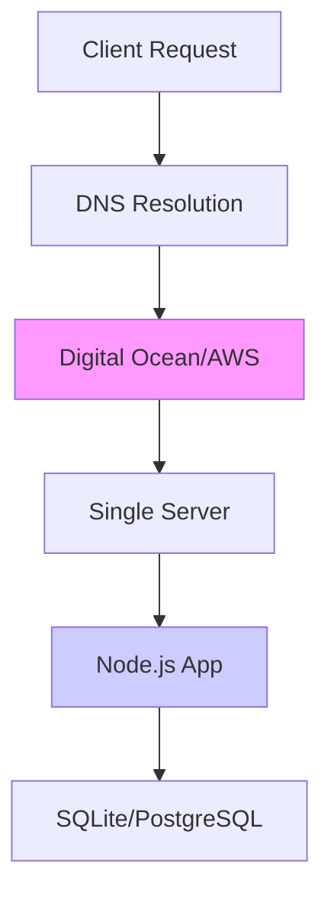
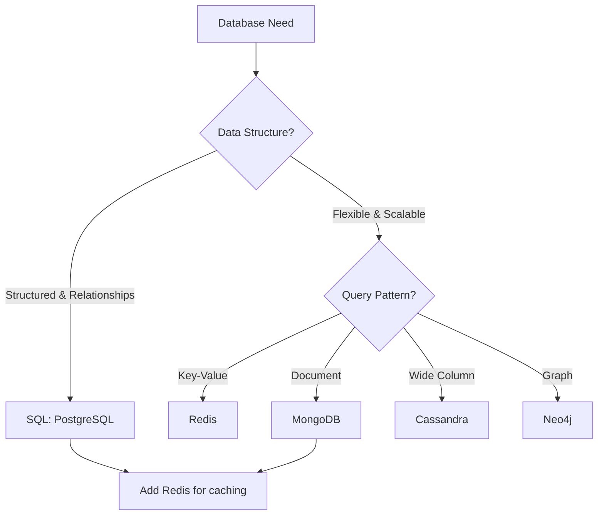
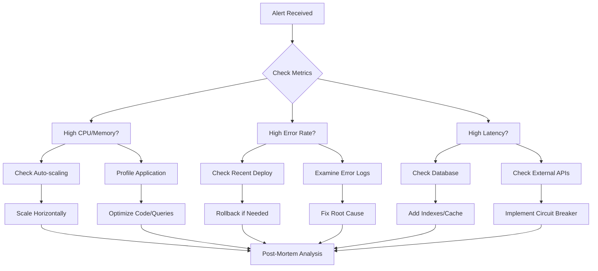

# 🚀 Senior System Design: From Theory to Production

_Practical Implementation Guide_

---

## 🎯 **The Production Mindset**

> **"Theory gets you interviews. Production experience gets you hired."**

**Core Philosophy:**

- **Build → Break → Learn → Repeat**
- **Start Simple, Scale Smart** – Don't over-engineer before you need to
- **Everything Fails** – Design for failure from day one
- **Know Your Stack** – Understand every layer from DNS to database

---

## 🏗️ **Phase 1: Single Server Foundation**

### **1.1 The Minimal Viable Architecture**



### **1.2 Server Setup Checklist**

```bash
# Production-Ready Server Bootstrap Script
#!/bin/bash

# 1. System Updates & Security
apt update && apt upgrade -y
apt install -y ufw fail2ban

# 2. User & SSH Security
adduser deployer
usermod -aG sudo deployer
mkdir /home/deployer/.ssh
cp ~/.ssh/authorized_keys /home/deployer/.ssh/
chown -R deployer:deployer /home/deployer/.ssh

# 3. Firewall Configuration
ufw allow 22    # SSH
ufw allow 80    # HTTP
ufw allow 443   # HTTPS
ufw --force enable

# 4. Node.js Environment
curl -o- https://raw.githubusercontent.com/nvm-sh/nvm/v0.39.0/install.sh | bash
export NVM_DIR="$HOME/.nvm"
[ -s "$NVM_DIR/nvm.sh" ] && \. "$NVM_DIR/nvm.sh"
nvm install 18  # LTS version
nvm use 18

# 5. Git & Deployment
apt install -y git
mkdir -p /var/www/app
chown deployer:deployer /var/www/app
```

### **1.3 Express.js Production Template**

```javascript
// server.js - Production Ready
const express = require("express");
const helmet = require("helmet");
const cors = require("cors");
const rateLimit = require("express-rate-limit");
const morgan = require("morgan");

const app = express();

// Security Middleware
app.use(helmet()); // Security headers
app.use(
  cors({
    origin: process.env.CORS_ORIGIN || "http://localhost:3000",
    credentials: true,
  })
);

// Rate Limiting
const limiter = rateLimit({
  windowMs: 15 * 60 * 1000, // 15 minutes
  max: 100, // limit each IP to 100 requests per windowMs
});
app.use("/api/", limiter);

// Logging
app.use(morgan("combined")); // Apache combined log format

// Static Files
app.use(
  express.static("public", {
    maxAge: "1d", // Cache static assets
    setHeaders: (res, path) => {
      if (path.endsWith(".html")) {
        res.setHeader("Cache-Control", "no-cache");
      }
    },
  })
);

// API Routes
app.use("/api/users", require("./routes/users"));
app.use("/api/products", require("./routes/products"));

// Health Check
app.get("/health", (req, res) => {
  res.json({
    status: "healthy",
    timestamp: new Date().toISOString(),
    uptime: process.uptime(),
  });
});

// Error Handling
app.use((err, req, res, next) => {
  console.error(err.stack);
  res.status(500).json({
    error:
      process.env.NODE_ENV === "production"
        ? "Something went wrong!"
        : err.message,
  });
});

const PORT = process.env.PORT || 3000;
app.listen(PORT, () => {
  console.log(`Server running in ${process.env.NODE_ENV} mode on port ${PORT}`);
});
```

### **1.4 Process Management with PM2**

```json
// ecosystem.config.js
module.exports = {
  apps: [{
    name: 'my-app',
    script: './server.js',
    instances: 'max', // Use all CPU cores
    exec_mode: 'cluster',
    watch: false,
    max_memory_restart: '1G',
    env: {
      NODE_ENV: 'development',
    },
    env_production: {
      NODE_ENV: 'production',
      PORT: 3000
    },
    error_file: './logs/err.log',
    out_file: './logs/out.log',
    log_file: './logs/combined.log',
    time: true,
    merge_logs: true,
    log_date_format: 'YYYY-MM-DD HH:mm Z'
  }]
};
```

**PM2 Commands:**

```bash
# Start application with PM2
pm2 start ecosystem.config.js --env production

# Monitor application
pm2 monit

# Log management
pm2 logs my-app --lines 100

# Zero-downtime reload
pm2 reload ecosystem.config.js

# Save PM2 configuration for auto-restart
pm2 save
pm2 startup
```

---

## 🗄️ **Phase 2: Database Architecture**

### **2.1 Database Selection Decision Tree**



### **2.2 PostgreSQL Production Setup**

```sql
-- production_schema.sql
-- Users table with proper indexing
CREATE TABLE users (
    id UUID PRIMARY KEY DEFAULT gen_random_uuid(),
    email VARCHAR(255) UNIQUE NOT NULL,
    username VARCHAR(50) UNIQUE NOT NULL,
    hashed_password VARCHAR(255) NOT NULL,
    created_at TIMESTAMP WITH TIME ZONE DEFAULT CURRENT_TIMESTAMP,
    updated_at TIMESTAMP WITH TIME ZONE DEFAULT CURRENT_TIMESTAMP,
    is_active BOOLEAN DEFAULT true,
    last_login_at TIMESTAMP WITH TIME ZONE
);

-- Indexes for performance
CREATE INDEX idx_users_email ON users(email);
CREATE INDEX idx_users_username ON users(username);
CREATE INDEX idx_users_created_at ON users(created_at);

-- Orders table with foreign keys
CREATE TABLE orders (
    id UUID PRIMARY KEY DEFAULT gen_random_uuid(),
    user_id UUID REFERENCES users(id) ON DELETE CASCADE,
    total_amount DECIMAL(10, 2) NOT NULL,
    status VARCHAR(20) DEFAULT 'pending',
    created_at TIMESTAMP WITH TIME ZONE DEFAULT CURRENT_TIMESTAMP,
    updated_at TIMESTAMP WITH TIME ZONE DEFAULT CURRENT_TIMESTAMP
);

-- Composite index for common queries
CREATE INDEX idx_orders_user_status ON orders(user_id, status);
CREATE INDEX idx_orders_created_at ON orders(created_at DESC);
```

### **2.3 Redis Caching Strategy**

```javascript
// cache.service.js
const Redis = require("ioredis");

class CacheService {
  constructor() {
    this.redis = new Redis({
      host: process.env.REDIS_HOST || "localhost",
      port: process.env.REDIS_PORT || 6379,
      password: process.env.REDIS_PASSWORD,
      retryStrategy: (times) => {
        const delay = Math.min(times * 50, 2000);
        return delay;
      },
    });
  }

  // Cache with TTL (Time To Live)
  async set(key, value, ttl = 3600) {
    try {
      await this.redis.setex(key, ttl, JSON.stringify(value));
      return true;
    } catch (error) {
      console.error("Cache set error:", error);
      return false;
    }
  }

  async get(key) {
    try {
      const data = await this.redis.get(key);
      return data ? JSON.parse(data) : null;
    } catch (error) {
      console.error("Cache get error:", error);
      return null;
    }
  }

  // Pattern: Cache Aside (Lazy Loading)
  async cachedQuery(key, ttl, queryFn) {
    const cached = await this.get(key);
    if (cached) return cached;

    const freshData = await queryFn();
    await this.set(key, freshData, ttl);
    return freshData;
  }

  // Invalidate related cache on write
  async invalidatePattern(pattern) {
    const keys = await this.redis.keys(pattern);
    if (keys.length > 0) {
      await this.redis.del(...keys);
    }
  }
}

module.exports = new CacheService();
```

---

## ⚖️ **Phase 3: Scaling & Load Balancing**

### **3.1 Nginx Load Balancer Configuration**

```nginx
# /etc/nginx/nginx.conf
events {
    worker_connections 1024;
    use epoll;
    multi_accept on;
}

http {
    upstream backend {
        # Load balancing algorithm
        least_conn;

        # Backend servers (add more as you scale)
        server 10.0.0.1:3000 weight=3 max_fails=3 fail_timeout=30s;
        server 10.0.0.2:3000 weight=2 max_fails=3 fail_timeout=30s;
        server 10.0.0.3:3000 weight=1 max_fails=3 fail_timeout=30s backup;

        # Keep-alive connections
        keepalive 32;
    }

    server {
        listen 80;
        server_name yourdomain.com;

        # Rate limiting
        limit_req_zone $binary_remote_addr zone=api:10m rate=10r/s;

        location / {
            # Health checks
            proxy_pass http://backend;
            proxy_http_version 1.1;
            proxy_set_header Upgrade $http_upgrade;
            proxy_set_header Connection 'upgrade';
            proxy_set_header Host $host;
            proxy_set_header X-Real-IP $remote_addr;
            proxy_set_header X-Forwarded-For $proxy_add_x_forwarded_for;
            proxy_set_header X-Forwarded-Proto $scheme;

            # Timeouts
            proxy_connect_timeout 5s;
            proxy_send_timeout 60s;
            proxy_read_timeout 60s;

            # Buffering
            proxy_buffering on;
            proxy_buffer_size 4k;
            proxy_buffers 8 4k;

            # CORS headers for API
            add_header Access-Control-Allow-Origin *;
            add_header Access-Control-Allow-Methods 'GET, POST, PUT, DELETE, OPTIONS';
            add_header Access-Control-Allow-Headers 'DNT,User-Agent,X-Requested-With,If-Modified-Since,Cache-Control,Content-Type,Range,Authorization';
        }

        location /api/ {
            # Apply rate limiting to API
            limit_req zone=api burst=20 nodelay;

            proxy_pass http://backend;
            # ... same proxy settings as above
        }

        location /health {
            access_log off;
            proxy_pass http://backend;
        }
    }
}
```

### **3.2 Auto-Scaling Implementation**

```javascript
// scaling-monitor.js
const os = require("os");
const axios = require("axios");

class ScalingMonitor {
  constructor() {
    this.cpuThreshold = 80; // 80% CPU usage
    this.memoryThreshold = 85; // 85% memory usage
    this.checkInterval = 30000; // 30 seconds
  }

  async startMonitoring() {
    setInterval(async () => {
      const metrics = await this.getSystemMetrics();

      if (this.shouldScaleUp(metrics)) {
        await this.triggerScaleUp();
      } else if (this.shouldScaleDown(metrics)) {
        await this.triggerScaleDown();
      }
    }, this.checkInterval);
  }

  getSystemMetrics() {
    const freeMem = os.freemem();
    const totalMem = os.totalmem();
    const memoryUsage = ((totalMem - freeMem) / totalMem) * 100;

    const cpus = os.cpus();
    const cpuUsage =
      cpus.reduce((acc, cpu) => {
        const total = Object.values(cpu.times).reduce((a, b) => a + b);
        const idle = cpu.times.idle;
        return acc + ((total - idle) / total) * 100;
      }, 0) / cpus.length;

    return {
      memoryUsage: Math.round(memoryUsage),
      cpuUsage: Math.round(cpuUsage),
      loadAverage: os.loadavg()[0] / os.cpus().length,
    };
  }

  shouldScaleUp(metrics) {
    return (
      metrics.cpuUsage > this.cpuThreshold ||
      metrics.memoryUsage > this.memoryThreshold ||
      metrics.loadAverage > 0.7
    );
  }

  shouldScaleDown(metrics) {
    return (
      metrics.cpuUsage < 30 &&
      metrics.memoryUsage < 40 &&
      metrics.loadAverage < 0.3
    );
  }

  async triggerScaleUp() {
    console.log("Scaling up...");
    // Integrate with cloud provider API
    // AWS: Auto Scaling Groups
    // Digital Ocean: API to create droplets
    // Kubernetes: Horizontal Pod Autoscaler
  }

  async triggerScaleDown() {
    console.log("Scaling down...");
    // Remove instances safely
  }
}
```

---

## 🔐 **Phase 4: Security & Production Hardening**

### **4.1 Security Checklist**

```yaml
Network Security: ☑️ Cloud firewall configured (allow only 22, 80, 443)
  ☑️ SSH key authentication only (disable password)
  ☑️ Fail2ban installed and configured
  ☑️ UFW (Uncomplicated Firewall) enabled

Application Security: ☑️ Helmet.js for security headers
  ☑️ CORS properly configured
  ☑️ Rate limiting implemented
  ☑️ Input validation and sanitization
  ☑️ SQL injection prevention (parameterized queries)

Authentication Security: ☑️ bcrypt for password hashing (not MD5/SHA-1)
  ☑️ JWT tokens with reasonable expiration
  ☑️ Refresh token rotation
  ☑️ Session management

Database Security: ☑️ Connection pooling with max limits
  ☑️ Read-only users for reporting
  ☑️ Regular backups with encryption
  ☑️ Database firewall rules

SSL/TLS: ☑️ Let's Encrypt SSL certificates
  ☑️ HTTP → HTTPS redirect
  ☑️ HSTS header enabled
  ☑️ TLS 1.3 preferred
```

### **4.2 Let's Encrypt SSL Setup**

```bash
# Install Certbot
sudo apt update
sudo apt install -y certbot python3-certbot-nginx

# Obtain SSL certificate
sudo certbot --nginx -d yourdomain.com -d www.yourdomain.com

# Auto-renewal setup
sudo certbot renew --dry-run

# Nginx SSL configuration snippet
ssl_certificate /etc/letsencrypt/live/yourdomain.com/fullchain.pem;
ssl_certificate_key /etc/letsencrypt/live/yourdomain.com/privkey.pem;
ssl_protocols TLSv1.2 TLSv1.3;
ssl_ciphers ECDHE-RSA-AES256-GCM-SHA512:DHE-RSA-AES256-GCM-SHA512;
ssl_prefer_server_ciphers off;
ssl_session_cache shared:SSL:10m;
ssl_session_timeout 10m;
add_header Strict-Transport-Security "max-age=63072000" always;
```

### **4.3 Monitoring & Alerting**

```javascript
// monitoring.js
const Sentry = require("@sentry/node");
const NewRelic = require("newrelic");
const winston = require("winston");

// Structured Logging
const logger = winston.createLogger({
  level: "info",
  format: winston.format.combine(
    winston.format.timestamp(),
    winston.format.json()
  ),
  transports: [
    new winston.transports.File({ filename: "error.log", level: "error" }),
    new winston.transports.File({ filename: "combined.log" }),
    new winston.transports.Console({
      format: winston.format.simple(),
    }),
  ],
});

// Error Tracking with Sentry
Sentry.init({
  dsn: process.env.SENTRY_DSN,
  environment: process.env.NODE_ENV,
  tracesSampleRate: 1.0,
});

// Custom metrics middleware
app.use((req, res, next) => {
  const start = Date.now();

  res.on("finish", () => {
    const duration = Date.now() - start;
    logger.info("request_completed", {
      method: req.method,
      url: req.url,
      status: res.statusCode,
      duration,
      userAgent: req.get("User-Agent"),
      ip: req.ip,
    });

    // Track slow requests
    if (duration > 1000) {
      logger.warn("slow_request", {
        url: req.url,
        duration,
        threshold: 1000,
      });
    }
  });

  next();
});
```

---

## 🚀 **Phase 5: Production Deployment Pipeline**

### **5.1 CI/CD with GitHub Actions**

```yaml
# .github/workflows/deploy.yml
name: Deploy to Production

on:
  push:
    branches: [main]
  pull_request:
    branches: [main]

jobs:
  test:
    runs-on: ubuntu-latest
    steps:
      - uses: actions/checkout@v3

      - name: Setup Node.js
        uses: actions/setup-node@v3
        with:
          node-version: "18"
          cache: "npm"

      - name: Install dependencies
        run: npm ci

      - name: Run tests
        run: npm test

      - name: Run security audit
        run: npm audit

      - name: Build
        run: npm run build

  deploy:
    needs: test
    runs-on: ubuntu-latest
    if: github.ref == 'refs/heads/main'
    steps:
      - uses: actions/checkout@v3

      - name: Deploy to Production
        uses: appleboy/ssh-action@v0.1.5
        with:
          host: ${{ secrets.PRODUCTION_HOST }}
          username: ${{ secrets.PRODUCTION_USER }}
          key: ${{ secrets.SSH_PRIVATE_KEY }}
          script: |
            cd /var/www/app
            git pull origin main
            npm ci --production
            npm run build
            pm2 reload ecosystem.config.js --env production

      - name: Health Check
        run: |
          curl -f https://yourdomain.com/health || exit 1
```

### **5.2 Infrastructure as Code (Terraform)**

```hcl
# infrastructure/main.tf
terraform {
  required_providers {
    digitalocean = {
      source = "digitalocean/digitalocean"
      version = "~> 2.0"
    }
  }
}

provider "digitalocean" {
  token = var.do_token
}

# Load Balancer
resource "digitalocean_loadbalancer" "public" {
  name = "production-lb"
  region = "nyc3"

  forwarding_rule {
    entry_port = 80
    entry_protocol = "http"

    target_port = 3000
    target_protocol = "http"
  }

  forwarding_rule {
    entry_port = 443
    entry_protocol = "https"

    target_port = 3000
    target_protocol = "http"

    certificate_name = digitalocean_certificate.ssl.name
  }

  healthcheck {
    port = 3000
    protocol = "http"
    path = "/health"
    check_interval_seconds = 10
    response_timeout_seconds = 5
    unhealthy_threshold = 3
    healthy_threshold = 2
  }

  droplet_ids = [for droplet in digitalocean_droplet.app : droplet.id]
}

# Application Droplets
resource "digitalocean_droplet" "app" {
  count = 3
  name = "app-${count.index + 1}"
  size = "s-2vcpu-4gb"
  image = "ubuntu-22-04-x64"
  region = "nyc3"

  ssh_keys = [digitalocean_ssh_key.default.fingerprint]

  connection {
    type = "ssh"
    user = "root"
    private_key = file(var.pvt_key)
    host = self.ipv4_address
  }

  provisioner "remote-exec" {
    inline = [
      "export DEBIAN_FRONTEND=noninteractive",
      "apt-get update",
      "apt-get install -y nodejs npm git nginx",
      "systemctl enable nginx",
      "systemctl start nginx"
    ]
  }
}

# SSL Certificate
resource "digitalocean_certificate" "ssl" {
  name = "production-ssl"
  type = "lets_encrypt"
  domains = ["yourdomain.com", "www.yourdomain.com"]
}
```

---

## 📊 **Phase 6: Monitoring & Observability**

### **6.1 Production Dashboard Setup**

```javascript
// metrics-collector.js
const client = require("prom-client");

// Create a Registry to register the metrics
const register = new client.Registry();

// Add default metrics (CPU, memory, etc.)
client.collectDefaultMetrics({ register });

// Custom metrics
const httpRequestDurationMicroseconds = new client.Histogram({
  name: "http_request_duration_seconds",
  help: "Duration of HTTP requests in seconds",
  labelNames: ["method", "route", "status_code"],
  buckets: [0.1, 0.5, 1, 2, 5],
});

const activeConnections = new client.Gauge({
  name: "nodejs_active_connections",
  help: "Number of active connections",
});

register.registerMetric(httpRequestDurationMicroseconds);
register.registerMetric(activeConnections);

// Expose metrics endpoint
app.get("/metrics", async (req, res) => {
  res.set("Content-Type", register.contentType);
  res.end(await register.metrics());
});

// Track request duration middleware
app.use((req, res, next) => {
  const end = httpRequestDurationMicroseconds.startTimer();
  res.on("finish", () => {
    end({
      method: req.method,
      route: req.route ? req.route.path : req.path,
      status_code: res.statusCode,
    });
  });
  next();
});
```

### **6.2 Alert Rules (Prometheus)**

```yaml
# prometheus-alerts.yml
groups:
  - name: production-alerts
    rules:
      - alert: HighErrorRate
        expr: rate(http_requests_total{status=~"5.."}[5m]) / rate(http_requests_total[5m]) * 100 > 5
        for: 5m
        labels:
          severity: critical
        annotations:
          summary: "High error rate on {{ $labels.instance }}"
          description: "Error rate is {{ $value }}% for {{ $labels.instance }}"

      - alert: HighResponseTime
        expr: histogram_quantile(0.95, rate(http_request_duration_seconds_bucket[5m])) > 1
        for: 10m
        labels:
          severity: warning
        annotations:
          summary: "High response time on {{ $labels.instance }}"
          description: "95th percentile response time is {{ $value }}s"

      - alert: ServiceDown
        expr: up == 0
        for: 1m
        labels:
          severity: critical
        annotations:
          summary: "Service {{ $labels.instance }} is down"
          description: "{{ $labels.instance }} has been down for more than 1 minute"
```

---

## 🎯 **Production Deployment Checklist**

### **Pre-Launch Validation**

```markdown
## Infrastructure Validation

- [ ] Load balancer health checks passing
- [ ] SSL certificates valid and installed
- [ ] DNS records propagated (TTL considered)
- [ ] Database backups scheduled and tested
- [ ] Monitoring and alerting configured

## Application Validation

- [ ] Environment variables set in production
- [ ] Database migrations completed
- [ ] Cache warmed (if applicable)
- [ ] CDN configured for static assets
- [ ] Rate limiting configured appropriately

## Security Validation

- [ ] Penetration test completed
- [ ] Security headers verified
- [ ] API keys rotated from development
- [ ] Access logs enabled and monitored
- [ ] DDoS protection configured

## Performance Validation

- [ ] Load testing completed at expected peak
- [ ] Auto-scaling triggers tested
- [ ] Database connection pooling verified
- [ ] CDN cache hit ratio monitored
- [ ] P95 response times measured
```

### **Launch Sequence**

```bash
# 1. Final Pre-flight Check
./scripts/health-check.sh

# 2. Database Migration
npm run db:migrate:production

# 3. Deploy Application
./scripts/deploy.sh --production

# 4. Verify Deployment
curl https://yourdomain.com/health

# 5. Monitor Traffic
watch -n 5 './scripts/monitor-traffic.sh'

# 6. Rollback Plan (if needed)
./scripts/rollback.sh --to=v1.2.3
```

---

## 📈 **Scaling Timeline & Strategy**

### **Growth-Based Scaling Plan**

```
┌──────────────┬───────────────────────────────┬─────────────────────────────┐
│ Stage        │ Architecture                  │ User Base                   │
├──────────────┼───────────────────────────────┼─────────────────────────────┤
│ Prototype    │ Single server, SQLite         │ < 100                       │
│ MVP          │ Separate DB, PM2 clustering   │ 100 - 1,000                 │
│ Growth       │ Load balancer + 2 app servers │ 1,000 - 10,000              │
│ Scale        │ Read replicas, Redis cache    │ 10,000 - 100,000            │
│ Enterprise   │ Microservices, CDN, sharding  │ 100,000+                    │
└──────────────┴───────────────────────────────┴─────────────────────────────┘
```

### **Cost Optimization Matrix**

```yaml
Optimization Strategy:
  - Server Types: Use burstable instances for variable workloads
  - Database: Read replicas for scaling reads, connection pooling
  - Caching: Redis for session storage and frequent queries
  - CDN: Cloudflare/CloudFront for static assets globally
  - Monitoring: Use open-source stack (Prometheus/Grafana) initially
  - Backup: Incremental backups with lifecycle policies
```

---

## 🎓 **Career Progression Through Production Experience**

### **From Junior to Senior: The Production Journey**

```markdown
## Junior Developer (0-2 years)

- Task: Fix bugs, implement features with guidance
- System: Works on assigned components
- Success: Code works in development

## Mid-Level Developer (2-4 years)

- Task: Owns features end-to-end
- System: Understands entire application flow
- Success: Features work in staging

## Senior Developer (4+ years)

- Task: Designs systems, mentors team, makes architectural decisions
- System: Designs for scale, failure, security, and cost
- Success: System runs reliably in production with real users
```

### **Production Experience Portfolio**

```markdown
# What Hiring Managers Look For

## ❌ Just Completed Course

"I learned about load balancing and microservices"

## ✅ Production Experience

"I deployed and scaled a Node.js application from 0 to 10,000 users:

- Implemented Nginx load balancing reducing latency by 40%
- Set up Redis caching improving API response times by 70%
- Configured auto-scaling handling traffic spikes to 5x baseline
- Reduced infrastructure costs by 30% through right-sizing instances
- Maintained 99.9% uptime over 12 months"
```

### **Salary Progression Through Specialization**

```
General Full-Stack: $80k - $120k
↓
Production Full-Stack: $120k - $160k
↓
Senior (Cloud + DevOps): $160k - $220k
↓
Staff/Principal (Architecture): $200k - $300k+
```

---

## 🚀 **Your 90-Day Production Mastery Plan**

### **Month 1: Foundation**

```markdown
Week 1-2: Single Server Deployment

- Deploy Node.js app to Digital Ocean/AWS
- Configure domain, SSL, PM2
- Implement basic monitoring

Week 3-4: Database & Caching

- Set up PostgreSQL with proper indexes
- Implement Redis caching layer
- Configure connection pooling
```

### **Month 2: Scaling**

```markdown
Week 5-6: Load Balancing

- Set up Nginx load balancer
- Deploy 2+ app servers
- Configure health checks

Week 7-8: Automation & CI/CD

- Implement GitHub Actions pipeline
- Infrastructure as Code (Terraform)
- Auto-scaling configuration
```

### **Month 3: Production Excellence**

```markdown
Week 9-10: Monitoring & Alerting

- Prometheus + Grafana dashboard
- Alerting with Slack/PagerDuty
- Log aggregation (ELK/CloudWatch)

Week 11-12: Security & Optimization

- Security audit and hardening
- Performance optimization
- Disaster recovery planning
```

---

## 📚 **Essential Production Tools Stack**

```
Monitoring & Observability:
• Prometheus + Grafana (metrics)
• ELK Stack (logs)
• Sentry (error tracking)
• UptimeRobot (uptime monitoring)

Infrastructure:
• Terraform (Infrastructure as Code)
• Ansible/Puppet (configuration management)
• Docker (containerization)
• Kubernetes (orchestration - later stage)

CI/CD:
• GitHub Actions/GitLab CI
• Jenkins (for complex pipelines)
• ArgoCD (GitOps)

Security:
• Let's Encrypt (SSL certificates)
• Vault (secrets management)
• Trivy (container scanning)
• OWASP ZAP (security testing)
```

---

## 💡 **Production Wisdom: Lessons from the Trenches**

### **Critical Production Rules**

```markdown
1. **Everything Fails** - Design assuming components will fail
2. **Monitor Everything** - You can't fix what you can't see
3. **Start Simple** - Add complexity only when needed
4. **Document Assumptions** - Future you will thank past you
5. **Have a Rollback Plan** - Every deployment needs an exit strategy
6. **Test in Production (Safely)** - Canary deployments, feature flags
7. **Security is Not Optional** - It's cheaper to prevent breaches than fix them
8. **Costs Multiply** - Monitor cloud costs from day one
9. **Users Notice 500ms** - Performance is a feature
10. **Sleep is Important** - Good alerting prevents 3 AM pages
```

### **When Things Go Wrong: Debugging Flowchart**



---

## 🏁 **Your First Production System: Next Steps**

### **Immediate Action Items**

1. **Today:** Deploy a simple Node.js app to Digital Ocean (free credit available)
2. **This Week:** Add PostgreSQL, Redis, and basic monitoring
3. **This Month:** Implement load balancing and CI/CD pipeline
4. **Next Month:** Add comprehensive monitoring and alerting
5. **Quarterly:** Conduct security audit and performance optimization

### **Document Your Journey**

```markdown
# Production Journal Template

## Date: YYYY-MM-DD

### What I Deployed:

- [Brief description]

### Challenges Faced:

- [List challenges]

### Solutions Found:

- [How you solved them]

### Metrics Before/After:

- Response time: Xms → Yms
- Uptime: X% → Y%
- Cost: $X → $Y

### Lessons Learned:

- [Key takeaways]

### Next Steps:

- [What to improve next]
```

---

> **Remember:** The gap between knowing system design theory and running production systems is where senior engineers are made. Every production outage, every scaling challenge, every security incident is tuition paid toward your expertise.

**Start today.** Deploy something. Break it. Fix it. Learn. Repeat. 🚀

---

_Production experience isn't earned in courses—it's forged in the fire of real users, real traffic, and real failures._
