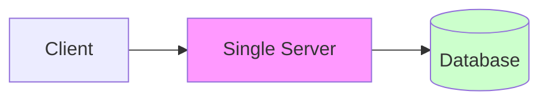
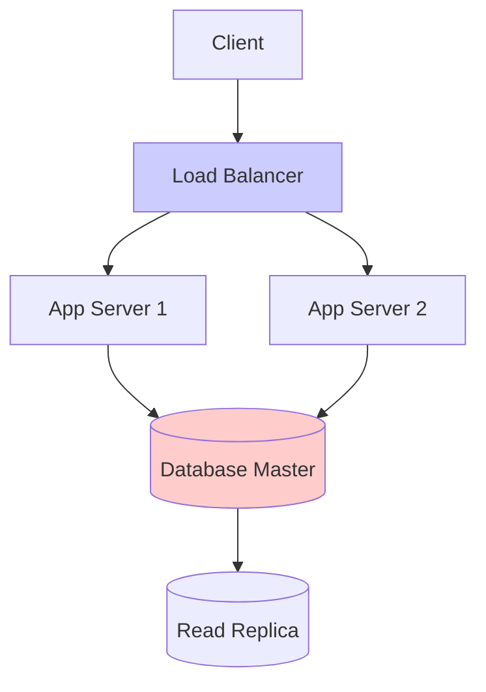
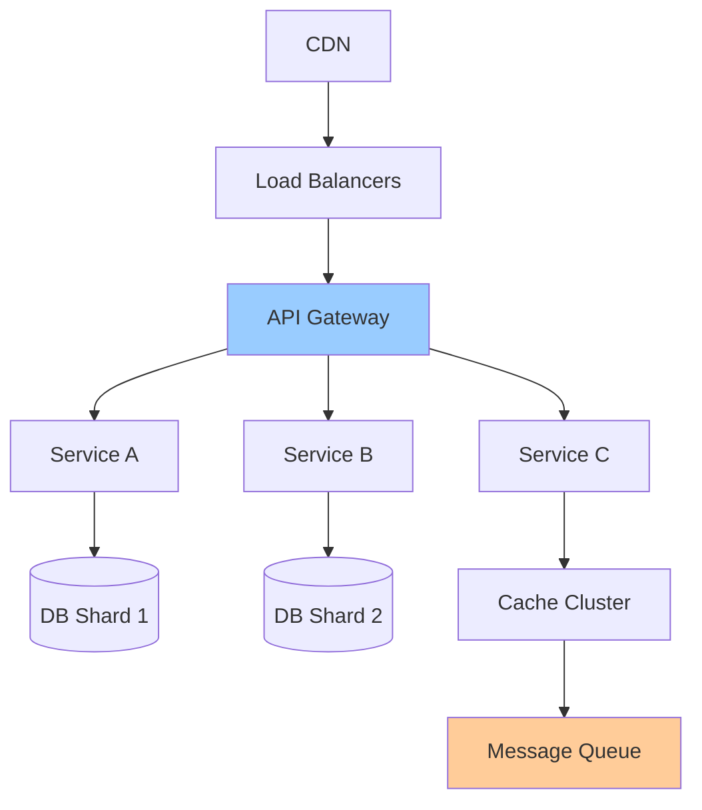
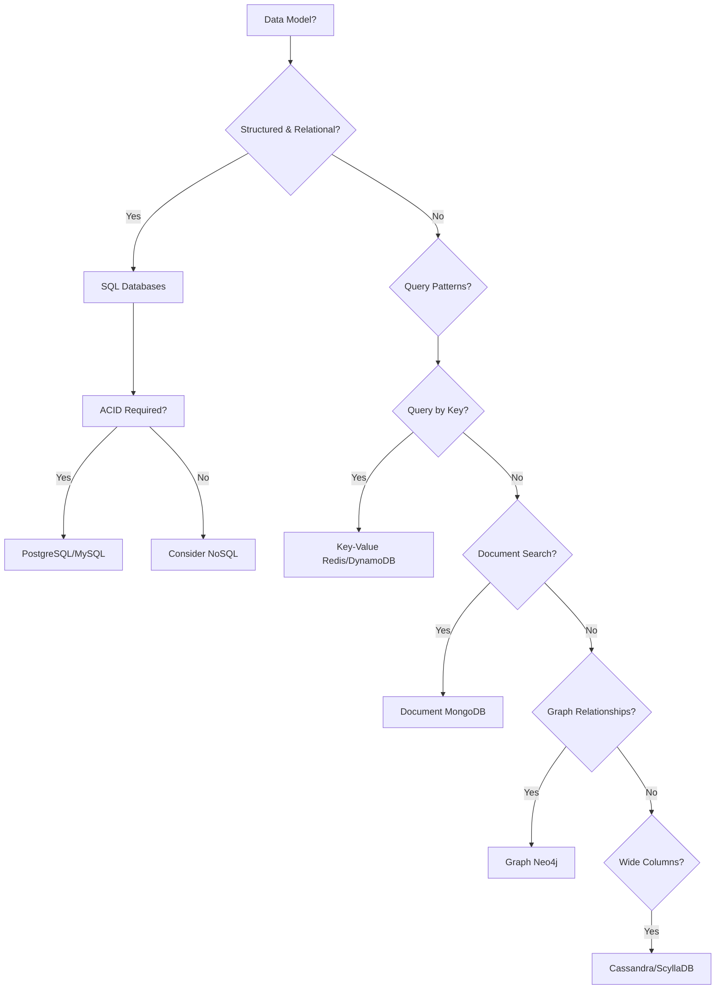
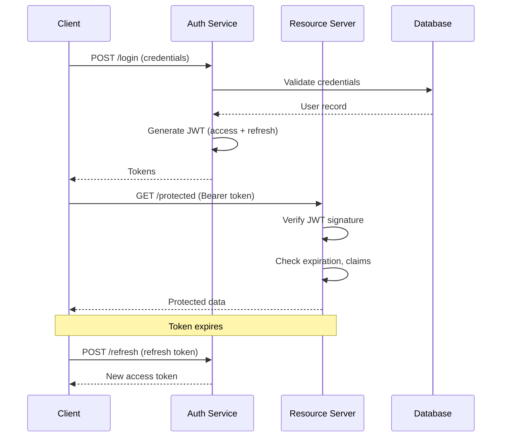

# 🏗️ System Design Mastery Guide

_From Single Server to Distributed Systems_

---

## 🌟 **Core Philosophy**

> **"Systems are designed, not discovered. Understand the trade-offs, not just the technologies."**

**Key Mindset Shifts:**

- Think in **constraints** (time, budget, scale)
- Embrace **trade-offs** – every decision has pros/cons
- Design for **failure** – systems will break; plan for it
- **Evolution over perfection** – Start simple, scale intelligently

---

## 🏗️ **System Architecture Evolution**

### **Phase 1: Single Server Setup (MVP)**



**When to Use:** Prototypes, MVPs, <10k users  
**Pros:** Simple, cheap, easy to debug  
**Cons:** SPOF, limited scalability  
**Stack:** Node.js/Express + PostgreSQL on $5 VPS

### **Phase 2: Separated Services**



**When to Use:** 10k-100k users, growing startup  
**Key Addition:** Load balancer, read replicas, caching

### **Phase 3: Distributed Architecture**



**When to Use:** 100k+ users, enterprise scale  
**Characteristics:** Microservices, sharding, queues, CDN

---

## 🗄️ **Database Architecture Deep Dive**

### **Database Selection Matrix**



### **SQL Mastery Checklist**

```sql
-- Essential Patterns
☑️ Normalization (3NF) for consistency
☑️ Denormalization for performance
☑️ Proper indexing strategy
☑️ Connection pooling
☑️ Read/write splitting

-- Performance Tuning
SELECT /* Analyze execution plans */
CREATE INDEX /* Strategic indexing */
VACUUM ANALYZE /* PostgreSQL maintenance */
EXPLAIN (ANALYZE, BUFFERS) /* Deep query analysis */
```

### **NoSQL Decision Framework**

| Use Case             | Database  | Why                       |
| -------------------- | --------- | ------------------------- |
| **Session Storage**  | Redis     | Sub-millisecond reads     |
| **User Profiles**    | MongoDB   | Flexible schema evolution |
| **Time-Series Data** | Cassandra | High write throughput     |
| **Social Graphs**    | Neo4j     | Traverse relationships    |
| **Shopping Cart**    | DynamoDB  | Predictable latency       |

### **Database Scaling Patterns**

```
┌────────────────┬──────────────────────┬─────────────────────────┐
│ Pattern        │ Implementation       │ Use Case                │
├────────────────┼──────────────────────┼─────────────────────────┤
│ Master-Replica │ 1 write, N reads     │ Read-heavy workloads    │
│ Sharding       │ Data partitioning    │ Massive scale (TB+)     │
│ Federation     │ Service per DB       │ Microservices isolation │
│ CQRS           │ Separate read/write  │ Complex query needs     │
└────────────────┴──────────────────────┴─────────────────────────┘
```

---

## ⚖️ **Load Balancing & Scaling Strategies**

### **Load Balancer Configuration**

```nginx
# Nginx Load Balancing Configuration
upstream backend {
    # Load Balancing Algorithm
    least_conn;  # Options: round_robin, ip_hash, random

    server backend1.example.com weight=3;
    server backend2.example.com weight=2;
    server backend3.example.com backup;

    # Health Checks
    health_check interval=10s fails=3 passes=2;
}

server {
    location / {
        proxy_pass http://backend;
        proxy_next_upstream error timeout invalid_header;
        proxy_connect_timeout 2s;
    }
}
```

### **Scaling Decision Tree**

```
┌─────────────────────────────────────────────┐
│   Are you hitting CPU/RAM limits?           │
│                   ↓                          │
│   ┌───────────────┬───────────────┐        │
│   │ CPU Bound     │ Memory Bound  │        │
│   ↓               ↓               │        │
│ Vertical Scaling  Vertical Scaling │        │
│                   ↓               │        │
│   Is single server sufficient?     │        │
│                   ↓               │        │
│   ┌───────────────┴───────────────┐        │
│   │        Go Horizontal           │        │
└─────────────────────────────────────────────┘
```

### **Horizontal Scaling Patterns**

```yaml
# Kubernetes Horizontal Pod Autoscaler
apiVersion: autoscaling/v2
kind: HorizontalPodAutoscaler
metadata:
  name: my-app-hpa
spec:
  scaleTargetRef:
    apiVersion: apps/v1
    kind: Deployment
    name: my-app
  minReplicas: 3
  maxReplicas: 10
  metrics:
    - type: Resource
      resource:
        name: cpu
        target:
          type: Utilization
          averageUtilization: 70
```

---

## 🔌 **API Design & Communication Protocols**

### **REST vs GraphQL vs gRPC Comparison**

| Aspect            | REST               | GraphQL            | gRPC               |
| ----------------- | ------------------ | ------------------ | ------------------ |
| **Data Fetching** | Multiple endpoints | Single endpoint    | Multiple endpoints |
| **Over-fetching** | Common             | Eliminated         | Minimal            |
| **Versioning**    | URL/Header         | Schema evolution   | Protocol buffers   |
| **Performance**   | Good               | Good (single trip) | Excellent (binary) |
| **Caching**       | HTTP caching       | Client-side        | Limited            |
| **Best For**      | Public APIs        | Mobile apps        | Microservices      |

### **RESTful API Design Standards**

```http
# Resource Naming Convention
GET    /users                    # List users
POST   /users                    # Create user
GET    /users/{id}               # Get user
PUT    /users/{id}               # Update user
PATCH  /users/{id}               # Partial update
DELETE /users/{id}               # Delete user

# Nested Resources
GET    /users/{id}/posts         # User's posts
GET    /users/{id}/posts/{pid}   # Specific post

# Filtering, Sorting, Pagination
GET /users?page=2&limit=50&sort=-created_at&role=admin
```

### **GraphQL Schema Design**

```graphql
type Query {
  user(id: ID!): User
  users(filter: UserFilter, page: Int = 1): UserConnection!
}

type Mutation {
  createUser(input: CreateUserInput!): User!
  updateUser(id: ID!, input: UpdateUserInput!): User!
}

type User {
  id: ID!
  email: String!
  posts(first: Int = 10): [Post!]!
}

# Input Types for Clean APIs
input CreateUserInput {
  email: String! @constraint(format: "email")
  name: String! @constraint(minLength: 2)
}

# Pagination Pattern
type UserConnection {
  edges: [UserEdge!]!
  pageInfo: PageInfo!
}
```

### **WebSockets vs Server-Sent Events**

```javascript
// WebSocket Implementation
const ws = new WebSocket("wss://api.example.com/ws");
ws.onmessage = (event) => {
  const data = JSON.parse(event.data);
  // Real-time updates
};

// SSE Implementation
const es = new EventSource("/api/events");
es.onmessage = (event) => {
  // Server push (one-way)
};
```

---

## 🔐 **Authentication & Authorization Systems**

### **Authentication Flow Architecture**



### **JWT Structure & Security**

```json
{
  "header": {
    "alg": "HS256",
    "typ": "JWT"
  },
  "payload": {
    "sub": "user123",
    "name": "John Doe",
    "iat": 1516239022,
    "exp": 1516242622,
    "roles": ["user", "premium"],
    "scopes": ["read:profile", "write:posts"]
  },
  "signature": "HMACSHA256(base64UrlEncode(header) + '.' + base64UrlEncode(payload), secret)"
}
```

### **Authorization Models Implementation**

```typescript
// RBAC Implementation
enum Role {
  ADMIN = "admin",
  EDITOR = "editor",
  VIEWER = "viewer",
}

interface Permission {
  resource: string;
  action: "create" | "read" | "update" | "delete";
}

const rolePermissions: Record<Role, Permission[]> = {
  [Role.ADMIN]: [{ resource: "*", action: "*" }],
  [Role.EDITOR]: [
    { resource: "posts", action: "create" },
    { resource: "posts", action: "update" },
    { resource: "posts", action: "read" },
  ],
};

// ABAC Implementation
class AttributePolicy {
  evaluate(user: User, resource: Resource, action: string): boolean {
    return (
      user.department === resource.ownerDepartment &&
      user.seniority >= resource.minSeniority
    );
  }
}
```

---

## 🛡️ **Security Implementation Matrix**

### **Layer-by-Layer Security**

```
┌─────────────────────────────────────────────────────┐
│ Application Layer                                   │
│  • Input validation & sanitization                  │
│  • SQL/NoSQL injection prevention                   │
│  • XSS prevention (CSP, encoding)                   │
│  • CSRF tokens                                      │
├─────────────────────────────────────────────────────┤
│ API Layer                                           │
│  • Rate limiting (per IP/user/endpoint)            │
│  • Authentication/Authorization                    │
│  • API key validation                              │
│  • Request signing                                 │
├─────────────────────────────────────────────────────┤
│ Network Layer                                       │
│  • WAF (Web Application Firewall)                  │
│  • DDoS protection                                 │
│  • TLS 1.3+                                        │
│  • VPN for internal services                       │
├─────────────────────────────────────────────────────┤
│ Infrastructure Layer                                │
│  • Security groups/firewalls                       │
│  • Secrets management (Vault, AWS Secrets Manager) │
│  • Regular security scanning                       │
│  • Zero-trust network                              │
└─────────────────────────────────────────────────────┘
```

### **Rate Limiting Strategies**

```python
# Token Bucket Algorithm Implementation
class RateLimiter:
    def __init__(self, capacity, refill_rate):
        self.capacity = capacity  # Max tokens
        self.tokens = capacity    # Current tokens
        self.refill_rate = refill_rate  # Tokens per second
        self.last_refill = time.time()

    def allow_request(self):
        self._refill()
        if self.tokens >= 1:
            self.tokens -= 1
            return True
        return False

    def _refill(self):
        now = time.time()
        time_passed = now - self.last_refill
        new_tokens = time_passed * self.refill_rate
        self.tokens = min(self.capacity, self.tokens + new_tokens)
        self.last_refill = now
```

### **Security Headers Checklist**

```nginx
# Essential Security Headers
add_header Content-Security-Policy "default-src 'self';";
add_header X-Frame-Options "DENY";
add_header X-Content-Type-Options "nosniff";
add_header Referrer-Policy "strict-origin-when-cross-origin";
add_header Permissions-Policy "camera=(), microphone=()";
add_header Strict-Transport-Security "max-age=31536000; includeSubDomains";
```

---

## 📡 **Network Protocols & Communication**

### **TCP vs UDP Decision Guide**

```
┌─────────────────────────────────────────────────────┐
│         When to Use TCP                             │
│  • Web browsing (HTTP/HTTPS)                       │
│  • Email (SMTP, IMAP)                              │
│  • File transfer (FTP, SFTP)                       │
│  • Database connections                            │
│  • When data integrity is critical                 │
│                                                    │
│         When to Use UDP                             │
│  • Video streaming                                 │
│  • Voice over IP (VoIP)                            │
│  • Online gaming                                   │
│  • DNS queries                                     │
│  • When low latency is critical                    │
└─────────────────────────────────────────────────────┘
```

### **Protocol Stack Implementation**

```rust
// Simplified TCP-like reliable delivery
struct ReliableChannel {
    sequence_number: u32,
    buffer: HashMap<u32, Packet>,
    ack_timeout: Duration,
}

impl ReliableChannel {
    async fn send(&mut self, data: &[u8]) -> Result<()> {
        let packet = Packet::new(self.sequence_number, data);
        self.buffer.insert(self.sequence_number, packet);

        // Send with retry logic
        self.send_with_retry(self.sequence_number).await?;
        self.sequence_number += 1;
        Ok(())
    }
}
```

---

## 🚀 **System Design Interview Framework**

### **The 4-Step Design Process**

```
1. REQUIREMENTS CLARIFICATION (5-10 mins)
   • Functional: What features?
   • Non-functional: Scale, latency, consistency?
   • Extended: Future features, constraints?

2. HIGH-LEVEL DESIGN (10-15 mins)
   • API design (endpoints, data formats)
   • Database schema
   • Component diagram
   • Data flow

3. DEEP DIVE (15-20 mins)
   • Scaling strategies
   • Database optimization
   • Caching strategy
   • Fault tolerance
   • Security considerations

4. WRAP-UP (5 mins)
   • Summarize key decisions
   • Discuss trade-offs
   • Suggest improvements
   • Mention monitoring/alerting
```

### **Common Design Problems & Solutions**

| Problem               | Solution                                 | Key Technologies               |
| --------------------- | ---------------------------------------- | ------------------------------ |
| **URL Shortener**     | Base62 encoding, KV store, CDN           | Redis, Cassandra, CloudFront   |
| **Twitter Feed**      | Fan-out on write, timeline aggregation   | Redis, Kafka, Message queues   |
| **Uber/Ride Sharing** | Location indexing, geohashing            | Redis GEO, PostGIS, WebSockets |
| **Netflix Streaming** | CDN, adaptive bitrate, edge caching      | AWS CloudFront, HLS/DASH, S3   |
| **Payment System**    | Idempotency, sagas, eventual consistency | Kafka, PostgreSQL, Redis       |

### **Capacity Estimation Worksheet**

```markdown
## Example: Twitter-like System

**Assumptions:**

- 500M daily active users
- Each user posts 5 tweets/day
- Each user follows 200 people
- Each tweet view generates 10 timeline reads

**Calculations:**

- Write QPS: 500M × 5 / 86400 ≈ 29,000 tweets/sec
- Read QPS: 500M × 200 × 10 / 86400 ≈ 1.1B reads/sec
- Storage/day: 2.5B tweets × 1KB = 2.5TB/day
- Cache needed: Hot 1% of data = 25GB in cache
```

---

## 🏢 **Real-World System Patterns**

### **GitHub Permission System (ACL)**

```yaml
# Repository Permission Model
permissions:
  admin:
    - push
    - pull
    - manage_collaborators
    - modify_settings
  write:
    - push
    - pull
  read:
    - pull
  triage:
    - pull
    - manage_issues

# Implementation using Bitmask
PERMISSIONS = {
    'read': 0b0001,
    'write': 0b0011,  # Includes read
    'admin': 0b0111,  # Includes write
}
```

### **Google Drive Sharing (Real-time Collaboration)**

```javascript
// Operational Transformation for Collaborative Editing
class OTServer {
  operations = [];

  applyOperation(clientOp, clientId) {
    // Transform against concurrent operations
    const transformed = this.transform(clientOp);
    this.operations.push(transformed);
    this.broadcast(transformed, clientId);
    return transformed;
  }

  transform(operation) {
    // Resolve conflicts using OT algorithm
    return operation;
  }
}
```

---

## 📊 **Monitoring & Observability Stack**

### **Four Golden Signals of Monitoring**

```prometheus
# Prometheus Metrics
http_requests_total{method="POST", endpoint="/api/users"}
http_request_duration_seconds{quantile="0.95"}
http_errors_total{status="500"}
system_cpu_usage{instance="app-01"}

# SLO/SLI Definitions
- Availability: 99.9% (≤43m downtime/month)
- Latency: p95 < 200ms
- Throughput: 10k requests/second
- Error rate: < 0.1%
```

### **Distributed Tracing**

```yaml
# OpenTelemetry Configuration
tracing:
  exporter: jaeger
  sampler: parent_based_always_on
  attributes:
    service.name: "user-service"
    deployment.environment: "production"

# Span Structure
Trace: User Signup Flow
├── Span: API Gateway (10ms)
├── Span: Auth Service (50ms)
│   ├── Span: Database Query (30ms)
│   └── Span: Send Welcome Email (20ms)
└── Span: Profile Creation (40ms)
```

---

## 🔄 **Message Queues & Event-Driven Architecture**

### **Queue Patterns Comparison**

```
┌─────────────────────────────────────────────────────┐
│     Queue Pattern      │ Use Case                   │
├─────────────────────────────────────────────────────┤
│ Point-to-Point        │ Task distribution          │
│                       │ Worker queues              │
│                       │ Email sending              │
├─────────────────────────────────────────────────────┤
│ Pub/Sub               │ Event broadcasting         │
│                       │ Notifications              │
│                       │ Real-time updates          │
├─────────────────────────────────────────────────────┤
│ Request/Reply         │ RPC over queues            │
│                       │ Async API calls            │
│                       │ Microservices comms        │
└─────────────────────────────────────────────────────┘
```

### **Kafka vs RabbitMQ Decision**

```yaml
# Choose Kafka when:
- Need high throughput (>100k msgs/sec)
- Need message replay capability
- Building event sourcing system
- Need exactly-once semantics
- Long-term message retention needed

# Choose RabbitMQ when:
- Complex routing needed
- Priority queues required
- Need message TTL/expiration
- Smaller scale (<50k msgs/sec)
- Traditional queue semantics
```

---

## 🎯 **Practice Projects for Mastery**

### **Project 1: Distributed URL Shortener**

**Technical Challenges:**

- Base62 encoding/decoding at scale
- Distributed ID generation (Snowflake algorithm)
- Cache warming strategies
- Analytics at scale (click tracking)
- Global low-latency routing

**Implementation Stack:**

```
Frontend: Next.js + CloudFront
Backend: Go microservices
Database: Redis (cache) + DynamoDB (persistent)
Queue: Kafka for analytics events
ID Generation: Twitter Snowflake
```

### **Project 2: Real-time Collaborative Editor**

**Technical Challenges:**

- Operational Transformation/CRDT algorithms
- WebSocket connection management
- Presence detection (who's online)
- Version history and conflict resolution
- Real-time performance optimization

**Implementation Stack:**

```
Frontend: React + Quill.js
Backend: Node.js + Socket.io
OT Server: Rust for performance
Database: PostgreSQL for documents
Cache: Redis for sessions
Queue: RabbitMQ for background jobs
```

---

## 📈 **Learning Path & Progression**

### **Phase 1: Fundamentals (Weeks 1-4)**

```
Week 1: HTTP, REST, Basic Auth
Week 2: SQL Databases, Indexing
Week 3: Caching (Redis), Load Balancing
Week 4: Build a monolithic blog with auth
```

### **Phase 2: Intermediate (Weeks 5-12)**

```
Week 5-6: Microservices, Message Queues
Week 7-8: Database Scaling, Sharding
Week 9-10: Security Deep Dive
Week 11-12: Build Twitter clone
```

### **Phase 3: Advanced (Weeks 13-20)**

```
Week 13-14: Distributed Systems Theory
Week 15-16: Streaming Platforms (Kafka)
Week 17-18: Performance Optimization
Week 19-20: Design Uber-like system
```

### **Phase 4: Mastery (Weeks 21+)**

```
• Contribute to open-source distributed systems
• Get AWS/GCP certifications
• Build production-grade side projects
• Practice system design interviews
```

---

## 🧠 **System Design Principles Cheatsheet**

### **CAP Theorem Application**

```
Choose 2 of 3:
• Consistency: All nodes see same data
• Availability: Every request gets response
• Partition Tolerance: System works despite network failures

Most web: Choose AP (Availability + Partition Tolerance)
Banking: Choose CP (Consistency + Partition Tolerance)
```

### **Design Patterns Quick Reference**

```
• Circuit Breaker: Fail fast when downstream fails
• Bulkhead: Isolate failures to one component
• Retry with Backoff: Handle transient failures
• Saga Pattern: Distributed transactions
• CQRS: Separate read/write models
• Event Sourcing: Store state changes as events
```

---

## 📚 **Essential Reading List**

### **Foundational Books**

1. "Designing Data-Intensive Applications" - Martin Kleppmann
2. "Site Reliability Engineering" - Google
3. "The System Design Interview" - Alex Xu
4. "Building Microservices" - Sam Newman

### **Must-Watch Resources**

- **YouTube:** System Design Interview channel
- **Courses:** "Grokking the System Design Interview"
- **Practice:** leetcode.com (system design section)
- **Diagrams:** excalidraw.com for design sketching

### **Open Source to Study**

- **Redis:** In-memory data structure store
- **Kafka:** Distributed event streaming
- **Kubernetes:** Container orchestration
- **Prometheus:** Monitoring system

---

## 💡 **Pro Tips for Success**

1. **Think in Trade-offs:** Every decision has pros/cons
2. **Back-of-envelope Math:** Always estimate scale
3. **Start Simple:** Monolith → Microservices, not vice versa
4. **Design for Failure:** Assume everything will break
5. **Measure Everything:** You can't optimize what you don't measure
6. **Keep Learning:** New patterns emerge constantly
7. **Build Mental Models:** Abstract patterns from specific implementations

---

> **Remember:** The best system designers are not those who know every technology, but those who understand the fundamental principles and can apply them creatively to solve real problems.

**Next Action:** Pick ONE system design problem and whiteboard it today. Start with URL shortener. Document your decisions. Iterate. 🚀

---

_Master the fundamentals, practice relentlessly, and think in systems._
